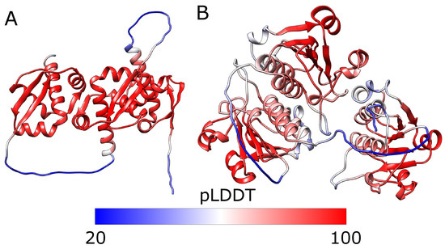




# Scope

This document should serve anyone with curiosity, as we'll cover: 

- Basic protein knowledge (no promises),
- The field of proteins as a whole, as well as providing potential data ingestion in case you'll be delving further in that field, 
- Problem statements along with their solutions, by fitting the (refined) data to a (relatively custom) model,
- Core concepts of the architecture,  
- And lastly what could be used to extend the idea itself of AlphaFold 1, as well as questions that have incurred to me personally while attempting to understand the architecture motivation and the interconnected nature of everything. These are thrown throughout the document as "insights" and in a (relatively) simple methodology of demonstration. However, it is favorable for the reader to absorb it however they like. 

Everything is wrapped with a "before in each component pass forward" and its after to enhance the [Engineering](#engineering) aspect. There is a that serves a bigger picture on what we'll be dealing with for later stages, as well as solidify our understanding towards each components role.
### Extension

While there will be a thorough study towards AlphaFold 2 and other architectures, the notes will be left here as possibilities for extension for oneself to exercise the muscle of "How can we improve this?", prompting that the reader has the ability to delve and realize they're passing an important, guaranteed (something that is built upon, AF2 and AF3 for example. There are also other possibilities) questions that are answered in later architectures.

The reason (we) chose AlphaFold 1 (with extension potential mentioned in [Foreword](#foreword)) and not its modern variants (AlphaFold 2's breakthrough) is due to the foundational approach towards the problem at hand.

>*You'd notice that a prototype architecture would contain several distinct modules, similar to the idea of "making it happen and perfect it later".*

In all intentions here lie on gaining intuition that will matter later on either on the same exact task and the elaborative extensions, or the in different disciplines (the science of adaptability). Hopefully that will serve as your "purpose" in reading the document at hand.

**Considerations:** 

- This may be published before polished, maybe even before folding completely, meaning that some text are also thoughts immediately jotted down, which will be separated from practicality with each revision.
- ***Some images are clickable and have links in them***. Be careful clicking any links before the final revision is out (HTTP etc.). 
- Some sources are also linked partially or fully, even though they're not the entire source in many of the text linking it.
- The document may be separated due to how large it is currently, but there will be attempts in making them fit to keep it holistic and central. 

*Any feedback of any form is welcome.*
## Brevity

To avoid repeating "AlphaFold X by DeepMind"; AFX is the norm,
AminoAcid abbreviation of "AA" which is used synonymously with "residue" or "res",
along with the abbreviation of Angstroms "Å": "Ang."
Reinforcement Learning: "RL"
[ProtienDataBank](https://www.rcsb.org/#Category-deposit): "PDB"
....
Other abbreviations are made on-spot.
There are also cases for alternating between them for clarity and intuition.

## Foreword

There are many architectures that have been placed in the record for the "protein folding" problem:

- AlphaFold 1, which is our main topic; What AF1 (AlphaFold 1) basically did:
  'Alphafold uses advanced biotechnology and AI to help determine ***longer*** protein structures over a ***shorter*** period)'. This is the simplest algorithm (least devouring of data as well as the complexity threshold), but is the most non end-to-end "solution" (several components and "externalities"), which also lays groundwork and first-hand intuition on the problem statement.
- AlphaFold 2 and its extensions: 2.3, and multimer which emphasizes a minor role in protein-protein interactions (some improved IDRs capturing capability), but it did well in the static protein-protein complexes (see [AlphaFold | EMBL-EBI Training](https://www.ebi.ac.uk/training/online/courses/alphafold/) as well as https://elearning.vib.be/courses/alphafold/lessons/the-alphafold-pipeline/topic/overview-of-the-architecture/).
- AlphaFold 3, which is abit out of the current scope: Prediction of interactions not just of proteins, but also DNA, RNA, small molecules (ligands), ions and chemical modifications.

### Purpose

Understanding why proteins fold is important towards understanding [the problem statement](#the-problem-statement), along with the motive of this entire interaction between the five fields (Biochemistry in the interactions, Bioinformatics and genetics relating to MSAs, Artificial intelligence (attention, Evo-former, diffusion, etc), Structural Biology as in the decades-old dataset of [PDB](#pdb) and experimental methods. And finally; Medicine and Biotechnology, **which are currently the primary beneficiaries** (think of it as the biggest "To-dos" after a breakthrough), using the insights derived from the other fields to:

1) Accelerate drug discovery. Drugs typically work by binding to specific protein targets in the body (a receptor on a cell, or an enzyme in a pathogen, or ). So if we know the precise 3D structure of a target protein, we can design small-molecule drugs that fit perfectly into its active site see [this](https://pmc.ncbi.nlm.nih.gov/articles/PMC6829626/)and [that!](https://pmc.ncbi.nlm.nih.gov/articles/PMC7121836/)
2) Understand and treat diseases along with predicting disease-causing mutations, as misfolded proteins are associated with a range of severe conditions (particularly neurodegenerative like Alzheimer's, Parkinson's and Huntington's) as well as some cancers. So by understanding how they misfold, we can design therapies to stabilize them or maybe enhance the cells natural quality control systems, or maybe even prevent the formation of the toxic aggregates that starts them all. Along with others mentioned in the [Disease prediction](#disease-prediction) section.
3) Synthesize more proteins. Maybe designing industrial enzymes that can break down plastic waste, creating more resilient crops, and many other.

**Summary:**
In AF1, we deal with a single protein, predicting how it will fold. Then, as the extension occur, we deal with complexes in AF2's multimer (along with single proteins in AF2 ver. 2.2). Lastly, we expand our capabilities of the two mentioned structures, all to view the wide range of biomolecules and predict their structures also. Any relatively interesting detail will be added along the way.

### The Problem Statement

The "protein folding problem" is actually three parts:

- The folding code (Thermodynamic questioning, basically the explicit rules of  folding), they're the interactions that will be mentioned in the [bigger picture](#building-up-from-the-smallest-to-the-biggest-protein-component)
- Protein structure prediction. The static, single structures [has been already determined](#alphafold-protein-structure-database-afdb)) (What we're doing in the [Engineering](#engineering) section). This provided the blueprint by having a static map of nearly all known proteins. 
- Understanding the actual **physical process and mechanism** by which a protein folds in nature, including the kinetics and intermediate states. Meaning that we understand "why" proteins fold the way they do, so efficiently and without random searches. This question is totally out of scope of this document.

AlphaFold generally goes with (2) without having explicit inputs of the folding code (1) nor attempt to explain the models outputs (3). There are, however, some current case(s) of utilizing the explicit inputs of the folding code (used here in AlphaFold 1) indicated at [Outputs](#outputs), as well as later in AlphaFold 3s input. Regarding (3), this can possibly be examined in the model weights, but it is currently a black-box when relating it to AlphaFolds (complex architectures that weights aren't as easy to examine), that is, if we attempt to understand the algorithms output (probably a first-approach is finding a heat-map of activations just like how we did in CNNs and attention as indicated in the image below, but it is more complex the deeper the architecture is). We can also possibly build an XAI (Interpretable AI that its internal logic is understandable) to explain the currently **epistemically opaque** weights of the complex architectures. Either ways, it is definitely out of scope and may be included in future extensions.


Source: https://johfischer.com/2022/01/27/class-activation-maps/ Linear combination of the weights and feature maps to obtain the class activation map

**In other words;**
"AlphaFold" in general predicts the final structure, ***but it does not fully explain the dynamic process of how it gets there in a biological system, nor does it address the [other protein formalisms fully](#formalisms-and-evaluation), which are mentioned below.*** There are also an important conclusion: we may need [only the AminoAcid sequences as a "manual" in the folding process,](https://en.wikipedia.org/wiki/Protein_folding) (more on that [here](#building-up-from-the-smallest-to-the-biggest-protein-component)) Which comes from the mass-feeding of the data to the target model (in which it earns the intuition and pattern-recognition from thousands of samples). This proved to work (in the case of OpenAIs GPT-3 and many other LLMS) when scaling complexity and data, till [reaching a certain plateau](https://artificialcorner.com/p/gpt-5-may-be-proof-that-scaling-alone) that requires a redirection to innovating newer architectures or maybe re-framing the current use of what we have. More on that at the [AlphaFold Protein Structure Database (AFDB)](#alphafold-protein-structure-database-afdb)).
### Cancer


### Stem cells

"The cell sizes of whales aren't bigger than a mouse's, it's just that the whales have more cells"


*Small insight:* 

The use of crystallography and OTHER techniques in identifying protein structure. They're an accurate way of figuring out the structure of proteins, but have you ever thought of other techniques, like Nuclear Magnetic Resonance (NMR), spectroscopy, Cryo-EM)? Well, if you go even deeper in that branch, you'd also realize the potential of Machine Learning application towards traditional techniques like crystallography and these other techniques. In the [formalisms](#formalisms-and-evaluation) section, there is a "realization" of using some of these experimental techniques in solving the current frontiers of problems revolving around the protein.

Continuing, the point that is trying to get across is that there can be a Machine Learning algorithm as an "Aid'er" or more professionally, a "Helper algorithm" in these techniques themselves. Meaning that besides a ML framework taking the core idea and digest (AF1), we'd have it as a secondary component that aids in the function of the core algorithm (or experiment if we're specific).

It also takes some form of delusion, too (mind you). As this is useful as a possibility opener if one is truly passionate about proteins and can open DOORS one couldn't have IMAGINED!! (yes, yes, bla bla) as long as it doesn't distract one from pursuing a single technique to their subjective creative limits, or however your working philosophy may apply.
### Formalisms and evaluation

*Some highlights in bold are of relative significance*

So, we conclude that:

1) [Proteins are dynamic, not static](https://pmc.ncbi.nlm.nih.gov/articles/PMC11623436/): they're constantly moving, twisting, changing shape in a biological environment. So when they perform their functions, say, binding with other molecules for example, any "Alphafold" predicts one molecular photo similar to a static shot of a protein folded, but since proteins are dynamic and aren't yet captured by any "AlphaFold" model in particular, mentioning some more of the dynamics:
   - Transition states: The specific intermediate shapes it temporality adopts moving between stable states (example being its interpolation between "open" and "closed" form).
   - **IDRs**: Some parts of proteins are naturally and inherently unstructured and  flexible till they bind with their partners. This is actually crucial to interact with a wide range of client proteins. 
   - Real-time atomic fluctuations: Constant and rapid vibrations of chemical  bonds and residues.

Some experimental techniques (the one finding the structure of the protein itself) which are NMR and spectroscopy and FRET, along with molecular dynamics simulations do DESCRIBE the conformational changes and the continuous flexibility and movement of the proteins in their natural environments. All of which would be key in figuring out not just one possible conformation, but all of their potential conformations per protein (one protein or a single "polymer") or complex (multiple proteins... the computation outlook seems large). Their methodology revolves around **stacking multiple protein structures (ensemble)** and transitioning between them from rapid atomic vibrations to slower domain rearrangements, which is somewhat related to Markov's formalisms of Partially Observable Markov Decision Processes in [Reinforcement Learning](#reinforcement-learning), where we also (generally) stack frames when this problem arise (again! for later. And this is not the only method!). Back at the experimental methods, there is a foreseeable future of datasets containing these just like PDB and such. Well, there is apparently a [method in combining multiple datasets](https://pmc.ncbi.nlm.nih.gov/articles/PMC3096476/), as well as developing NMR-only datasets like the one mentioned [here](https://pmc.ncbi.nlm.nih.gov/articles/PMC10767026/). The only thing we can do is wait for more NMR dataset instances... unless we find out a faster technique or use what we have now (including the NMR or not).

 So we can safely say that the [protein folding process isn't a one-time event.](https://pmc.ncbi.nlm.nih.gov/articles/PMC9815721/#:~:text=While%20the%20importance%20of%20protein%20structure%20cannot,a%20typical%20protein%20adopts%20multiple%20stable%20conformations.). It is a dynamic and often reversible process. Some need the help of other proteins to fold (chaperones), some unfold (denure) physiologically (like the natural process of protein refolding in muscles to allow muscles to stretch and recoil), others unfold to certain conditions. Amazing!!

2) The functional and interactional formalism: which would describe the proteins activity within the broader cellular context, interacting with other molecules and their surroundings (Protein-Protein interactions, Ligands, DNA: Which all seem to be partially or fully the target of AlphaFold multimer and Alphafold 3. They're still not following the first formalism, though) to preform specific biological functions. It would involve:
- **Network dynamics:** One a proteins action influences the behavior of an entire cellular pathway or network of interacting molecules.
- Kinetic properties: The rate and speed of biological reactions and interactions (enzymes kinetics, etc)
- **Allosteric regulation:** The binding at one side on a protein affects the function at a different, distant site by changing the proteins shape along with its dynamics.
- Environmental effects like solution conditions (pH, temp, salt conc) and presence of other molecules (ligands, other proteins) on the overall behavior of the protein.

There are also point mutations, which implies a single AminoAcid mutation that caused a structural defect. Similar to a pawn being promoted to a queen in chess that wrecks havoc on the advantage bar [which may be related to Reinforcement learning](#reinforcement-learning), too. This is also similar to the Network dynamics and allosteric regulation. Point mutations are the trigger of an ensemble of cascades of events. These are the structural basis for diseases, more on that at the [Disease prediction](#disease-prediction) section.

> It is advised to re-read this section after we're done with the small biology lesson.

---
## A Small Biology Lesson:

Proteins are made from instructions made by the DNA, and the RNA (the messenger of DNA). It, the protein, then folds to a 3D structure to do a specific function in the body. The structure itself is destined by *a mostly deterministic process* (i.e. native conformation). 

> More on that at [PDB bias](#pdb-bias) section.


Source: https://en.wikipedia.org/wiki/Homology_modeling an image of the DHRS7B protein (dehydrogenase/reductase 7B) created using Ribbon diagrams and rendered with PyMOL

The AminoAcid sequence is the linear order of amino acids in a protein chain (referred to as the backbone or the "main chain"), meaning that we're currently hitting the main component of the protein structure.

AminoAcids (AA's) are made up of a carbon atom with a carboxyl (COOH, acidic) and an amine group (NH2, written H2N which is a base) each to the center (the carbon). The north bond being the Hydrogen on the north, and the last bond (south of the AA, called R group) would be either of the side chains.
Please don't mind the pole directories I mentioned.


Source: [Veritasium](https://www.youtube.com/watch?v=P_fHJIYENdI), attempting multiple different side chains, which are later binded to other AAs forming a linear chain (that is different from a side chain). That straight line represents a linear chain of the carbon (center of the amino acids!), each bound to a side chain [till they form a protein or become part of a complex?]

This random choice between different side chains ends up forming the 20 AA's that exist in nature, not taking into account the unknowns, and the rare AA's. They're encoded in Alphabetical names, such as "`U`" for the Selenocysteine AminoAcid (there are some not encoded with their respective starting word). The unknown one(s), or harder to distinguish between other AminoAcids are as following:

1) `B` (Difficult; may be a `D` or `N`),

2) `Z` (Difficult; may be `E` or `Q`),

3) `J` (Difficult; may be `L` or `I`) and finally:

4) `X`(Undetermined or any unknown AA. Very interesting).

Along with the rare AA's, which are the AA's no. 21 and 22 respectively:

1) `U` and 

2) `O`

Some of these are not needed in human trials, for example the `O`, found in certain archaea and bacteria unless there are specific needs or research to be conducted on these organisms.

You can call the 22 AminoAcids "Proteinogenic" AminoAcids, which implies that they are used for building the protein from the sequencing and folding process. It's important to note that there are over 500 naturally occurring AminoAcids that have been identified, in which case are called "Non-proteinogenic" AminoAcids. They are beyond the scope of proteins and the alphabetical order, as in they do not serve the function as to become proteins, but they serve other biological functions. The potential of creating [newer AminoAcids](https://www.nature.com/articles/nchembio847), however, are being researched by modifying the R group (the "legally" modifiable part). Unless you modify the core parts (COOH and NH2), in which the AA may not be recognized by the cells machinery


Source: https://www.ml6.eu/en/blog/esm3-the-frontier-of-protein-design

Sequence determines structure, structure determines function --- and .. Oh, wait:


Source: https://pmc.ncbi.nlm.nih.gov/articles/PMC12467925/ an amazing article about the De novo protein design of "RF diffusion". They also have an amazing table on the protein-design workflow!

So we hit a "RF diffusion" spot here, where we can and are able to "create" proteins for specific functions (extremely cool I know!) that we dictate (inputs being PDB) in a model for it to produce a 3D image of the protein design. They use the Proteinogenic 20 (sometimes the other two) for this, not by creating new AA's! The process is very similar to creating images using AI, Briefly; having noise at the beginning, then iteratively removing the noise to generate a new protein structure that is a "plausibly folded structure", maybe even incorporating a novel proteinogenic AminoAcid (engineered) in the diffusion process (or other parameters like symmetry specifications and length ranges). Keep in mind that this is a generated backbone, and we still don't know its sequence of AAs.

Small note: It is very similar to predicting the next word in a sentence, where we iteratively remove the noise, and the model starts seeing patterns linking the text of description we gave (tokens) to its embedding space tokens. Its also similar to seeing patterns out of a seemingly redundant static noise. Whatever, It is deemed for another talk.


Source: https://zontal.io/rfdiffusion-leveraging-the-power-of-ddpms-to-generate-protein-sequences-and-structures-2/

There are more nuances to that, such as using [ProteinMPNN](https://github.com/dauparas/ProteinMPNN) to design a sequence of AAs that is most likely to adopt that specific 3D shape, then use AF 2 or 3 to verify the structure viability (sanity checking if it will fold back into the designed structure) before costly lab synthesis begins, that is, if we were attempting to create the protein.

> Psst! This model is a fine-tuned version of the RoseTTAFold structure prediction network (similar to AlphaFold)! Check out [BakersLab](https://www.bakerlab.org/2023/07/11/diffusion-model-for-protein-design/)!!

[More on that is a potential for integration in this article]
### Building up from the smallest to the biggest protein component 

The levels of protein structure are as follows:
#### 1) The Primary Structure

These are the most fundamental level of "structure", which refers to the linear sequence of AminoAcid themselves. The covalent bonds (Called "peptide bonds" here, linking an AA with the other. and sometimes called disulfide) are keeping them intact (more on that below). Contrary (Opposite) to the interactions other than that, which are to be considered "absent" within the primary structures stability and integrity under stress. 

Source: https://www.genome.gov/genetics-glossary/Amino-Acids

There are also conformational freedom, which are by the partial double-bond, which are also called "trans conformation" of the peptide bond between two AA's and its strength is between single and fully double bonds. What matters here is that the angle is nearly always fixed at 180 between only two AA's, conveying a planar structure. So the bond has the proteins on a "strong approximation" set of an absolute physical constant angle called 𝜔 (omega). 

> Note: The Carbon (C𝛼) backbone are bonded with NH2 (single bonds, flexible) and have an angle, **which are called Phi ϕ torsion angles**, while the Carbon C𝛼 and COOH bonds angles are **called Psi 𝜓 torsion angles.**

The "Ramachandran plots" are the plots defining the sterically allowed conformations of the psi and phi angles (so atoms wont go crashing on each other).

#### 2) The Secondary Structure:

These are alpha helices and beta sheets. The existence of specific and stable Secondary Structure


[Source compressed](https://chem.libretexts.org/Bookshelves/Organic_Chemistry/Organic_Chemistry_III_%28Morsch_et_al.%29/26%3A_Amino_Acids_Peptides_and_Proteins/26.10%3A_Protein_Structure): The main chain (called the Cα coordinates)

#### 3) The tertiary structure

Since the tertiary structure is the overall, complex 3D shape of a single polypeptide chain, which includes all the secondary structure elements and how they fold, there is a conclusion that the proteins tertiary structure (the 3D fold) is determined by the interactions between the AA side chains (R group) and between other side chains with other! Their interactions (more on interactions below) cause the stabilization of the 3D shape, there is also an influence between side chains and the atoms of the peptide backbone.

>The stressors of proteins are heat, pH salinity and other chemical treatments that make the protein "denure" (to break down), with the exception of one structure:
>Having the ***primary structure*** intact during stress provides **renaturation potential**! Implying that for the other two structures (SS and TS), which are greatly affected by the stressors of proteins, can REFOLD back (with gentle reintroduction to its normal conditions) to its correct functional tertiary structure all due to the proteins primary structure. The only thing(s) that can break the proteins primary structures are harsh chemical treatments or specific enzymatic action (proteolysis) to break the covalent bonds. This deserved to be at [Disease prediction](#disease-prediction)

#### 4) Quaternary Structure

For the last structure, there is Quaternary protein structure (complexes), which has proteins consisting of the (1), (2), (3) structures, called now "subunits" (two or more proteins in the entire complex) that we mentioned.


**Summary:**

Source: https://www.khanacademy.org/science/biology/macromolecules/proteins-and-amino-acids/a/orders-of-protein-structure (Honestly an amazing demonstration for the bigger picture view, maybe have some terminologies in brackets like pleated sheets should be "Beta Pleated sheets" but that's only to aid beginners in learning structure terms).

We can conclude that 


In our static protein structure prediction problem, we can safely say that the strongest predictors are their primary structure, **the sequences**. It is a deterministic way of finding out the final 3D structures. Their properties also matter:

1) The order of AA's: Which is the primary structure predictor. This contains all the information needed for the protein to spontaneously fond into its correct, functional 3D shape.

2) The types of AAs

These two together are crucial as they dictate which interactions can occur in one of the two interactions; the predominant ***non-covalent interaction(s)***: hydrophobic effects, H-bonds, van der walls forces and salt (ionic bonds) bridges. They are weak individually but act together (thousands of them!) to stabilize the protein. Their drawbacks is that how easily they're disrupted from heat or changes in ph. We also assume no extraordinary environmental conditions as mentioned in [PDB bias](#pdb-bias).

And one ***covalent interaction***: disulfide bridges (or bonds). These bonds are stronger than the former mentioned non-covalent bonds. There is already a foreseeable potential of its aid in the [Disease prediction](#disease-prediction) section, maybe also a previous section that you can connect to.

These interactions as a whole put us on the importance of the [2) MSA](#2) MSA). Which has one sequence far away from the other (in the same chain, speaking of a single protein) that are touching [Important finding!]

3) The No. of AA's which defines the overall length of the chain. This is relevant because it defines the size and complexity of the resulting structure. The longer the chain the more opportunities it has for more folding

The interactions were ***not*** explicitly fed to the algorithm. It implicitly learned the the. Maybe that's for the best, as sometimes exploration ([RL!](#reinforcement-learning)) is more important. Although in AF1, it is fed during [Stage two](#stage-two). In other architectures, however, it is learned implicitly through the scaling of the network and data.

Keep in mind that we have protein (or related) "lessons" also scattered around the document, as some information will be pulled when required.

Now, let us us demonstrate the data main dataset at hand:

## PDB

The central protein databank has explicit [entries](https://www.ebi.ac.uk/training/online/courses/exploring-pdb-entry/) of:

1) The 3D atomic coordinates (fundamental target data for later) which allows the visualization of the final static snapshot of the folded protein. This is a very precise X, Y and Z location of every non-hydrogen atom (sometimes  hydrogen) in the resolved structure.
2) Bound Ligands/Molecules which are coordinates of water, ions (zinc, magnesium), drug molecules that are bound in the structure. They are non-proteins that were co-crystalized or co-solved with the proteins.
3) Multiple conformations (limited): NMR ensembles are models, meaning a small set of 10-20 representative coordinate sets
4) Secondary Structure (SS) assignments (derived from 3D structures for a deterministic assignment, and derived from the AA sequence for a probabilistic assignment).

Source: https://www.sciencedirect.com/science/article/pii/S0079610716300499

5) Experimental metadata:
- Experimentation methodology: X-ray crystallography (traditional, accounting for ~87% of all the PDB archive), NMR (, Cryo-em (Cryo is advancing rapidly!), which are the big three used in PDB. There are still other techniques used like SAXS, CD and other. Maybe also the **experimental conditions** that are crucial as indicated in the [Formalisms and evaluation](#formalisms-and-evaluation) section
- The resolution or quality of the data, where higher resolution indicate a better "zooming in" the protein to identify the structure and its fine details. The higher the (Ang.), the lower resolution that we get. Similar to a pixelated photo, you can see the backbone, but not the individual parts like atoms and side chains and the opposite applies here.
- R-factor and R-free, B-factors, clash score, RSR and other. Check out [the amazing documentation BY PDB assessing the quality linked here](https://www.rcsb.org/docs/general-help/assessing-the-quality-of-3d-structures#:~:text=mismatches%20between%20the%20model%20and%20the%20experimental,to%20errors%20in%20model%20building%20and/or%20refinement.)
 - Source organism, and other data like sample preparation and refinement statistics.

The potential of application (of the quality and metadata) relies on their ability to be ingested to the Neural Network (NN) and to reduce their weight, as the less accurate the experimentally decided structure is the lower value we have on its potency to the predictions outputted. Surface side chains, disordered regions and flexible loops are other examples on weak or no experimental data due to their inherent motion or disorder in the experiment. They can be useful, however, if we were trying to innovate something here...


Some of which should be derived (not explicitly stated):

- Protein dynamics and flexibility
- Allosteric Mechanisms
- Network dynamics
- IDRs
- Point Mutation Effects
- Active identification and enzyme mechanisms
- Protein-Protein interaction (PPI) interfaces
- Protein Stability

Remember the second formalism of proteins? The one about enviroments?
Meaning that we have DATA from the infamous [ProtienDataBank](https://www.rcsb.org/#Category-deposit) (PDB), in which (commonly) gotten from the X-ray crystallography has an environment which probably misses:

 - Non-physiological PH or salt conc. (These were used to force crystallization)
 - Low temperatures (almost always, unless specialized experiments. Room temperature is increasingly becoming the norm here)
 - Absence of binding partners or cofactors that normally are present
 - Dehydration, etc

### PDB bias

*This follows the aforementioned [Formalisms and evaluation](#formalisms-and-evaluation). It also uses "AF1" (our target understanding algorithm) to demonstrate the use of PDB. Targeting the missed second formalism as well as other notions

Protein folding, as a problem statement in itself is both a deterministic (somewhat NOT random) and stochastic process (somewhat random). Its determinism comes from the AA's specific sequence, as ***most*** proteins with the exact same AA sequence have obviously the same shapes (scientifically, the "lowest-energy state"), while the environmental factors and random thermal motions (pH, ions, ligands, etc) add the stochastic elements in the folding process. 

***AF1 uses the deterministic side of the equation.*** In other words, they assume stable environmental and specific laboratory conditions. At the worst case scenario, there there will be misfolding, and all the bad things could happen if a protein is introduced to an extreme environment.

At every other scenario, even a fever of 39c or so, there is little to no effect to the protein and stochasticity which implies a more deterministic outlook that we have currently have (sufficient average determinism). Only after that point, though, does it compromise proteins and its folding process, and the chances increase from thereon.

The uncertainty in AF1 predictions, where even a 1-2Ang. difference is considered uncertain, is much larger than a 2C shift in temperature. Though marginal activity may drop but still has no significant effect, maybe even more "flexible" and within biological tolerance (The effects that I'm currently aware of. DO NOT solidify that as a foundational barrier to your brain).

Therefore, unless we're making protein fold in "possible" scenarios, this may not matter as much. It's great to keep this in mind, though, as maybe you'd want to make a fever model or a very mythical application in which I do not endorse, maybe a certain environment-based protein folding process in the future that adds on to that layer, or something according to your liking.

**And also to note** that there are other databases (DB) that were used by AF1, such as UniProt (big brain), Uniclust (targeted brain), BigFantasticDatabase (BFD) and MGnify. Some of which DBs are related to the protein itself and its sequence and such, and the other may be related to the [2) MSA](#2) MSA). These were skimmed as we'll give them their fair chance later on in the engineering part.
In the [Potential data integration](#potential-data-integration) section, there can be an extension when looking at the several different and unmentioned tools that we have, depending on what we want to model in the first place.
#### AlphaFold Protein Structure Database (AFDB):

Now we know about the Protein Data Bank (PDB) and many other available Databases to tackle the protein folding problem, it's great to know that the predictions utilizing the PDB database (the one we're building for example) have their own database of predictions. There are over 200 million protein "highly accurate" structure prediction from the AF2 algorithm. We have the confidence scores of the fold predicted compared to the structure from the PDB called per-residue confidence score (pLDDT, which should be over ≥ 90 to be considered "Very high confidence").



Source: https://www.mdpi.com/1420-3049/28/22/7462 Red shows high confidence areas and blue indicating a lower confidence score. They were used as primary losses in AF2.

The lower we go, the more likely we reach a "flexible" protein zone of prediction, meaning that the algorithm cannot predict it well (or it doesn't have the information that's "satisfactory" level to model these, or maybe they're just random regions or coils "IDRs").

These aren't ground truth data per se, but they have the potential to serve something, like maybe giving it to the scientists once again to save time evaluating it's structure if we're already at ~90% (confidence when experimenting on newer proteins). As for the their accuracy, it turned out that the predictions were actually [comparable to an experimentally determined structure](https://www.ebi.ac.uk/training/online/courses/alphafold/validation-and-impact/how-accurate-are-alphafold-structure-predictions/), as maybe we've had the majority of the data handed by the PDB is labeled as the "predicted and replicated" stage relative to AFDB. Experimentations done there may reveal useful outliers but the generalist model for this very specific task seems to be going towards completion (with a human-in-the-loop!). Here's the catch: its [limitations stem at a what it cannot do,](https://www.ebi.ac.uk/training/online/courses/alphafold/an-introductory-guide-to-its-strengths-and-limitations/strengths-and-limitations-of-alphafold/)meaning that although we have solved the "structure prediction" problem, the proteins are dynamic and w

Nevertheless, it's great to mention AFDB

It is also to be noted that reliance on predictions to make predictions (or in other words relying on theories to make a theory) isn't in essence a bad thing,
as maybe theory 1 may be right (proved or assumed from the conclusions it produces). which makes all the other theories it produces plausible.

### Reinforcement learning


Source: Reinforcement Learning by Maxim Lapan (Cool book)

How can you apply reinforcement learning here? The insight was mainly formed Because reinforcement learning (RL) has both stochasticity (at the beginning with possible environmental changes), and also has deterministic phases in later stages (by decreasing the epsilon-greedy parameter) in some foundational algorithms. But that's only intuition, and not truly touching on the main idea of the document! Like increasing stochasticity the more temperature we rise in the folding process, and subsequently decrease the determinism factor in it! That's a similarity remark in processes, which doesn't provide actual "insights" unless

You can start small, because the reward signal maybe is the challenging part. As some are sparse and some are goal-based rewards (which require knowing the answer), 

But if we think about it as a non-originator algorithm (not being the core algorithm), RL may shine in refining coarse predictions from AF1 itself, that part that AF1 missed which is the stochastic parts, in which we have:

- **State:** Current structure from AlphaFold, as well as the MSA and probably every data ingested at the [Implementation and Intuition](#implementation-and-intuition)
- **Action:** Local perturbation (adjust a region) 
- **Reward:** Energy decrease + structural validity
- **Policy:** Learn to make smart local adjustments that respect physics!

Maybe if we even incorporate video output to the pipeline, for the algorithms to have a chance in modeling the complexities and incorporate a game just similar to [Foldit](https://en.wikipedia.org/wiki/Foldit) (molecular dynamics intact and have a state), then, we can probably think about their practical extension and application (along with adding players back into the field... or any other field, really).

# Implementation and Intuition:
## Bigger Picture [Are they really not using physics module anymore? meaning the explicit stage]

There is an input, and there is an output (Stage 1). Then, there is a Structural Construction stage, where we utilize physics-based constraints on all the inputs from stage 1 to get the final 3D coordinates. Then, optionally, we attempt to reduce the energy to its lowest possible energy state (of course, based on what the model can handle with its current complexity!) using also a physics-based energy minimization. This third phase uses the 2nd stage as input and has an output of a refined 3D coordinates implying a yay!-level-lower-energy state of the protein predicted.

But since ***most*** architectures aren't using the "physics" aspect as modules anymore, as that they avoid explicitly encoding the physics by gaining enough PDB examples, one can safely say that there is a way to skip that part to learn the lowest-energy state (the folding process) and go pure pattern recognition from MSA's and Structural data. This is a possibility to note.

AF1 didn't represent the minimum complexity of modeling proteins, it achieved a rather significant advancement than template-based modeling (same protein == same structure) and Ab initio which uses physics energy functions to simulate folding (in which also rarely worked well, but hey, potentials are everywhere). Basically, you can say AF1 is the proof-of-concept that one can apply DL techniques on proteins, with other architectures using the same dataset of PDB, also using different methods such as eliminating MSA and such.

Maybe all it needed was more essentials and lesser complexity.

## Training

The inputs to the Neural Network are as follows:

#### 1) AA sequence: 

It is given from PDB as a three letter word; `ALA` for Alanine, `CYS` for Cysteine, `ASP` for Aspartic Acid, etc) that we convert to their standard one-letter codes that we mentioned in [A Small Biology Lesson](#a-small-biology-lesson).

"`MKTAYIAKQRPGLV`" an example. They can be subunits as in quintenary  structures (hemoglobin, which has 4 subunits of these sequences) or a simple sequence of a single protein. 


#### 2) MSA:

In simple terms, we see if two AA stay conserved across different specifies and other AA that may have co-evolved. Meaning that they mutate together, and that often signals that they're often close in physical contact when folded to 3D structure. This is crucial input to the NN.

Take a single protein for example, we'll call it hemoglobin as a scientific name over "blood" (Bear with me for the simplification):

`MKTAYIAKQRPGLV`

So if we say that "M" and "T" are pretty close in that 1D sequence, it may be temping to say they are close to each other in 3D. but proteins can surprise you with how far they actually are. One can be only a single position away in the sequence 

For this specific case, these are called structural significance. As in, `M` and `T` maybe are not close in 3D space, but they are important for the structure itself. Don't mix the two ideas.
[Sudden introduction to MSA]

Imagine the same protein in 1,000 different species: ``` 

```
Human: MKTAYIAKQRPGLV... 
Chimp: MKTAYIAKQRPGLV... (99% identical) 
Mouse: MKTAYISKQRPGLV... (changed position 7: A→S) 
Fish: MKTVYISKERPGLV... (changed positions 4,7,9) 
Bacteria: MKTVFISQERPKLV... (many changes) 
```

Say that we conclude that positions 7 and 150 are in contact in 3D (We x'rayed it):

If position 7 is changed from AminoAcid`A` to  AminoAcid `S`, position 150 (in which it is too far to be written sequentially here) also changes to maintain interaction (Which is called: Co-Evolution!). This is the point of MSA and homologs in general, which is to find this interaction and conserved regions by arranging related protein sequences).

#### Co-evolution vs general conservation

 and we have "General Conservation", which is the simplest signal reflecting the structural importance of an AA position. Meaning that highly conserved sites are critical for: 


So we're basically saying here: "If two AA positions in a protein are close (in the final structure), they likely have co-evolved over millions of years."

#### What's the correlation between co-evolution and contact in the 3D structure?! [TO DO]


By Miguel Andrade at English Wikipedia - Transferred from en.wikipedia to Commons., CC BY-SA 3.0, https://commons.wikimedia.org/w/index.php?curid=3930704
#### Orphan proteins

These are proteins without homologs (No MSA depth, in other words, has no neighbors: similar to the **Tetherin** in vertebrates). Here, the sequence itself becomes the only input available for the NN, alongside the meaning that AF1 gets zero co-evolutionary information. There are other algorithms utilizing language models like RGN2 and ESMFOLD and trRosettaX-Single to predict structures. One may think of combining the two, or utilizing the other when there are no homologs available, the other may think of generating Synthetic MSAs (beneficial for Alphafold and its variants) like GhostFold and such. So anything out of MSAs is definitely out of AF1 (unless you're seeing something that I cannot see).

#### Remote or distant homologs

There are certain proteins that look similar to certain others in their 3D structure, while oftentimes having also similar functions, all due to having descended from a common ancestor (being evolutionary related). But at the same time, they have a VERY LOW AminoAcid sequence-sequence similarity, maybe even undetectable because of the huge evolutionary time.

So despite the vast differences in their AA sequence, the structure AND function are the same as other sequences! There are tools that negate this type of homolog when searching for MSA's, but certain others (like the "HHblits" and such that we'll be applying in the [Dataset and preparation ~80%](#dataset-and-preparation-80) section) are more sensitive and specifically designed to detect such homologs.

The use cases may be that if we had a new protein sequence without knowing their functions, we could search for a possible remote homolog to infer the functions.

Therefore, we can conclude that we have two input features:

1) The AA sequences along with the 
2) MSA

The Cα coordinates are only given throughout training as ground-truth data that we derive "The targets" from, not during inference.

### Targets (Loss functions) [Bad]

Loss functions are the predicted value or representation and comparing it to the actual representation that it should have predicted (Ground-truth labels). In other words, the difference (minus sign here) between the predicted value and its actual value. **The folding code (rules and interactions) are learned here.** The loss function guides the massive number of weights to learn the correct patterns, meaning that the NN optimizes for structural accuracy: implicitly learning the folding code that is mentioned at the [The Problem Statement](#the-problem-statement).

We use the PDB ground truth labels (also called Target Outputs) to minimize the loss function and update the NN weights. Here, we use two matrices computed from the Cα coordinates to use as target values (ground truth). They're pure mathematics:

### The Target Outputs

They're split between two groups: 
Primary target outputs: The final 3D structure
Neural Network target outputs: The Torison angles as well as the 

##### 1) Distance matrix (Primary target output):

A more clear definition for clarity: They're the "precise" coordinates of 3D positions (X - Y - Z) orthogonal coordinates, all measured in Ångströms (which are really small!) for every atom in a proteins entirety of a tertiary or quaternary structure, including the backbone and side-chain atoms. Other data includes: occupancy (likelihood of protein binding to a specific site), temperature factors, and element names. "Cα coordinates", which stand for the alpha-carbon in the AA backbones! Their always in the backbone, which are different than the beta-carbons (Cβ) which are on the side chains. There is an important distinction to make here, though:

2) Atomic coordinates (our data) every atom name in the molecule 
3) The primary structure, which is just a string of AminoAcids mentioned in the [Implementation and Intuition](#implementation-and-intuition).

> Hydrogen being a "sometimes" in the data is due to its weak signal and experimental limitations. They can be also too predictable, making it wiser" to omit them (increasing computational efficiency) even though they are the crucial for protein folding and function.

#### B) Auxiliary/Intermediate target outputs

1) Angle Matrix (exception): It uses the backbone and side-chain dihedral angles. Basically the rotational **degrees of freedom** that define the SS (directly) of Alpha and beta sheets! They were learned and provided knowledge on how the backbone could physically bend and twist. Phi and Psi are also called Backbone Torsion Angles. These were computed on a separate NN


Source: https://www.researchgate.net/figure/Dihedral-angles-in-glutamate-Dihedral-angles-are-the-main-degrees-of-freedom-for-the_fig4_44651362

2) The (Sec)ondary(Struct)ure (SS) profile, often derived from the AA sequence. SS is generated by running PSIPRED or similar on the sequence (likely computed from coordinates in AF1, though), then outputs a probability of each position being a H(helix: spiral)/E(strand)/C(coil: strand but unstructured form).
3) SASA: The actual amount of surface area of each residue exposed to the surrounding solvent. This helped the model learn about hydrophobic core formation, along with loop regions.
4) Inter-residue distances (Distograms): They are the distances between two residues (AAs). Here, we compare the distance between each AA and another in the SAME PROTEIN at the 3D space. They're often categorized by bins as will be mentioned in the [Engineering](#engineering). You can say that we derive the XYZ features (target!), but the loss was on the feature space.

Example illustration between five amino acids in the same protein:

```
    M    S    V    T    Q 
M  0    3.8   7.2  12.1  15.3 
S  3.8   0    4.1   8.9  14.2 
V  7.2   4.1   0   5.3   10.1 
T  12.1  8.9   5.3   0    4.8 
Q  15.3  14.2  10.1 4.8   0
```

So they're distances between pairs of AminoAcids. You can see that the distance between AA "`M`" and itself is zero (similar to the distance between you and yourself), while other pairs facing the same pattern. There is also a pattern hinted by a diagonal line.

>"What can the NN conclude?!"

```
Close residues (3-4 Å) then a match in helix shapes
Variable distances then susceptible loops
Far apart in sequence but close in space then a possible folding interaction
```

You can optionally switch them to Binary Contact Maps when hit a range:

```
1 = if distance is below 8Ang.
0 = Above 8Ang.
```

Example Illustration of Binary Contact Maps:   


```
    M S V T Q   
M   0 1 0 0 0   
S   1 0 1 0 0  
V   0 1 0 1 0   
T   0 0 1 0 1   
Q   0 0 0 1 0
```

So if we think about outputting the 3D structure itself, we hit a roadblock that our NN cannot distinguish from easily. [That was not yet clarified by myself!]

These auxiliary losses aid the NN to learn, **but remember, we don't specifically output them, nor do we specifically input them to the NN itself!** Alphafold 1 explicitly had Torsion angles and Distograms as outputs. For the auxiliary losses, use these as additional training signal during training with a very marginal weight provided (not affecting the outputs as much as other loss functions like Distance Matrices and the Angle Matrices)

The intuition here is that even though some these data points were not explicitly defined in the [PDB](#pdb), they were nonetheless used as supplementary data to help the algorithm MODEL the data better.
### Outputs:

> Note: AlphaFold 1 produced several outputs that described the proteins conformation in a 2D, pairwise representation which are essentially structural features and local geometry information.

#### Stage one

...are the two targets mentioned: an Angle matrix and a Distance map. Then OPTIONALLY, the SS are derived from those distance maps themselves using other algorithms like DSSP to assign H/E/C by analyzing angles of the distance maps (which is AFTER the prediction of the NN). If we wanted to know and predict the SS before the model outputs a 3D structure, we use the AA sequence and ingest it to a "PSIPRED" or a "S4PRED" to get a prediction. Whichever fits the speed/accuracy goal respectively.

Insight: Subsampling and templates, varying random seeds to the MSA to output multiple proteins and conformations (black-box as salt alternative). If you needed uncertainty quantification//constraints beyond just distances (angle and excluded volumes) or maybe you have a noisy or incomplete distance map(s). Modifying the MSA itself seems core. There are potentials of having an NN here, too.

#### Stage two

Then we take both outputs (Distance and Angle Matrices), by constructing the full 3D atomic coordinates using either options:

1) Pure Maths (MDS or similar tools) without learning.
2) A blend of physics and mathematics: which is different from a traditional energy function, as it directly learns from data and principles from physics (Van der Waals forces, and all the other interactions covalent and non-covalent interactions taken into account as constraints), instead of using a less-sophisticated method like MDS. This ensured that the resulting structure was physically realistic, too, also is the approach used by AF1!

For the physicists:
There are no pure quantum-level physics involved, as the energy function is semi-empirical (derived from known structures) using classical force fields and such. They're learned patterns from real protein structures, with a blend of classical mechanics approximations.
#### Stage three (Optional)

After the converging of the gradient descent on stage 2, using a classical physics simulation to slightly adjust the structure. Removing minor clashes and optimizing local geometry along with other many optimizations. The difference between this stage and the second stage is that this is more fine-grained polishing (very fine touches) while the former second stage is more coarse and a global optimization of the fold. At the third stage, we use the best structure outputted from the previous stage and apply cycles of energy minimization and repacking.

#### Attraction and repulsion, size, and mutations:
## TO BE CLEANED UP AFTER [Building up the smallest to the biggest protein component [For intuition and bigger picture](#building-up-the-smallest-to-the-biggest-protein-component-for-intuition-and-bigger-picture)]

There are things called attraction forces coming from salt bridges, we need positive and negative charges together so the entire protein can be stable. So as long as we have that charge balance, everything can become stable.

Imagine for a second: Two proteins touching each other:
`MKTAYIAKQ(K)PGLV ... YKV(E)SFIKQ`

`K:` AA no. 10 which is positively charged
`E:` AA no. 50 which is negatively charged

So if we had AA on position 10 of a protein K, we can safely get another AA with the same charge in it's place, like 'R' , which are both positive (which is also called a conservative mutation).

Or else, if that occurs where repulsion meets where there should be attraction (If it were an AA of `A`, which is neutral); The protein misfolds, aggregates and maybe loses its function (No, there is no zombie behaviour for Halloween in such cases!)...
#### Disease prediction:

[personalized medicne]

There are three disease mechanisms (Roughly):

1) Loss-of-function
2) Gain-of-Function
3) Dominant-Negative

The percentages are subjectively approximated, but conveys the meaning nonetheless

There are possibilities when proteins do not fold as intended, either due to size mismatches or wrong charges; Maybe due to the energy landscape changing as a result of a different environment or maybe due to a protein that cannot escape a kinetic trap, as in being in wrong conditions and no chaperones or maybe proteasomes which are quality control (cell level).

The percentage of diseases coming from Gain-of-Function (GOF), when the protein works too well or does something new and bad) are approximately (24%) of all diseases, while Loss-of-function (LOF), when the protein breaks, are accountable for up to 52% of diseases.

Keep in mind that (AR) mutations occur at the protein interiors (58%), while only (15%) are in the protein's surface. These are also at the LOF mutations.

Some of which can trigger certain diseases where mutant proteins sometimes gain zombie-like behaviour called Dominant-Negative (DN) (That's the Halloween spirit!) and unfortunately, most of these mutations are that of serious diseases; some are: cancers and seizures (GOF). Others are: the Prion disease, some Huntington's diseases // Hemophilia // Cystic fibrosis (LOF) and other such protein-based issues like (DN) whereas it is a contagious mutation causing HMT, Myocilin and some collagen diseases.

So that we got this out of the way, maybe we start thinking using these as an anchor point. Say, a "ΔΔG" to measure a folded protein's stability (i.e: How easily it unfolds and cause trouble) basically a measure of destabilization and such after the protein has folded. Any unstable protein has the potential to unfold, and getts degrades, may also be potential for a LOF mutation.

Now this ΔΔG is also called the change in free energy between two states:

`ΔΔG = ΔG(mutant) NOT normal - ΔG(wild-type) NORMAL`

Meaning that ΔΔG (folding) is for stability! But a crucial point to make here is that ΔΔG can be also a binding (interaction). The former (stability) is done after the protein has folded and measures how stable it is, Example:

**Interpretation:**

- ΔΔG > +1.0 kcal/mol: Mutation destabilizes → protein misfolds or unfolds more easily
- ΔΔG < -1.0 kcal/mol: Mutation stabilizes → protein is harder to unfold (often GOF signal)

The latter ΔΔG (binding) is done also after the protein folding process, but when interacting with something else. So it answers: "Does this mutation weaken or strengthen the protein-protein interaction?". Example:

**Interpretation:**

- ΔΔG > +1.0 kcal/mol: Mutation weakens interaction → potential GOF or LOF depending on context
- ΔΔG < -1.0 kcal/mol: Mutation strengthens interaction → GOF signal (binds too well to wrong partner)

Important misconception: When calculating both ΔΔG's, we're always working with the folded structure (unless your creativity says otherwise). But we're predicting how stable is the final folded state. (Remember? Proteins don't fold once and that's it!)

Now, how much would it take for a mutant to stay in the native state? Or in other words, how much MORE destabilized is the mutant? So the higher the ΔΔG, the more easy it unfolds, the lower it is, the more it resists unfolding (which open up possibilities of GOF).

So, to sum it up, ΔΔG (folding) doesn't predict "folding." It predicts "unfolding."

Architecture wise, there are some already on the shelf computing ΔΔG!

1) FoldX and 
2) Rosetta, 
3) and maybe a latest RaSP

An output may look similar to this (A layered production pipeline, just for demonstration!):

```
STRUCTURAL ANALYSIS:
- ΔΔG Folding Stability: +2.3 kcal/mol (DESTABILIZING) 
- Position Location: Buried interior (80% burial) 
- Distance to interface: 12.4 Å (isolated) 

RECOMMENDATION: 
- Likely pathogenic (LOF mechanism) 
- Experimental validation: Thermal stability assay 
- Cellular: Check protein expression levels

```
Anyways, being aware of the limitations of our current architectures and available tools is crucial, as we need several factors that are deeper than intuition-level:

- aggregation propensity (Forming plaques similar to certain diseases),
- cellular trafficking (Stuck in ER. Used as a DN signal), 
- dynamic properties (Flexibility changing and such),
- binding kinetics (How fast does it unbind)
- cofactor dependence (Metal coordination and its loss)

So they don't explain which forces are broken and such other things. We can take a scenario where it fails to forecast a mutation type:

```
Scenario: Mutation has ΔΔG = +1.5 kcal/mol (destabilizing)

FoldX says: "This is destabilizing, probably LOF"

But actually:
- IF it breaks a salt bridge in interior then LOF!
- IF it breaks hydrophobic core indicates aggregation (Alzheimer's-like)
  and more...

Same ΔΔG, different diseases!
```

Maybe we need a layering advice: Energy calculations, interface analysis, mechanism-specific logic all on top of the structure that we get from PDB or our model... all increasing complexity but that's a potential right there to optimize and hopefully find a better approach. This part feels a bit underdeveloped, though. My condolences

We delved too much on insights and other introductory parts, but the intuition shall be enough to continue with the implementation of the algorithm itself. This requires basic familiarity, but nothing will pass unquestioned that I myself have even questioned. We'll zoom in, zoom out, keep seeing both pictures and identify the optimal practices for both Python and Machine learning.

## Engineering
### Dataset and preparation ~80%
#### Note on MSA databases:

UniProt is a comprehensive protein sequence and annotation DB, containing millions of them. All the other databases point to it! But if we use UniRef, we can reference clusters at which the sequences are either 100%//or 90% or 50% the same in identity of the target sequence. The purpose as to reduce the database size probably to find more [Remote or distant homologs](#remote-or-distant-homologs) as we get less-similar sequences. Uniclust, however, goes deeper than 50% match.

In AF1 case, we are still unsure what and which database they used. Which is why were going to stick with the most likely clustered versions (Uniref90 or 50 at that time). Although for AF2, it was confirmed that they used Uniclust 30 along with the Uniref90 and implicitly Uniref50 using BFD databases.

Another note, specifically for HHblits and Jackhmmr: There are speculations that they may have used HHblits and HMMER tools (not explicitly defined) simultaneously, but it is confirmed to have been utilized that way in AF2, not AF1.
### Inputs:

1) AA sequences

2) MSA: Using external databases, we search for MSA's using the Uniclust30 and BDF (using HHblits) /Uniref90 and MGnify databases (using JackHMMR). We also use along with PSI-blast to summarize the signal (probability of each AA at each single position). MSA : Generated!

   Now, feeding the raw MSA directly to the NN (AF2 used the "Evoformer" module here, more about it later). Now that it learns the patterns and recognizing the subtle, complex co-variations (MSA purpose) that correlate with physical contact in a 3D structure.
   
>A Potts model was the traditional way of calculating the co-evolutionary signals. It used the traditional methodology of pseudolikelihood maximization to calculate evolutionary signals (inferring direct AA contacts from raw MSAs). Now, the NN does just that without it. 

This, as an input, can be a bottleneck in runtime and we should have error handling incase there are no homologs present. The lower quality MSA we have the lesser accurate the model may be. Although some algorithms have completely removed this component with slightly diminished accuracy


### Targets:

1) Distance maps: A distance distribution of 64 bins.
2) Angles: Psi and Phi Torsion angles
3) Auxiliary loss:

### Output

Stage one: Distance maps and angle torsions

Stage two: Using guided minimization, which is an algorithm (specifically a version of gradient descent: L-BFGS algorithm), that used this potential surface as guidance to fold the protein and find the lowest "energy", outputting a 3D structure. In other words, this stage optimizes the backbone Cα positions (X - Y - Z) to satisfy the distance predictions when training. Three processes occur here:

1) Multiple starting points, implying that the algorithm was run multiple times with different 3D configurations of the protein (all random). This explores a wide range of possible folds (related to the previous insight?!) then it performs an
2) Iterative minimization, adjusting the AA positions to get the most steeply decreased potential function (basically epochs for you ML engineers), and finally
3) We choose the best candidates after converging. They are the lowest-energy structure from multiple starting runs implied on the first step of this algorithm. 

Stage three: Optional refinement using Rosetta REF15 energy function.

###
## NN architecture ~20%

We first create a Class that inherits the nn.module (so we can do all of its powers like `.train() ` and `.eval()`, and many others mentioned in the documentation [here](https://docs.pytorch.org/docs/stable/generated/torch.nn.Module.html)
 
## Fitting to [The Problem Statement](#the-problem-statement)


We already clarified the reason for approaching the problem using distance maps between AA's and another, plus clarified the issues if we were to approach the problem like predicting the entire protein [P1] in a 3D representation right away from the output [P2]. 

In protein distance prediction, we do distance bins classification (grouping predictions and settling for "Good Enough" instead of regression. So, we predict the not the exact distances, but an approximation of them: 

0.1A 0.2A 0.3A bins and so on till 8A; because contacts matter in proteins 
Then after they get far enough, the bins become more coarse 8A, 9A etc till we reach the 20 angstorm threshold for a "functionality irrelevant" state between AA's.

So not only are we predicting distances that are "close enough "
 (Bins), we also do not produce a 3D output predicting the exact protein shape, but were outputting a distance map between each two AA's. 

## Embeddings

We then create an embedding layer, which basically serves as our "means" [*demonstration] ,

1) So we give the embedding space an index (AA) 
2) We give it the index we DO NOT want to update (like padding idx which is index(20) in our VOCAB). If we remove this part, we'd be training the padding tokens and the model would think there are patterns in such cases: 

But here's the catch: Maybe one lesser protein still has potential in making useful pattern, in such case we'd basically be adding a "feature", not a "bug" in our training. For example: adding soft masking with learned embedding; we provide the padding with a learnable identity (i.e not shouting "ignore me!!", but represents a "no amino acid" index).

Back at the embedding space, we had created ONE embedding for EACH AA. One way to ensure the model has enough "learning capacity" is by introducing more embedding dimensions. So we create a 64 dimensional embedding space for EACH amino acid. 

So if we had 2 proteins, max length (between them) is 8 AA's:

```python
[[0, 1, 2, 3, 4, 20, 20, 20], #Take note of the first zero on protein 1
  [0, 1, 2, 3, 4,  5,  6,  7]] 

# batch_size = 2
# seq_len = 8
# Their shape is (2 , 8)
```

Then the forward pass of the embedding layer:

```python
embedding.weight[0, :] = [0.23, -0.45, ..., 0.67]  # 64 numbers for amino acid A, which is the zero index protein one. 
# Shape has become (2, 8, 64)
```
### Masks

Now, we apply the masks to identify which lookup tables (embeddings) should be trained. In this notebook, we go with hard masking as mentioned before. But to those curious to apply soft masking (learnable identity), it'd go somewhere along the following lines: 

```
self.pad_embedding = nn.Parameter(torch.zeros(embed_dim))
# embeddings = torch.where(
#     masks.unsqueeze(-1).bool(),
#     embeddings,
#     self.pad_embedding
```

Hard masking, however, is applied by multiplying (zeroing) the padding tokens by zero and all the other values multiplied by zero, which are actual AA's, so the model ignores these values because their weights are zero. 

### Pairwise

We need to create pairwise (the relationship between AA0 AA1) relationships.... since we're comparing two AAs locations using "euclidean distance" (Pythagoras but 3D instead of 2D) as mentioned before, and each embedding is 64 dimemions.

Maybe this will stick:

In 1D sequence: [AA0, AA1, AA2], AA0 and AA2 are only two positions farther away from each other  0 - 2 = 2 positions.
BUT, in 3D space (our life but minus the "time" dimension), maybe they're neighbors. We avoided outputting 3D maps directly because of the confusion in the neural network [ * need more possibilities], so we proposed the pairwise idea of 2D dimensions. 

It goes by first adding dimensions to our first "General embedding": `emb_i` by using `. unsqueeze(zeroindexed) ` to add rows for each AA. 

First, let's see a sample data:

```python

1 protein, 3 amino acids, 2-dim embeddings (for visualization)
batch_size = 1
seq_len = 3 # Our AA's
embed_dim = 2


# "General embedding" 

embeddings = tensor([
    [[0.1, 0.2],   # AA0 embedding
     [0.3, 0.4],   # AA1 embedding
     [0.5, 0.6]]   # AA2 embedding
])

  # Shape: (1, 3, 2)


emb_i = embeddings.unsqueeze(2)


emb_i = [[[0.1, 0.2]([[0.1, 0.2),   # AA0
          [0.3, 0.4](0.3, 0.4),   # AA1
          [0.5, 0.6](0.5, 0.6)]]  # AA2, and yes, they only have one bracket extra. 


# Original: [AA0, AA1, AA2]
# (1, 3, 2)
# After:    [[AA0], [AA1], [AA2]]  Each AA in its own "row"
#(1, 3, 1, 2)

```

Then, with another embedding, calling it `emb_j`. 

#### Why two embeddings? 

To achieve pairwise relationships. Yes, this is how we do it. 

So, the PAIRWISE embeddings should exist by adding an embedding of an AA with with another called `concat'ing`

In other words, If we had a 64 dimensional embedding for each AA, it'd be a 128 dimensional PAIRWISE embedding.

So we gt emb_j, our other pair to be concatted with the other embedding emb_i using our "General embedding".

To get emb_j, we add another dimension so all AA's can be together rather than each to be in one row


```python
# Our "General embedding"
embeddings = [[[0.1, 0.2],
               [0.3, 0.4],
               [0.5, 0.6]]]


# Original: [AA0, AA1, AA2]
# Shape: (1, 3, 2)

emb_j = embeddings.unsqueeze(1) # Here it is

emb_j = [[[[0.1, 0.2],   # All AAs in one "row" now
           [0.3, 0.4],
           [0.5, 0.6]]]]


# After:    [AA0, AA1, AA2](AA0, AA1, AA2)   All AAs together
# Shape: (1, 1, 3, 2)  Added dimension at position 1

```

Then we `.expand` and enter a Python confusion point out of the range of the intuition required to understand AlphaFold 1.

`emb_i = emb_i.expand(-1, -1, seq_len, -1)`

We repeat the last column three times (our` seq_length` which is AA count); 

 
```python
emb_i = [[[[0.1, 0.2],   # Focus on this
           [0.3, 0.4],
           [0.5, 0.6]]]]
```

We repeat 0.1, 0.2 by duplicating them to other columns to the right:

```python
[[0.1, 0.2], [0.1, 0.2], [0.1, 0.2]],  # Row 0: AA0
```
The same for the other AA's:

```
[[0.3, 0.4], [0.3, 0.4], [0.3, 0.4]],  # Row 1: AA1 repeated 3 times
[[0.5, 0.6], [0.5, 0.6], [0.5, 0.6]]   # Row 2: AA2 repeated 3 times
```
Which end up looking like:

```python
      Col0        Col1           Col2
Row0: [AA0]     [AA0]      [AA0]
Row1: [AA1]     [AA1]      [AA1]
Row2: [AA2]     [AA2]      [AA2]

```
Now emb_j:

`emb_j = emb_j.expand(-1, seq_len, -1, -1)`


Which is done by repeating the rows, not the columns

Visual interpretation:

```python
# Col0 Col1 Col2 
# Row0: [AA0] [AA1] [AA2] 
# Row1: [AA0] [AA1] [AA2] 
# Row2: [AA0] [AA1] [AA2]
```
What does each cell contain?

```python 
# Position (row=0, col=0):
emb_i[0, 0, 0, :] = [0.1, 0.2] # AA0
emb_j[0, 0, 0, :] = [0.1, 0.2] # AA0 # So, (AA0, AA0) pairs...

# Position (row=0, col=1):
emb_i[0, 0, 1, :] = [0.1, 0.2] # AA0
emb_j[0, 0, 1, :] = [0.3, 0.4] # AA1 # So, (AA0, AA1) pairs... etc

# Position (row=0, col=2):
emb_i[0, 0, 2, :] = [0.1, 0.2] # AA0
emb_j[0, 0, 2, :] = [0.5, 0.6] # AA2 # So, (AA0, AA2)

# Position (row=1, col=0):
emb_i[0, 1, 0, :] = [0.3, 0.4] # AA1 
emb_j[0, 1, 0, :] = [0.1, 0.2] # AA0 So, (AA1, AA0)

```

Let's concat both embeddings `emb_i` with `emb_j` each cell contains 4 dimensional vectors (2 for each AA)

Now, one may propose that we have used a different concat technique, touching on feature engineering, which is called asymmetric (where it captures direction) and symmetric order (doesn't matter) decomposition:

Symmetric + Antisymmetric decomposition 
 
 ```python
 sym = emb_i + emb_j # Symmetric
 antisym = emb_i - emb_j # Antisymmetric
```
```
Then concat them:
```
```python
pair_features = torch.cat([sym, antisym, emb_i * emb_j], dim=-1)

```
Or maybe leverage the  "sequence separation" technique, in which I have no expertise on.


Now we use convolutional layers. These are "kernels" that perform computation based on[ * ] and slide [ * ]. Note that we need reshaping to BCHW.

This is a WEIGHTED SUM of all input channels
Each output channel learns different "combinations" of input features. Then we add [non-linearities](non-linearities), in our case is a RELU activation function. This gives us depth which the problem statement deserves (Unless:
1) There are scaling techniques incorporated (more layers compensating for the lack of depth, etc...)
2) There will be a more simple algorithm (preferably comparable performance to that of the bigger AF1/2 we have now) in the future other, but that's for another topic

Now, this is my favorite second-trick: 
Remember that we had pairwise relationships? That indirectly holds us capable of sliding a window across these pairs! They truly look like boxes that can be slid over once you think about that.. 

but apparently the purpose of CONV2D was diminished after we did `kernel = 1`, which makes us unable to render neighbors and see the relationships of pairs.

Then we add residual blocks, so the gradient can flow backwards in larger architectures. 
Also to have padding ON for convnets, because having same shapes is a necessary design choice (but not strictly) for the residual connection to work.

After passing  through the network's head, it outputs 37 logits as bin ranges output that we later convert with softmax 

Then we initialize specific parts of the network as demonstrated here, by simply looping on the list of modules that we have (Architecture components like CONV/). This aids in deep NN architecture or if we needed to scale.

## Inference and recap (To be refined)

Given a novel, non-seen-before protein sequence: `MSVTQRFIAKQ`(1)
We generate a MSA (2) using an external DB (HHblits), then generate a PSI-blast profile. Then, after the output of the distance map from the NN, using the distance map, Then use MDS or similar tool to construct a 3D, folded protein. We optionally can compute the Angle Matrices using DSSP analysis to label H/E/C on the SS per AA.

Therefore, we ingest (1), (2) and (3) to the model, with it predicting without "improving" thus not using Cα coordinates (unless we specifically add TrainingTestTime functionality), because we're inferencing after all. No gradients, weight updates, activations.

Note that AF1 is far away from being an E2E architecture, because of the external MSA generation and requiring GradientDecsent (GD) optimization rather than directly predicting coordinates.

[Continue]
## To be added:

- Doodles on the images themselves (studying purposes obviously)
- Instances of outer scope interdisciplinary knowledge are to be integrated when needed (should serve as fun "tips" for your physical and mental life as well)
- All the "continue"'s either visibile or not
- Linking factual information and separating it from speculative theory
- Including the original paper in attempt of paper replication, not truly word-for-word but close enough
- Align the topics to their respective headings. Some are scattered!
- Many other images for demonstration and illustration. Maybe a self-made GIF to clear up both the bigger and smaller pictures. Heavy intermediate factors may be distracting!
- Foldit competition and more relevant documentation are WIP along with RL enhancement

Important links:

Citation: 

**John Jumper, et al. (2018). _AlphaFold: A Protein Structure Prediction System_. The abstract book of the 13th Critical Assessment of Techniques for Protein Structure Prediction (CASP13).**

Varadi, M. et al. "AlphaFold Protein Structure Database in 2024: Providing structure coverage for over 214 million protein sequences." _Nucleic Acids Research_ gkad1011 (2023). DOI: 10.1093/nar/gkad1011.

Zhang G, Liu C, Lu J, Zhang S, Zhu L. The Role of AI-Driven De Novo Protein Design in the Exploration of the Protein Functional Universe. Biology (Basel). 2025 Sep 15;14(9):1268. doi: 10.3390/biology14091268. PMID: 41007412; PMCID: PMC12467925.

Senior, A.W., Evans, R., Jumper, J. et al. "Improved protein structure prediction using potentials from deep learning." _Nature_ 577, 706–710 (2020).

**Jumper, J. et al. "Highly accurate protein structure prediction with AlphaFold." _Nature_ 596, 583–589 (2021). DOI: 10.1038/s41586-021-03819-2**

Abramson, J., Adler, J., Dunger, J. et al. Accurate structure prediction of biomolecular interactions with AlphaFold 3. _Nature_ **630**, 493–500 (2024).

Interesting for later:

http://fhalab.caltech.edu/?page_id=171#page-content

Others:

https://discovery.ucl.ac.uk/10142031/1/NatMethOpinionRevised-Final.pdf

https://pmc.ncbi.nlm.nih.gov/articles/PMC11348012/

https://medium.com/@satishlokhande5674/what-information-does-alphafold-use-from-the-protein-data-bank-44048e672100

https://github.com/google-deepmind/deepmind-research/tree/master

https://pmc.ncbi.nlm.nih.gov/articles/PMC11319189/

https://pmc.ncbi.nlm.nih.gov/articles/PMC9710616/

https://www.youtube.com/watch?v=NN_uRCH7mrQ

https://pmc.ncbi.nlm.nih.gov/articles/PMC5588872/

https://lmu.pressbooks.pub/conceptsinbiology/chapter/protein-structure/

https://pmc.ncbi.nlm.nih.gov/articles/PMC5588872/