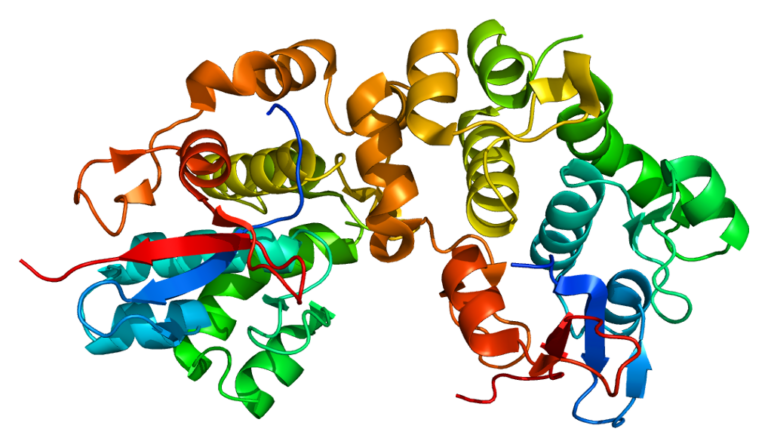
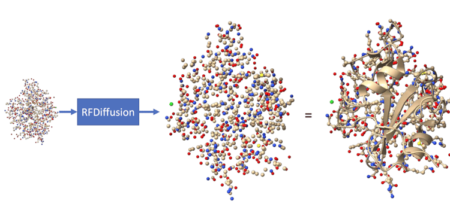
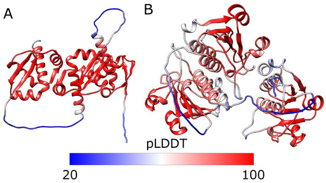
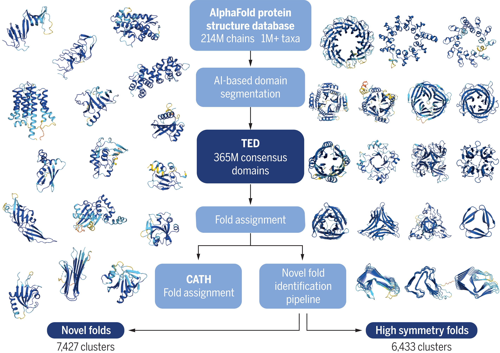
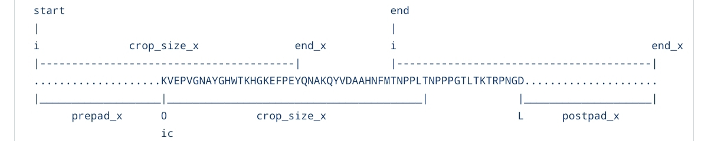

# Scope

This document should serve anyone with curiosity related to the following, as we'll cover: 

- Basic protein knowledge (no promises), meaning the field of "proteins" as a whole (with) elaboration in many topics (branches) that are of potential relation with the main topic in case you'll be delving further in that field, 
- The Protein Problem Statement(s), along with their plausible routes, 
- Core concepts of the architecture of "Alphafold 1" by DeepMind. Codebase and illustration into fitting the data to a (custom) model in separate modules, also called Machine Learning,
- And lastly what could be used to extend the idea itself of AlphaFold 1, as well as questions that have incurred to me personally while attempting to understand the architecture motivation and the interconnected nature of everything. These are thrown throughout the document as "insights" and in the (relatively) simple methodology of demonstration itself. However, it is favorable for the reader to absorb it however they like. 

At the [Engineering](#engineering) section, everything is wrapped with a "before in, and out of each component pass forward" in the favor of better comprehension of the map. There is also a [Building up from the smallest to the biggest protein component](#building-up-from-the-smallest-to-the-biggest-protein-component) that serves a bigger picture on what we'll be dealing with for later stages, as well as solidify our understanding towards each components role.
### Extension

While there will be a thorough study towards AlphaFold 2 and other architectures, some of the notes will be left as possibilities for extension for oneself to exercise the muscle of "How can we improve this?" and "What is this prototype doing inefficiently?", prompting the reader to delve into the material and realize they're potentially passing an important, guaranteed questions that are answered in later architectures (something that is built upon; AF2 and AF3 for example and others). If you have expertise in anything related here, don't forget to leverage it! 

>A prototype architecture would contain several distinct modules, similar to the idea of "making it happen and perfect it later"

The reason (we) chose AlphaFold 1 (with extension potential mentioned in [Foreword](#foreword)) and not its modern variants (AlphaFold 2's breakthrough) is due to the foundational approach towards the problem at hand. The extensions are the iterative enhancement of the inital architecture *(e.x. by introducing granularity),* hence becoming the foundation for many others. 

All intentions here lie on gaining intuition that will matter later on either on the same exact task and the elaborative extensions, or the in different disciplines (the science of adaptability). Hopefully that will serve as your "purpose" in reading the document at hand.

**Considerations:** 

- This may be published before polished, maybe even before folding completely; meaning that some text are also thoughts immediately jotted down, which will be separated from practicality with each revision.
- Some sources are also linked partially or fully, even though they're not the entire source in many of the text linking it.
- The document may be separated due to how large it is currently, but there will be attempts in making them fit to keep it holistic and central. ***Implementations will follow the Pytorch version*** of the repository [here](https://github.com/Urinx/alphafold_pytorch/tree/master) whilst adding paper evaluation and analysis if available. **This codebase is for inference purposes only.** No training happens anywhere.
- Lately, as of updating this in March 31st, the original paper published in **nature** was available through a public  access token provided by the CASP13 repository authors. Now, that token only provides a preview of the paper, giving the first page of the publishing. It's saddening how older research papers are locked behind paywalls, or even worse, how it was presumably available then later locked.

*Any feedback of any form is welcome.*
## Brevity

To avoid repeating "AlphaFold X by DeepMind"; AFX is the norm,
AminoAcid abbreviation of "AA" which is used synonymously with "residue" or "res",
along with the abbreviation of Angstroms "Å": "Ang."
Reinforcement Learning: "RL"
[ProtienDataBank](https://www.rcsb.org/#Category-deposit): "PDB"
....
Other abbreviations are made on-spot.
There are also cases for alternating between them for clarity and intuition.

## Foreword

There are many architectures that have been placed in the record for the "protein folding" problem, going with "AlphaFold" by DeepMind: 

- AlphaFold 1, which is our main topic;
  'Alphafold uses advanced biotechnology and AI to help determine ***longer*** protein structures over a ***shorter*** period'. This is the simplest algorithm (least devouring of data as well as the complexity threshold), but is the most non end-to-end "solution" (several components and "externalities"), which also lays groundwork and first-hand intuition on the problem statement.
- AlphaFold 2 and its extensions: 2.3, and multimer which emphasizes a minor role in protein-protein interactions (some improved IDRs capturing capability), but it did well in the static protein-protein complexes (see [AlphaFold | EMBL-EBI Training](https://www.ebi.ac.uk/training/online/courses/alphafold/) as well as for later purposes, [this link here](https://elearning.vib.be/courses/alphafold/lessons/the-alphafold-pipeline/topic/overview-of-the-architecture/)).
- AlphaFold 3, which is abit out of the current scope: Prediction of interactions not just of proteins, but also DNA, RNA, small molecules (ligands), ions and chemical modifications.

### Purpose

Understanding why proteins fold is important towards understanding [the problem statement](#the-problem-statement), along with the motive of this entire interaction between the many fields, mentioning some: 
- Biochemistry in the interactions between the side chains and many others,
- Bioinformatics and genetics relating to MSAs,
- Artificial intelligence; convolutions, attention, Evo-former, diffusion, etc,
- Structural Biology as in the decades-old dataset of [PDB](#pdb) and experimental methods. 
- Medicine and Biotechnology, **which are currently the primary beneficiaries** of a viable solution (which is greatly variant too). Think of it as the biggest "To-dos" after a breakthrough, using the insights derived from the other fields to:

1) **Accelerate drug discovery.** Drugs typically work by binding to specific protein targets in the body (a receptor on a cell, or an enzyme in a pathogen). So, if we know the precise 3D structure of a target protein, we can design small-molecule drugs that fit perfectly into its active site. *See [this](https://pmc.ncbi.nlm.nih.gov/articles/PMC6829626/)and [that!](https://pmc.ncbi.nlm.nih.gov/articles/PMC7121836/)*. Related to [Cancer](#cancer)
2) **Understand and treat diseases** along with predicting disease-causing mutations, as misfolded proteins are associated with a range of severe conditions *(particularly neurodegenerative like Alzheimer's, Parkinson's and Huntington's)* as well as some cancers. So by understanding how they misfold, we can design therapies to stabilize them or maybe enhance the cells natural quality control systems, or maybe even prevent the formation of the toxic aggregates that starts them all. Along with others mentioned in the [Disease prediction](#disease-prediction) section.
3) **Synthesize more proteins.** Maybe designing industrial enzymes that can break down plastic waste, creating more resilient crops, and many other. This is probably the most understated yet most potent goal.

**Summary:**
In AF1, we deal with a single protein, predicting the fold. Then, as the extension(s) occur, we deal with complexes in AF2's multimer (along with single proteins in AF2 ver. 2.2). Lastly, we expand our capabilities of the two mentioned structures, all to view the wide range of biomolecules and predict their structures also. See more below on AF2 and AF3 advancement over AF1. *Any relatively interesting detail will be added along the way.*

### The Problem Statement

The "protein folding problem" is actually three parts:

1) **The folding code** (Thermodynamic questioning). Basically all the explicit physical interaction rules that determine which folded state is "**stable**" for a given sequence.
2) **Protein structure prediction.** The static, single structures has been already determined of millions of proteins and are stored in the [AlphaFold Protein Structure Database 'AFDB'](#alphafold-protein-structure-database-afdb). This provided the blueprint by having a static map of nearly all known proteins.
3) Understanding the **physical process and mechanism** by which a protein reaches its folded state in real time (*which is largely open kinetics*); including the intermediate states, pathways, chaperone assistance and **misfolding**. Meaning that we have a goal towards understanding "why" proteins fold the way they do. This question is abit out of scope, but we do address the misfolding and many other disease-causing mutations in a later section ([Disease prediction](#disease-prediction))

With the evolutions of AlphaFold 1, the core stayed constant; you get one frozen pose with trust scores.
AlphaFold generally goes with (2) without having explicit inputs of the folding code (1) nor attempt to explain the models outputs (3). There are, however, some current case(s) of utilizing the explicit inputs of the folding code (used here in AlphaFold 1) indicated at [Outputs](#outputs), as well as later in AlphaFold 3s input. 

Regarding (3), which is slightly technical; one line possibly be examined are in the "weights" themselves regarding a machine learning interpretation. Athough it is currently a black-box when relating it to AlphaFolds complex architecture that weights aren't as easy to interpret, that is, if we attempt to understand the algorithms output (probably a first-approach is finding a heat-map of activations just like how we did in CNNs and attention as indicated in the image below, but it is more complex the deeper the architecture is).


[Source](https://johfischer.com/2022/01/27/class-activation-maps/); Linear combination of the weights and feature maps to obtain the class activation map. It is also possible to build an XAI (Interpretable AI that its internal logic is understandable) to explain the currently **epistemically opaque** weights of the complex architectures. Either ways, it is definitely out of scope and may be included in future extensions.

**In other words;**
"AlphaFold" in general predicts the final structure, *but it does not fully explain the dynamic process of **how** it gets there in a biological system*, nor does it address **the other protein formalisms highlighted at [Formalisms and evaluation](#formalisms-and-evaluation).**
### Cancer

The ***general*** things that go wrong, across all cancers:

```
1} Growth signals get stuck ON (oncogenes, like "KRAS", "EGFR")

2} Brakes get broken (tumor suppressors, like "TP53", "BRCA", "RB")

3} DNA repair fails, so mutations accumulate faster

4} The cell hides from immune surveillance

5} The cell recruits blood vessels to feed itself (called angiogenesis)

6} It spreads (called metastasis, which is the deadliest stage of cancer)
```

Every Cancer hits some combination of these. Since Cancers are usually your own cells, and the immune system is trained not to attack your own kind (preventing other disease called autoimmune, which is still present regardless), therefore, some clever workaround targets the "**neoantigens**; which are mutation-generated proteins that are foregin enough (by also enough training) to not be categorized of your own kind, hence being a drug-worthy candidate.

For decades, proteins like `KRAS` or `MYC` couldn't be targeted because we had no structure. No structure meant no rational drug design (setting aside drug-resistant cancers). AlphaFold filled in thousands of these (see also [AlphaFold Protein Structure Database 'AFDB'](#alphafold-protein-structure-database-afdb)). AlphaFold 3 extends this to predict interactions between proteins and other molecules including DNA, RNA, and small molecule ligands, **which means you can now *at least* see a binding pocket that was previously invisible.**

#### Stem cells potential (Sounds interesting for later!)

*Small note*

Experimental techniques in capturing the protein itself; as in the use of "crystallography" (the main experimental technique) and ***other*** techniques. Crystallography is an accurate way of figuring out the structure of proteins, but what about the ***other*** techniques? In the bigger picture, this is just a "branch" of many thinking streams.

>*In the next formalisms section, there is a "realization" of using some of these experimental techniques in solving the current frontiers of problems revolving around the protein.*

Another branch of thinking lies on the potential of a Machine Learning application towards these traditional techniques. So a Machine Learning algorithm to be used as an "Aid'er" or more professionally, a "Helper algorithm" in these techniques themselves. So besides a ML framework taking the core idea and digest (AF1's case, also many feature engineering), we'd have it as a secondary component that aids in the function of the core technique in question (or experiment if we're specific).

It also takes some form of delusion, too (mind you), as this is useful as a possibility opener if one is truly passionate about proteins and can open DOORS one couldn't have IMAGINED!! (yes, yes, bla bla) as long as it doesn't distract one from pursuing a single technique to their subjective creative limits, or however your working philosophy may apply.
### Formalisms and evaluation

*Some highlights in bold are of relative significance.*

So, we conclude that:

1) [Proteins are dynamic, not static](https://pmc.ncbi.nlm.nih.gov/articles/PMC11623436/): they're constantly moving, twisting, changing shape in a biological environment. So when they perform their functions, say, binding with other molecules for example, any "Alphafold" predicts one molecular photo, similar to a static shot of a protein folded. But since proteins are dynamic and aren't yet captured by any "AlphaFold" model in particular, mentioning some more of the dynamics:

    - Transition states: The specific intermediate shapes it temporarily adopts moving between stable states (example being its interpolation between "open" and "closed" form).
    - **IDRs (Intrinsically Disordered Regions)**: Some parts of proteins are naturally and inherently unstructured and flexible till they bind with their partners. This is actually crucial to interact with a wide range of client proteins. Not to be confused with IDPs which are Intrinsically Disordered Proteins. More about it below.
    - Real-time atomic fluctuations: Constant and rapid vibrations of chemical  bonds and residues.

Some experimental techniques in finding the structure of the protein itself are **NMR**, **Spectroscopy** and **FRET**, along with ***molecular dynamics simulations*** that do *DESCRIBE* the conformational changes and the continuous flexibility and movement of the proteins in their natural environments (data we can use later). All of which would be key in figuring out not just one possible conformation, but all of their potential conformations per protein (one protein or a single "polymer") or complex (multiple proteins... the computation outlook seems large). These experimental techniques methodology revolves around **stacking multiple protein structures (ensemble)** and transitioning between them from rapid atomic vibrations to slower domain rearrangements...

>... Which is somewhat related to Markov's formalisms of "Partially Observable Markov Decision Processes" in [Reinforcement learning](#reinforcement-learning), where we also (generally) stack frames when this problem arise (again, for later! And this is not the only method!)

Back at the experimental methods, there is a foreseeable future of datasets containing these just like PDB and such. Well, there is apparently a [method in combining multiple datasets](https://pmc.ncbi.nlm.nih.gov/articles/PMC3096476/), as well as developing NMR-only datasets like the one mentioned [here](https://pmc.ncbi.nlm.nih.gov/articles/PMC10767026/). The only thing we can do is wait for more NMR dataset(s) instances... unless we find out a faster technique or use what we have now (including the NMR or not).

It is also worth noting that the [protein folding process isn't a one-time event.](https://pmc.ncbi.nlm.nih.gov/articles/PMC9815721/#:~:text=While%20the%20importance%20of%20protein%20structure%20cannot,a%20typical%20protein%20adopts%20multiple%20stable%20conformations.). It is a dynamic and often reversible process. Some proteins need the help of other proteins to fold (chaperones), some unfold (denure) physiologically (like the natural process of protein refolding in muscles to allow muscles to stretch and recoil), others unfold to certain conditions. Amazing!!

As for cancers: A huge fraction of cancer-relevant proteins (p53's transactivation domain, MYC, many transcription factors) are Intrinsically Disordered (IDPs), meaning that they don't have a stable structure. They fold only when binding a partner, or they exist as dynamic ensembles. AlphaFold gives you one conformation, which for these proteins can be actively misleading. NMR and MD simulations are still the honest tools here. 

2) **The functional and interactional formalism**: which would describe the proteins activity within the broader cellular context, interacting with other molecules and their surroundings to preform specific biological functions (Protein-Protein interactions, Ligands, DNA: Which all seem to be partially or fully the target of AlphaFold multimer and Alphafold 3. They're still not following the first formalism, though). It would involve:

    - **Network dynamics:** One a proteins action influences the behavior of an entire cellular pathway or network of interacting molecules.
    - Kinetic properties: The rate and speed of biological reactions and interactions (enzymes kinetics, etc)
    - **Allosteric regulation:** The binding at one side on a protein affects the function at a different, distant site by changing the proteins shape along with its dynamics.
    - Environmental effects like solution conditions (pH, temp, salt conc) and presence of other molecules (ligands, other proteins) on the overall behavior of the protein.

There are also point mutations, which implies a **single** AminoAcid mutation that caused a structural defect. Similar to a pawn being promoted to a queen in chess that wrecks havoc on the advantage bar, which is maybe related to [Reinforcement learning](#reinforcement-learning), too. This is also similar to the Network dynamics and allosteric regulation. Point mutations are the trigger of an ensemble of cascades of events. These are the structural basis for diseases, more on that at the [Disease prediction](#disease-prediction) section.

> It is advised to re-read this section after we're done with the biology and the next implemention section. 
## A Small Biology Lesson:

For the motive, the knowledge of biology or in any other discipline is required when attempting cross-disciplinary attempted solution implementation of a foundational problem in that discipline (the 2nd protein folding problem).

Proteins are made from instructions made by the DNA, and the RNA (the messenger of DNA). It, the protein, then folds to a 3D structure to do a specific function in the body. The structure itself is destined by *a mostly deterministic process* (i.e. native conformation). 

> More on that at [PDB bias](#pdb-bias) section.


[Source](https://en.wikipedia.org/wiki/Homology_modeling); an image of the DHRS7B protein (dehydrogenase/reductase 7B) created using Ribbon diagrams and rendered with PyMOL. This is not of concern now!

The AminoAcid sequence is the linear order of amino acids in a protein chain (referred to as the backbone or the "main chain"), meaning that we're currently hitting the main component of the protein structure. Which is also the [1. Primary Structure](#1-primary-structure) of the protein 

AminoAcids (AA's) are made up of a carbon atom with a carboxyl (COOH, acidic) and an amine group (NH2, written H2N which is a base) each to the center (the carbon). The north bond being the Hydrogen on the north, **and the last bond** (south of the AA, called R group) would be either of the side chains. *Please don't mind the aforementioned pole directories*


[Source](https://www.youtube.com/watch?v=P_fHJIYENdI): Veritasium; attempting multiple different side chains, which are later binded to other AAs forming a linear chain (that is different from a side chain). In the final picture, that straight line represents a linear chain of the carbon (center of the amino acids!), each bound to a side chain [till they form a protein or become part of a complex?]. This serves significance when fidgeting with the data or a part of the larger intuition as a potential exploration area of interest. 

This random choice between different **side chains** ends up forming the 20 AA's that exist in nature, not taking into account the unknowns, and the rare AA's. They're encoded in Alphabetical names, such as "`U`" for the Selenocysteine AminoAcid (there are some not encoded with their respective starting word). The unknown one(s), or harder to distinguish between other AminoAcids are as following:

1) `B` (Difficult; may be a `D` or `N`),

2) `Z` (Difficult; may be `E` or `Q`),

3) `J` (Difficult; may be `L` or `I`) and finally:

4) `X`(Undetermined or any unknown AA. Very interesting).

Along with the rare AA's, which are the AA's no. 21 and 22 respectively:

1) `U` and 

2) `O`

Some of these are not needed in human trials, for example the `O`, found in certain archaea and bacteria. Unless there are specific needs or research to be conducted on these organisms... This information is useful in knowing what AA's we ***can*** model vs what we ***currently*** use to predict the final snapshot (we use the 20 known AminoAcids) 

You can call the 22 AA's "Proteinogenic" AminoAcids, which implies that they are used for building the protein from the sequencing and folding process. It's important to note that there are over 500 naturally occurring AminoAcids that have been identified, in which case are called "Non-proteinogenic" AminoAcids. They are beyond the scope of proteins and the alphabetical order, meaning that they do not become "proteins", but they serve other biological functions.

For the first question that came through, yes, there exists a potential of creating [newer AminoAcids](https://www.nature.com/articles/nchembio847). However, they are being researched by modifying the R group (the "legally" modifiable part). Unless you modify the core parts (COOH and NH2), in which the AA may not be recognized by the cells machinery (no longer an "AminoAcid"). 


[Source:](https://www.ml6.eu/en/blog/esm3-the-frontier-of-protein-design) Sequence determines structure then structure determines function --- and .. Oh, wait:

In this current decade, we can and are able to "create" proteins for specific functions that we dictate for a model to create a 3D protein (extremely cool I know!). They use the Proteinogenic 20 (sometimes the other two) for this, not by creating new AA's. The process is very similar to creating images using AI, Briefly; having noise at the beginning, then iteratively removing the noise to generate a new protein structure that is a "plausibly folded structure", maybe even incorporating a novel proteinogenic AminoAcid (engineered) in the diffusion process (or other parameters like symmetry specifications and length ranges). 

>Keep in mind that this is a generated backbone, and we still don't know its sequence of AAs.


[Source](https://pmc.ncbi.nlm.nih.gov/articles/PMC12467925/): An amazing article about the De novo protein design of RF diffusion. They also have an amazing table on the protein-design workflow!

Small note: It is very similar to predicting the next word in a sentence, where we iteratively remove the noise, and the model starts seeing patterns linking the text of description we gave (tokens) to its embedding space tokens. Its also similar to seeing patterns out of a seemingly redundant static noise. Nonetheless, It is deemed interesting but slightly out of scope.


[Source:](https://zontal.io/rfdiffusion-leveraging-the-power-of-ddpms-to-generate-protein-sequences-and-structures-2/) The amazing Rf diffusion!

There are more nuances to that, such as using [ProteinMPNN](https://github.com/dauparas/ProteinMPNN) to design a sequence of AAs that is most likely to adopt that specific 3D shape, then use AF2 or AF3 to verify the structure viability (sanity checking if it will fold back into the designed structure) before costly lab synthesis begins, that is, if we're attempting to create the protein. At the [AlphaFold Protein Structure Database 'AFDB'](#alphafold-protein-structure-database-afdb), there are further elaboration on diffusion as well as AF3's generative approach towards the 2nd prorein problem. 

> Psst! This model is a fine-tuned version of the RoseTTAFold structure prediction network (similar to AlphaFold)! Check out [BakersLab](https://www.bakerlab.org/2023/07/11/diffusion-model-for-protein-design/)!! 

[More on that is a potential for integration in this article]
### Building up from the smallest to the biggest protein component 

The levels of protein structure are as follows:
#### 1. Primary Structure

These are the most fundamental level of "structure", which refers to the linear sequence of AminoAcid themselves. The covalent bonds (Called "peptide bonds" here, linking an AA with the other... sometimes disulfide) are keeping them intact (more on that below). Contrary (opposite) to the interactions other than that, which are to be considered "absent" (not affecting) within the primary structures stability and integrity under stress. 


[Source](https://www.genome.gov/genetics-glossary/Amino-Acids); The AminoAcid Chain

There are also conformational freedom, which are done by the partial double-bond, which are also called "trans-conformation" of the peptide bond between two AA's... and its strength is somewhat between single and fully double bonds. What matters here is that the angle is nearly always fixed at 180 between only two AA's, conveying a planar structure. So the bond has the proteins on a "strong approximation" set of an absolute physical constant angle called 𝜔 (omega). 

We may need [**only the AminoAcid sequences as a "guide manual"**](https://en.wikipedia.org/wiki/Protein_folding) in the folding process, which is due to the mass-feeding of the data to the target model (in which it earns the intuition and pattern-recognition from thousands of samples). This proved to work in the case of OpenAIs GPT-3 and many other LLMS when scaling complexity and data, till [reaching a certain plateau](https://artificialcorner.com/p/gpt-5-may-be-proof-that-scaling-alone) that requires a redirection to innovating newer architectures or maybe re-framing the current use of what we have. This is highlighted as the "information bottleneck".
#### 2. Secondary Structure:

These are **alpha helices** and **beta sheets**, which are defined by specific, repeating patterns of . The secondary structure of a protein is related to a type of feature-in-interest (in the note below) more than the primary structure.

>The Carbon (C𝛼) backbone are bonded with NH2 (single bonds, flexible) and have an angle, **which are called Phi ϕ torsion angles**, while the Carbon (C𝛼) and COOH bond angles are **called Psi 𝜓 torsion angles.**

SS is defined by specific, repeating patterns of the PHI/PSI angles along the backbone of the polypeptide chain. The values of these angles determine the overall conformation of the backbone in a specific region, thereby, it dictates whether that region forms a helix, a sheet, or a random coil.


[Source](https://chem.libretexts.org/Bookshelves/Organic_Chemistry/Organic_Chemistry_III_%28Morsch_et_al.%29/26%3A_Amino_Acids_Peptides_and_Proteins/26.10%3A_Protein_Structure): The main chain, called the Cα coordinates (left), as well as the side chains (right)

 
[Source;]() The "Ramachandran plots" are plots defining the *sterically allowed* ***conformations*** of the PSI/PHI angles so the atoms wont go crashing on each other. Helpful in limiting the possible conformations, maybe better early on as an initialization technique or creating strict bins. 
#### 3. Tertiary structure

Since the tertiary structure is the overall, complex 3D shape of a single polypeptide chain (and the one AF1 attempted to "solve"), which includes all the secondary structure elements and how they fold; **there is a conclusion that the proteins tertiary structure (the 3D fold) is determined by the interactions between the AA side chains (R group) and between other side chains with other!** Their interactions (more on interactions below) cause the stabilization of the 3D shape. There is also an influence between side chains and the atoms of the peptide backbone.
#### 4. Quaternary Structure

For the last structure, there is Quaternary protein structure (complexes), which has proteins consisting of the (1), (2), (3) structures, called now "subunits" (two or more proteins in the entire complex) that we mentioned.

**Summary:**


[Source:](https://www.khanacademy.org/science/biology/macromolecules/proteins-and-amino-acids/a/orders-of-protein-structure) Honestly, an amazing demonstration for the bigger picture view, for it to potentially have some terminologies in brackets like pleated sheets should be "Beta Pleated sheets" but that's only to aid in learning structure terminology and avoiding unnecessary complications.

> A very important part of structure are [Domains in proteins](#domains-in-proteins), which are independently folding parts and are explained later for tandem with future Multiple Sequence Alignment. 
#### The predictors of the tertiary structure

In our static protein structure prediction problem, we can safely say that the strongest predictors are their primary structure, **the sequences**. It is a deterministic way of finding out the final 3D structures, even though sometimes some proteins have different AA's and still incur some attributes that of a different AA sequence (see [2 MSAs homologs](#2-msas-homologs)). Their properties also matter:

1) The order of AA's: Which is the primary structure predictor. This contains all the information needed for the protein to spontaneously fond into its correct, functional 3D shape.

2) The second property and it is the *types* of AAs. 

3) The third property is the number of AA's, which defines the overall length of the chain. This is relevant because it defines the size and complexity of the resulting structure. The longer the chain the more opportunities it has for folding.

These two properties together (types of AA and their order) are crucial as they dictate which interactions can occur. As stated on [The Problem Statement](#the-problem-statement), the folding code (1) are the explicit rules of folding **in one of the two interactions**; the predominant ***non-covalent interaction(s)***: hydrophobic effects, H-bonds, van der Waals forces and salt (ionic bonds) bridges. They solve the core question of "Why is this folded state energetically favored, and not the other states?"


[Source](https://commons.wikimedia.org/wiki/File:Accessible_surface.svg#/media/File:Accessible_surface.svg): Van der Waals, as well as Solvent Accessible Surface Area (more on SASA/ASA at the [B. Auxiliary/Intermediate Loss Functions](#b-auxiliaryintermediate-loss-functions))

They are weak individually but act together (thousands of them!) to stabilize the protein. Their drawbacks is that how easily they're disrupted from heat or changes in ph. We also assume no extraordinary environmental conditions as mentioned in [PDB bias](#pdb-bias).

The other type of interaction is the ***covalent interaction***: disulfide bridges (or bonds). These bonds are stronger than the former mentioned non-covalent bonds. There is already a foreseeable potential of its aid in the [Disease prediction](#disease-prediction) section, maybe also a previous section that you can connect to.

These interactions as a whole put us on the importance of the [2) MSA](#2-msa). Which has one sequence far away from the other (in the same primary structure chain, speaking of a single protein) that are also touching [Important finding!]

>The interactions were *not* explicitly fed to the algorithm as it implicitly learned them. Maybe that's for the best, as sometimes exploration ([Reinforcement learning](#reinforcement-learning)) is more important than being given foundational knowledge. It is learned implicitly through the scaling of the network and data. If the algorithm doesn't converge

One other predictor of protein structure are Multiple Sequence Alignments [2. MSAs homologs](#2-msas-homologs) which are explained later and is the main signal used in AlphaFold 1.

Keep in mind that we have protein (or related) "lessons" also scattered around the document, as some information will be pulled when required.

Now, let us us demonstrate the popular dataset at hand:

## PDB

The central Protein Data Bank has explicit [entries](https://www.ebi.ac.uk/training/online/courses/exploring-pdb-entry/) of:

1) **The 3D atomic coordinates** (fundamental target data for later) which allows the visualization of the final static snapshot of the folded protein. This is a very precise X, Y and Z location of every non-hydrogen atom (**sometimes** ( * ) hydrogen) in the resolved structure.


[Source:]() Fun fact, this data structure in PDB has changed in ID's for 5 years consecutively. I believe from 4 to 5 to 12, but it's a great reminder that datasets do change.

2) Bound Ligands/Molecules which are coordinates of water, ions (zinc, magnesium), drug molecules that are bound in the structure. They are non-proteins that were co-crystallized or co-solved with the proteins. May be useful in the deeper aspect of [The Problem Statement](#the-problem-statement)


[Source:](https://www.researchgate.net/figure/a-Scheme-of-the-ligand-binding-of-a-small-molecule-to-the-target-proteins-b-Binding_fig1_285783261) Amazing "big picture" image illustrating ligands and molecules interactions

3) Multiple conformations (limited): NMR ensembles are models, meaning a small set of 10-20 representative coordinate sets
4) Experimental metadata:

    - Experimentation methodology: X-ray crystallography (traditional, accounting for ~87% of all the PDB archive), NMR, and finally Cryo-em (Cryo is advancing rapidly!). These are the big three used in PDB. There are still other techniques used like SAXS, CD and other. Maybe also the **experimental conditions** that are crucial as indicated in the [Formalisms and evaluation](#formalisms-and-evaluation) section
    - **The resolution or quality of the data,** where higher resolution indicate a better "zooming in" the protein to identify the structure and its fine details. The higher the (Ang.), the lower resolution that we get. Similar to a pixelated photo, you can see the backbone, but not the individual parts like atoms and side chains and the opposite applies here.
    - R-factor and R-free, B-factors, clash score, RSR and other. Check out [the amazing documentation BY PDB assessing the quality linked here](https://www.rcsb.org/docs/general-help/assessing-the-quality-of-3d-structures#:~:text=mismatches%20between%20the%20model%20and%20the%20experimental,to%20errors%20in%20model%20building%20and/or%20refinement.)
    - Source organism, and other data like sample preparation and refinement statistics.

> ( * ) Hydrogen being "sometimes" in the data is due to its weak signal and experimental limitations. They can be also too predictable, making it "wiser" to omit them (increasing computational efficiency) even though they are the crucial for protein folding and function.

The potential of application (of the quality and metadata) relies on their ability to be ingested to the Neural Network (NN) and to reduce their weight, **as the less accurate the experimentally decided structure is the lower value we have on its potency to the predictions outputted.** Surface side chains, disordered regions and flexible loops are other examples on weak or no experimental data due to their inherent motion or disorder in the experiment. They can be useful, however, if we were trying to innovate something here...

*Most of the data used in AF1 should be derived.*

> Research: Changing to a more granular prediction 

Remember the second formalism of proteins, the one about environments?
We have data from the infamous [ProtienDataBank](https://www.rcsb.org/#Category-deposit) (PDB), in which the experiments in it (commonly) gotten from the X-ray crystallography has an environment **which probably misses some important details:**

 - Non-physiological PH or salt conc. (These were used to force crystallization)
 - Low temperatures (almost always, unless specialized experiments. Room temperature is increasingly becoming the norm here)
 - Absence of binding partners or cofactors that normally are present
 - Dehydration, etc

### PDB bias

*This follows the aforementioned [Formalisms and evaluation](#formalisms-and-evaluation). It also uses "AF1" (our target understanding algorithm) to demonstrate the use of PDB. Targeting the missed second formalism as well as other notions of an "accurate protein structure prediction"

Protein folding, as a problem statement in itself is both a deterministic (somewhat NOT random) and stochastic process (somewhat random). Its determinism comes from the AA's specific sequence, as ***most*** proteins with the exact same AA sequence have obviously the same shapes (scientifically, the "lowest-energy state"), while the environmental factors and random thermal motions (pH, ions, ligands, etc) add the stochastic elements in the folding process. 

***AF1 uses the deterministic side of the equation.*** In other words, it assumes a stable environment and specific laboratory conditions. At the worst case scenario, there there will be misfolding, and all the bad things could happen if a protein is introduced to an extreme environment.

At every other scenario, even a fever of `39c` or so, there is little to no effect to the protein and stochasticity which implies a more deterministic outlook that we have currently have (sufficient average determinism). Only after that point, though, does it compromise proteins and its folding process, and the chances increase from thereon.

The uncertainty in AF1 predictions, where even a `1-2A` difference is considered uncertain, is much larger than a couple Celsius shift in temperature. Though marginal activity may drop but still has no significant effect, maybe even more "flexible" and within biological tolerance (The effects that I'm currently aware of. DO NOT solidify that as a foundational barrier to your brain).

Therefore, unless we're making protein fold in "possible" scenarios, **this may not matter as much.** This might affect our abilities in understanding and solving some diseases [Disease prediction](#disease-prediction), it's great to keep this in mind, though, as maybe there would exist a fever model or a very mythical application in which I do not endorse, maybe a certain environment-based protein folding process in the future that adds on to that layer, or something according to your liking.

**And also to note** that there are other databases (DBs) that were used by AF1, such as UniProt (big brain), Uniclust (targeted brain), BigFantasticDatabase (BFD) and MGnify. Some of which DBs are related to the protein itself and its sequence and such, and the other may be related to the [2. MSAs homologs](#2-msas-homologs). 
#### AlphaFold Protein Structure Database 'AFDB':

Now we know about the Protein Data Bank (PDB) and many other available Databases to tackle the 2nd protein folding problem, it's great to know that the predictions utilizing the PDB database (the one we're building for example) have their own database of predictions. There are over 200 million "highly accurate" protein structure predictions from AlphaFold 2. 

As the accuracy metric, we have the confidence scores of the fold predicted compared to the structure from the PDB called per-residue confidence score (pLDDT)


[Source;](https://www.mdpi.com/1420-3049/28/22/7462) Red shows high confidence areas while blue indicating a lower confidence score (which should be over ≥ 90 to be considered "Very high confidence"). They were used as primary losses later in AF2

The lower we go (blue), the more likely we reach a "flexible" protein zone of prediction, meaning that the algorithm cannot predict it well (or it doesn't have the information that's "satisfactory" level to model these, or maybe they're just random regions or coils "IDRs").

[Source](https://www.science.org/doi/10.1126/science.adq4946): One of many research papers utilization of the AFDB and the [Domains in proteins](#domains-in-proteins)

*Small general theory lesson*

It is also to be noted that the reliance on predictions to make predictions (or in other words relying on theories to make a theory) isn't in essence a bad thing, as ***maybe*** theory (1) may be "right" (proved or assumed from the conclusions it produces), making all the other theories that is built upon theory (1) plausible.
### Reinforcement learning


Source: Reinforcement Learning by Maxim Lapan (Cool book), demonstrating efficient parallelism training of algorithms

The insight is mainly raw intuition and fitting something seemingly impractical, as it was mainly formed because reinforcement learning (RL) has both *stochasticity* (at the beginning with possible environmental changes), and also a *deterministic* phase in later stages in some foundational algorithms (by decreasing the epsilon-greedy parameter to exploit knowledge gathered earlier from exploration. Similar to inference after training).  

But that's only intuition. In an idea of granular application, maybe there is potential; Like increasing stochasticity the more temperature we rise in the folding process, and subsequently decrease the determinism factor in it.

Although it is apparent that this is a similarity remark in processes of the two (proteins nature of folding and RL training processes), which doesn't provide actual "insights", unless..

One other way of thinking is that if we think about it as a non-originator algorithm (not being the core algorithm), RL may shine in refining coarse predictions from AF1 itself, that part that AF1 missed which is the stochastic parts, in which we have:

- **State:** Current structure from AlphaFold, as well as the MSA and probably every data ingested at the Next section, 
- **Action:** Local perturbation (adjust a region), 
- **Reward:** Energy decrease + structural validity. The reward signal maybe is the challenging part, as some are sparse and some are goal-based rewards (which require knowing the answer), 
- **Policy:** Learn to make smart local adjustments that respect physics!

Maybe also if we even incorporate video output to the pipeline, for the algorithms to have a chance in modeling the complexities and incorporate a game just similar to [Foldit](https://en.wikipedia.org/wiki/Foldit) (molecular dynamics intact and have a state), then, we can probably think about their practical extension and application, along with adding players back into the field... or any other field, *really*.

# Implementation and Intuition:
## Bigger Picture

There is an input, and there is an output —  to and out of the neural network (Stage 1). Then, there is a Structural Construction stage, where we utilize physics-based "**constraints**" on all the inputs from stage 1 to get the final 3D coordinates (Stage 2). 

The feature pipeline is one of the most important aspects for engineering, but for now, the components that are modeling the constraints for the second module are highlighted. They're the loss functions for the Neural Network that also require intuition on biology to see their ***general potential usefulness*** as mentioned in the introduction of [A Small Biology Lesson](#a-small-biology-lesson). 

Then, optionally another stage, we attempt to reduce the energy to its lowest possible energy state (of course, based on what the model can handle with its current complexity!) using also a physics-based energy minimization. This third stage (optional) uses the 2nd stage as input and has an output of a refined 3D coordinates implying a yay!-level-lower-energy state of the protein predicted.

It's somewhat plausible that there is a way to skip some parts working by using physics to learn the lowest-energy state (the folding process) and go pure pattern recognition from MSA's and structural data. This is a possibility to note. (Nevermind, this is AlphaFold2-RAVE with others! and nothing is invented here)

 Physics modules are still essential, though! One use case are for the drug binding that respect the physics aspect, e.x AutoDock, and others are for protein dynamics (data collection), and some other for validation (AMBER force-field-min) because machine learning in general *can* hallucinate structures (in AF2 case) or provide inaccurate constraints from the neural network (or general clashes).
 
> It's always useful to see the potential application of physics, even if it is "outdated". Most likely, both components can be paired in a way. This applies to any field. 

AF1 didn't represent the minimum complexity of modeling proteins, it achieved a rather significant advancement than the simple **template-based modeling** (same protein == same structure) and Ab initio *which uses physics energy functions to simulate folding* (in which also rarely worked well, but hey, it may potentially have a comeback or at least similar to its intuition somewhere).

*Maybe all it needed was essentials and fewer complexity.*
## Inputs


[Source](https://www.nature.com/articles/s41586-019-1923-7.epdf?author_access_token=Z_KaZKDqtKzbE7Wd5HtwI9RgN0jAjWel9jnR3ZoTv0MCcgAwHMgRx9mvLjNQdB2TlQQaa7l420UCtGo8vYQ39gg8lFWR9mAZtvsN_1PrccXfIbc6e-tGSgazNL_XdtQzn1PHfy21qdcxV7Pw-k3htw%3D%3D): The AlphaFold 1 paper. This image should make sense by the end of this section

The main data at hand;
### 1. AA sequence

Three letter words; `ALA` for Alanine, `CYS` for Cysteine, `ASP` for Aspartic Acid, etc) that we sometimes have to convert to their standard one-letter codes that we mentioned in [A Small Biology Lesson](#a-small-biology-lesson). They're often packaged in a FASTA file and AF1's cannot ingest it without the help of the MSA, unlike AF2's sequence-only mode. 

"`MKTAYIAKQRPGLV`" an example. They can be subunits as in Quaternary structures (hemoglobin, which has 4 subunits of these sequences) or a simple sequence of a single string of protein AA's. These are not used raw, and is used to search for MSA (next section).
### 2. MSAs homologs


[Source; Veritasium](https://www.youtube.com/watch?v=P_fHJIYENdI); The Multiple Sequence Alignment. The term "homology" is an umberrla term for both "orthologs" and "paralogs". 

In simple terms, we see if two AminoAcids stay conserved across *different* species (orthologs) and other AA that may have co-evolved. Meaning that they mutate together, which often signals that they're often close in physical contact when folded to 3D structure. This is crucial input to the NN. Minding the fact that this is not any p

**Take a single protein for example**, we'll call it hemoglobin as a scientific name over "blood" (Bear with me for the simplification):

"`MKTAYIAKQRPGLV`"

Here, we say that "`M`" and "`T`" are pretty close in that 1D sequence (the string of characters you see here), it may be temping to say they are close to each other in 3D. but proteins can surprise you with how far they actually are. For this specific case, these are called structural significance. As in, `M` and `T` maybe are not close in 3D space, but they are important for the structure itself. Don't mix the two ideas.

Now, let us introduce the meaning of "MSA" and how useful can it be by its amazing two aiding intuition: Co-evolution and General Conservation.

*Imagine the same protein in 1,000 different species:* 

```
Human: MKTAYIAKQRPGLV... 
Chimp: MKTAYIAKQRPGLV... (99% identical) 
Mouse: MKTAYISKQRPGLV... (changed position 7: A→S) 
Fish: MKTVYISKERPGLV... (changed positions 4,7,9) 
Bacteria: MKTVFISQERPKLV... (many changes) 

Pattern: some other organisms have similar AA sequences to a protein in question
```

Say that it was concluded that positions 7 and 150 are in contact in 3D (We x'rayed it); If position 7 changed from AminoAcid `A` to  AminoAcid `S`, THEN consequently, position 150 (in which it is too far to be written sequentially here) also changes to maintain interaction (Which is called: Co-Evolution!) This is the point of MSA and homologs in general, which is to find this interaction and conserved regions by arranging related protein sequences). There are also ***types*** of correlations between residues: 

**Direct** vs **indirect** correlation. If these two residues evolve together, then so often they are in contact or are physically close in the 3D space. The issue arises when two residues "seem" evolving together; after (1) one residue mutates, a third (3) (third party) residue also mutates, due to the second residue (2), in which we think that (1) and (3) are directly correlated and touching. *Direct correlation is apparently a synonymous word with "contact". I hope it has more depth into it*

> "DCA" (direct coupling analysis), a tool to be used later, solves this issue. Opposed to the *traditional* mutual information (MI) technique that will also be used regardless. 
#### How "Identical" should we aim for?

As with this scope, it may seem vague as we would be optimally utilizing any form of similarity between homologs toward predicting structures. In the case with AF1, they utilized both techniques as to utilize even the weaker links between homologs (see [Remote or distant homologs](#remote-or-distant-homologs) and [Orphan proteins](#orphan-proteins)) either ways, **they shouldn't be a constraint** if we're looking for that along some smart engineering designs.

30-50%< match between the AA in question and its homolog(s), as a rule of thumb towards its viability, as to use in template-based matching till a 80% match. Else, they'll be considered "[Remote or distant homologs](#remote-or-distant-homologs)", even worse for the case of the reliant AF1, one of the [Orphan proteins](#orphan-proteins).
##### Remote or distant homologs

There are certain proteins that look similar to certain others in their 3D structure, while oftentimes having also similar functions, all due to having descended from a common ancestor (being evolutionary related). But at the same time, they have a VERY LOW AminoAcid sequence-sequence similarity, maybe even undetectable because of the huge evolutionary time. The "metric" here is close to a <30% match and below till 20% between the given AA sequence and the homolog.

It's important to note that, despite their vast differences in the AA sequence, **there can be a similar structure AND function between the homolog and the AA sequence!** Because that fold works, even if the AA seq are different. Nature says; "if it ain't broke, don't fix it".

Here, we can be skeptical, though. As there will be different structural details (obviously, as the AA sequence is the primary driver of its structure as we previously mentioned [1. Primary Structure](#1-primary-structure))

>The use cases may be that if we had a new protein sequence without knowing their functions, we could search for a possible remote homolog to infer the functions.

Therefore, we can conclude that we have two input features;
the [1. AA sequence](#1-aa-sequence), and 
the [2. MSAs homologs](#2-msas-homologs)
##### Orphan proteins

These are proteins without homologs (No MSA depth, in other words, has no neighbors; similar to the **Tetherin** in vertebrates). Here, the sequence itself becomes the only input available for the NN, alongside the meaning that AF1 gets zero co-evolutionary information. We model the given AA sequences using "Free-modeling" (FM).

Orphan proteins may be attributed to the recent study of the *Microproteome*, where proteins of 100 or lower AminoAcids do exist and have a function (they thought it didn't exist). Since they were ignored, there were not annotation intentions before that time, hence no abundant homologous sequences. 

There are other algorithms utilizing language models like "RGN2" and "ESMFOLD" and "trRosettaX-Single" to predict structures. One may think of combining the two, or utilizing the other when there are no homologs available, also the idea of **generating Synthetic MSAs** (beneficial for Alphafold and its variants) like "(GhostFold)" and such. So anything out of MSAs is therefore definitely out of AF1 (unless you're seeing something that haven't seen), since it relies heavily on MSA's and orphan proteins aren't ideal. Planning on adding in this article many architectural combinations and / or tools in mitigating the dozen concerns, including the [Formalisms and evaluation](#formalisms-and-evaluation). 
#### Domains in proteins

A protein like TITIN is 34,000 amino acids long. It has about 300 of the title; ***domains***. Each domain folds independently, has its own evolutionary history, its own function, its own set of homologs. Treating it as one thing "i.e searching MSA's using whole proteins" isn't very wise. For that MSA search is meaningless, because you get noise searching for homologs when including the entire protein and not a domain. 

`TITIN`:
```
[domain1]  [domain2]  [domain3]...[domain300]
                        
Example domain respectively: 

 kinase     ig-fold    PEVK repeat
 domain     domain      domain
```
 
 Each domain has completely different evolutionary history, MSA, co-evolution signal and structural constraints than other domains. There are also two types of domain search (MSA): the domain search of ***orthologs*** (different organisms, diverged due to oragnsim speciation) are the dominant methodology for MSA search, while the search of ***paralogs*** (same organism domain, where the sequence is diverged due to gene duplication) is a weaker signal than the orthologs due to it being mostly surface-level mutations (functional) that don't convey much about the structure of the domain. 
## Loss functions

Loss functions are the predicted value or representation and comparing it to the actual representation that a neural network or a machine learning algorithm should have predicted (Ground-truth labels). In other words, the difference (minus sign here) between the predicted value and its actual value. **The folding code (rules and interactions) are learned here.** The loss function guides the massive number of weights to learn the correct patterns, **meaning that the NN optimizes for structural accuracy,** implicitly learning the folding code that is mentioned at the [The Problem Statement](#the-problem-statement).

Adding onto that, at the [Second stage](#stage-two), there will be no "optimizing weights", just something that's similar to it in the wording, called "Energy minimization". So most of the following loss functions are used strictly in the NN process.

The loss function outlook is just as large as AF1 multi-task learning technique. One neural network is trained on multiple outputs, as well as the hope that the "shared structure" improves performance. Because, having a shared structure of 

The loss functions are split between two groups: 
[A. Primary Loss Function](#a-primary-loss-function): Distogram
[B. Auxiliary/Intermediate Loss Functions](#b-auxiliaryintermediate-loss-functions):  Torsion Angle, The Secondary Structure, SASA
### A. Primary Loss Function

#### The True Distogram

Also called "**Inter-residue distances**"; They are the distances between two residues (A pair of AAs). Here, we compare the distance between each AA and another in the **same protein** at a 3D space. They're often categorized by bins as will be mentioned in [Engineering](#engineering). The Distograms aren't provided plainly from PDB, but they are DERIVED from the "Atomic Coordinates" (more on Atomic Coordinate are at the [Final Output; from the previous stage](#final-output-from-the-previous-stage), and to find more about derivations and some speculation, head to [Stage one NN's four heads outputs four variables](#stage-one-nns-four-heads-outputs-four-variables)).


[Source](https://discussions.unity.com/t/use-case-distance-matrix-3d-protein-biology/308143); What the usual distogram looks like

*Example (distogram) illustration between five Amino Acids in the same protein:*

```
    M    S    V    T    Q 
M  0    3.8   7.2  12.1  15.3 
S  3.8   0    4.1   8.9  14.2 
V  7.2   4.1   0   5.3   10.1 
T  12.1  8.9   5.3   0    4.8 
Q  15.3  14.2  10.1 4.8   0
```

So they're distances between pairs of AminoAcids. You can see that the distance between AA "`M`" and itself is zero on the top left corner (similar to the distance between you and yourself), while other pairs facing the same pattern. There is also a pattern hinted by a diagonal line (as you've also seen in the image above)

*You can optionally switch them to Binary Contact Maps when hit a range:*

```
1 = if distance is below 8Ang
0 = Above 8Ang
```

*Example Illustration of Binary Contact Maps:*   

```
    M S V T Q   
M   0 1 0 0 0   
S   1 0 1 0 0  
V   0 1 0 1 0   
T   0 0 1 0 1   
Q   0 0 0 1 0
```

###### Motive of the distogram:

The idea on choosing the distogram is due to **its similar properties with the MSA:**

Compared to our other loss functions, this is only **global information,** meaning that it involves residue (AA) **pair interactions** (Contacts, folding topology, domain packing) far apart in sequence: Res20 with Res150 as explained in the previous MSA section. As for the **local information,** handled by mainly our PHI/PSI torison angles as well as the secondary structure.

In AlphaFold 1, researchers turned protein data into that distogram (a 2D grid showing the distance between every pair of amino acids). They treated this distance map **_exactly like an image_** because they assumed that if amino acid `A` is near `B`, and `B` is near `C`, there’s a local "shape" to be found. Though, this was a *constraint*, which was alleviated using AF2 (the Transformer architecture). A great thought here is how simple this is, and how forgetful one can be of such properties when indulged into their technicalities. Research is great if the part of simplicity and core information is used to align with many other and then later form intuition. 

>*"What can the NN conclude though?!"*

- Some AminoAcid pairs are far apart in 1D, but are close in space. Then, this is possibly a folding interaction (which are exactly what the [2 MSAs homologs](#2-msas-homologs) encode)
- For other auxiliary losses, Close residues (`3-4 Å`)? Then a match in helix shapes, Variable distances then suspects a loop form (both are secondary structure)
- Other conclusions and (on how) it occurs are by the stacking of many layers at the Neural Network. Many other features that are statistics-based; like the residues own information (speaking of one-dimensional data), and then the residues pair relationship (speaking of two-dimensional data). This is combined with the other biological cues, which are the loss functions. Statistics is emphasized more at the engineering section. 

The NN can conclude the characteristics of a given sequence and distance map and use the pattern it found to predict the distance maps and others, and it keeps iterating on that till it has finer predictions (with emphasis on bias and variance).

### B. Auxiliary/Intermediate Loss Functions

They are the loss functions that aid learning early on (Scaffolding), as the global information is known from accumulative local information.
#### 1. True Torsion Angles, PHI/PSI
 
 It uses the backbone and side-chain dihedral angles. Basically the rotational **degrees of freedom** (the intuition) that define the SS (indirectly in practice) of Alpha and beta sheets! They were learned, and they provided knowledge on how "much" the backbone could physically bend and twist on the Ram-plots previously defined. Torsion Angles are compromised of **Phi** and **Psi**. (See [2. Secondary Structure](#2-secondary-structure))


Source: https://www.researchgate.net/figure/Dihedral-angles-in-glutamate-Dihedral-angles-are-the-main-degrees-of-freedom-for-the_fig4_44651362

#### 2. **True SecondaryStructure (SS) profile**


[Source](https://www.researchgate.net/figure/D-structure-of-ligand-free-sterol-carrier-protein-2-like-2-from-Aedes-aegypti-Protein_fig6_326220346): The Secondary Structure of a Protein (see the previous [2. Secondary Structure](#2-secondary-structure))

Although they have their own head as output (just as the other loss functions), they're often derived from the PHI and PSI ranges( * ). *These help learn the local geometry as stated before.* It outputs a probability of each position being either:
    - `H` (helix: spiral-looking)
    - `E` (strand-looking)
    - `C` (coil: strand but in an unstructured form)

#### 3. **True Solvent Accessibility SASA/ASA**

The actual amount of surface area of each residue exposed to the surrounding solvent. Binding sites are likely to have High SASA, **but not vice versa**. Meaning that an exposed part of a protein may likely be a binding site for whatever the purpose of the protein in question is to do [Cut off]. This helps the NN learn about hydrophobic core formation, along with loop regions. **Scientists check if hydrophobic residues are properly "buried" away from the solvent as expected in a stable fold.** The SASA is found by the rolling-sphere algorithm

By adding "True" in these loss functions, we're emphasizing the current stage in question *(i.e: Training, these are given ground truth derived data, as they won't be available in inference).* Adding onto that, the two loss functions SASA and SS will not be used in the later stages, but it is useful to attempt and find some form of use for them downstream.

These auxiliary losses aid the NN to learn, **but remember, we don't specifically use them in other than the neural network to aid learning. An exception is the PSI and PHI angles that help in later stages.*** For the auxiliary losses, use these as additional training signal during training with a very marginal weight provided *(not affecting the outputs as much as other loss functions like Distance Matrices and the Angle Matrices, as they're with a priority here).*
## Outputs:

> Note: AlphaFold 1 produced several outputs that described the proteins conformation in a 2D, pairwise representation which are essentially structural features and local geometry information.

### Stage one: NN's four heads outputs four variables

...they're also probability distributions, ***not single values,*** using the name of all the four aforementioned loss functions; Torsion angles, SS, SASA, and the Distogram.

*The loss functions are NOT the same as "output heads", keep that in mind.* 

Here are "Shared latent representation" of a single NN type *(A Conv-net, which are used not only for images as some practitioners assume. More on that later)*, and the probability distributions are the outputs of the four heads from that shared latent space of the neural network (Emphasizing efficiency).

>AF1 is not predicting structure.  
  It is predicting ***constraints***, using evolution as a sensor. The final stage is geometry constructed using the provided constraints.

**The network basically is heading toward the distogram, as AF1 authors, put more weight on it than any other head.*** All the other heads are "regularizes" that shape the loss landscape and make learning easier early on for that distogram head (priority). In practice, **you can add more heads as desired. E.x;** contacts, hydrogen bonds, disorder, interface probabilities. But, if these novel heads won't add a new learning signal *(other than the four we currently have)*, then they won't improve our target: The distogram. Worse yet, they will make training performance degrade (information bottleneck theory).

The paper authors tested *ablations* (what if we removed component X? Any changes in accuracy? Any changes in component Y's behavior?), and by removing the distogram the model had collapsed (a head of significance), whilst other components shown lesser performance drops.

>( * ) Note: The SS are inferred/derived from the PHI and PSI angles themselves using other algorithms like DSSP logic to assign H/E/C by analyzing angles of the distance maps all in all after the NN prediction. If we wanted to know and predict the SS before the model outputs a 3D structure, we use the torsion angles and ingest it to a "PSIPRED" or a "S4PRED" to get a prediction. Whichever fits the speed/accuracy goal respectively. 

**A Question I had, now answered:**
*Information content separation from training signal:*

**In theory:** SS can be **"inferred/derived"** from φ/ψ (PHI/PSI torsion angles that were outputted), so it's a ground truth label from the predictions themselves, which fits the provided PHI/PSI that the model predicted. So why do we even predict the SS in a different head? Isn't that computational overhead?

The issue with "inferring", for multiple reasons;

1) Is that "inferring" itself doesn't have **gradients** (i.e: the neural network doesn't "learn" from inferring). The Auxiliary heads we have are not about correctness, but they are about ***conditioning the geometry of the representation space*** (Machine Learning). 
- So "infer-able" means to be able to compute something after the fact (output)
- As for "supervisable", it is able to provide gradients during training, which shapes learning

Using ML terms, in the case of the "inferring" route, the NN algorithm can reach the same solution, but SGD **has no reason to walk there efficiently** 
(*Stochastic Gradient Descent, it is an optimizer of any loss function. More on that are later at the engineering section)*.

2) Again, the head(s) output a probability distribution of the PHI/PSI angles. Would it be wise and derive all of the probable values that we get? Well that means we can add as much outputs as we need, but there has to be a loss that guides it in a way that it knows that it does its thing (prediction) correctly; hence the "Supervised learning" term comes through.

 >"What if we switch to a single value output only for the PHI/PSI head?"

Well, to infer the SS, we still need to compute the X Y Z coordinates and such which is the output found and gotten from the second stage (next stage).

3) The real computational overhead is comparable and actually, is more from the act of inferring itself, not from the "extra" outputs. 

> in (1), It's almost similar to Reinforcement Learning when it is trained to play chess and we hand out the game rules to make training faster and less noisy at the start of training, avoiding the "reinvention of the wheel". However, it also puts a limit in it's exploration early on (which sometimes put non-creative assumptions risk that is early on training, hereby making the NN learn quickly in exchange to having "foundational assumptions").
> See the [video here](https://www.youtube.com/watch?v=to-lHJfK4pw&list=PLtBw6njQRU-rwp5__7C0oIVt26ZgjG9NI&index=5)

Insight: Sub-sampling and templates, varying random seeds to the MSA to output multiple proteins and conformations (black-box as salt alternative). If you needed uncertainty quantification or constraints beyond just distances (angle and excluded volumes) or maybe you have a noisy or incomplete distance map(s). Modifying the MSA itself seems core. There are potentials of having an NN here, too. Although in AF2, the geometry formation (the next stage where we construct the 3D coordinates) occurs inside a neural network, not away from it as with the case of AF1. Although it seems like in AF2 the [Cut off]

### Stage two

Then we take both outputs (Distograms and Angle Matrices), by constructing the full 3D atomic coordinates using either options:

1) Pure Maths (MDS or similar tools) without learning.
2) A blend of physics and mathematics: which is different from a traditional energy function, as it directly "**learns**" from data and principles from physics (Van der Waals forces, and all the other interactions covalent and non-covalent interactions taken into account as constraints), instead of using a less-sophisticated method like MDS. This ensured that the resulting structure was physically realistic, too, also is the approach used by AF1!

*The PHI/PSI angles are used as an initialization to the backbone geometry in this stage, while the distograms are converted to energy potential*

[More to be integrated of value initialization, as well as differing them between LeCun/GLorot and others]
### Final Output; from the previous stage


[Source](https://biosiva.50webs.org/genomics.htm): A 3D space of a protein,

"**The Atomic Coordinates**": They're the "precise" orthogonal coordinates in 3D positions (X - Y - Z) , all measured in Ångströms (which are really small!) for every atom in a proteins entirety of a tertiary (or quaternary) structure, including the backbone and side-chain atoms. I found it appeasing to introduce them here, as they are the outputs after-all and is the "main" PDB data we're given to think with. We use the PDB ground truth labels indirectly by deriving the distogram from it.

> "Why did we not use the coordinates as substitute to the Distograms?!"

To understand why, we must clarify an important distinction between three similar ideas:
- Atomic coordinates (our data). These are the final result, the solution in [Stage two](#stage-two). They are not used to train the model in any way other than deriving the distogram 
- The primary structure, which is just a string of AminoAcids mentioned in the [1. Primary Structure](#1-primary-structure)
- The [1. True Distogram](#1-true-distogram), This is invariable to the rotations and flips we may make to the protein in a 3D space compared to the infinite and variable precise 3D coordinates, making the former (Distograms) significantly more stable than the latter (precise 3D coordinates). 

So if we inverse, rotate, translate the same structure, the coordinates would change even though it is the exact same structure. Meaning that this representation of proteins has **infinite coordinate representations** precise-coordinate wise, contrast to the beautiful and constant distogram.

>**This practically means we had to do the act of deriving or else the network wouldn't have converged at all (Meaning that it cannot see a pattern in the infinite representation of Atomic coordinates).** Nothing is "useless"


[Source](https://www.slideshare.net/slideshow/protein-folding-prediction-using-alphafold-1/251105975): Looking back at the previous image, the entire process should make more sense now (as well as the helpful captions above)

*Summary of the losses:* 
```
Extract PDB coordinates, to
  
Derive distograms, torisons, SS, SASA, to get the
  
NN losses
```

### Stage three (Optional)

After the converging of the gradient descent on stage 2, using a classical physics simulation to slightly adjust the structure. Removing minor clashes and optimizing local geometry along with other many optimizations. 

The difference between this stage and the second stage is that this is *more fine-grained polishing* (very fine touches) while the former second stage is *more coarse and a global optimization* of the fold. At this third stage, we use the best structure outputted from the previous stage and apply cycles of **energy minimization** and repacking techniques.

## Disease prediction

Imagine for a second: Two proteins touching each other:

```
MKTAYIAKQ(K)PGLV ... YKV(E)SFIKQ
```

`K:` AA no. 10 which is positively charged
`E:` AA no. 50 which is negatively charged

So if we had AA on position 10 of a protein K, we can safely get another AA with the same charge in it's place, like 'R' , which are both positive (which is also called *a conservative mutation*).

Or else, if that occurs where repulsion meets where there should be attraction (If it were an AA of `A`, which is neutral); The protein misfolds, aggregates and maybe loses its function (No, there is no zombie behaviour for Halloween in such cases!)...

>The stressors of proteins are **heat**, **pH**, and other chemical treatments that make the protein "denure" (to break down), with the exception of one structure:
>
>Having the ***primary structure*** intact during stress provides **renaturation potential**! Implying that for the other two structures (SS and TS), which are greatly affected by the stressors of proteins, can REFOLD back (*also by adding a gentle reintroduction to its normal conditions*) to its correct functional tertiary structure all due to the proteins primary structure. The only thing(s) that can break the proteins primary structures are harsh chemical treatments or specific enzymatic action (proteolysis) to break the covalent bonds.

There are three disease mechanisms (roughly):

1) Loss-of-function
2) Gain-of-Function
3) Dominant-Negative

There are possibilities when proteins do not fold as intended, either due to size mismatches or wrong charges; Maybe due to the energy landscape changing as a result of being in a **different environment** or maybe due to a protein that cannot escape a **kinetic trap**, as in being in wrong conditions and (e.x; no chaperones, the ones helping a protein fold) or maybe **proteasomes** which are quality control (cell level).

*The percentage of diseases coming from Gain-of-Function (GOF), when the protein works too well or does something new and bad) are approximately (24%) of all diseases, while Loss-of-function (LOF), when the protein breaks, are accountable for up to 52% of diseases.*

>(AR) mutations occur at the protein interiors (58%), while only (15%) are in the protein's surface. These are also at the LOF mutations.

Some of which can trigger certain diseases where mutant proteins sometimes gain zombie-like behaviour called Dominant-Negative (DN), and unfortunately, most of these mutations are that of serious diseases; some are: cancers and seizures (GOF). Others are: the Prion disease, some Huntington's diseases // Hemophilia // Cystic fibrosis (LOF) and other such protein-based issues like (DN) whereas it is a contagious mutation causing HMT, Myocilin and some collagen diseases.

So that we got this out of the way, maybe we start thinking using these as an anchor point. Say, a "ΔΔG" to measure a folded protein's stability (i.e: How easily it unfolds and cause trouble) basically *a measure of destabilization* and such after the protein has folded. Any unstable protein has the potential to unfold, and getts degrades, may also be potential for a LOF mutation.

Now this ΔΔG is also called the change in free energy between two states:

```
ΔΔG = ΔG(mutant) NOT normal - ΔG(wild-type) NORMAL
```

Meaning that ΔΔG (folding) is for stability! But a crucial point to make here is that ΔΔG can be also a binding (interaction). The former (stability) is done after the protein has folded and measures how stable it is, Example:

*Interpretation:*

```
- ΔΔG > +1.0 kcal/mol: Mutation destabilizes → protein misfolds or unfolds more easily
- ΔΔG < -1.0 kcal/mol: Mutation stabilizes → protein is harder to unfold (often GOF signal)
```

The latter ΔΔG (binding) is done also after the protein folding process, but when interacting with something else. So it answers: "Does this mutation weaken or strengthen the protein-protein interaction?". Example:

*Interpretation:

```
- ΔΔG > +1.0 kcal/mol: Mutation weakens interaction → potential GOF or LOF depending on context
- ΔΔG < -1.0 kcal/mol: Mutation strengthens interaction → GOF signal (binds too well to wrong partner)
```

Important misconception: When calculating both ΔΔG's, we're always working with the folded structure (unless your creativity says otherwise). But we're predicting how stable is the final folded state. (Remember? Proteins don't fold once and that's it!)

Now, how much would it take for a mutant to stay in the native state? Or in other words, how much MORE destabilized is the mutant? So the higher the ΔΔG, the more easy it unfolds, the lower it is, the more it resists unfolding (which open up possibilities of GOF).

>ΔΔG (folding) doesn't predict "folding", rather, **it predicts "*unfolding*."**

Architecture wise, there are some already on the shelf computing ΔΔG

1) FoldX and 
2) Rosetta, 
3) and maybe a latest RaSP

*An output may look similar to this (A layered production pipeline, just for demonstration!):*

```
STRUCTURAL ANALYSIS:
- ΔΔG Folding Stability: +2.3 kcal/mol (DESTABILIZING) 
- Position Location: Buried interior (80% burial) 
- Distance to interface: 12.4 Å (isolated) 

RECOMMENDATION: 
- Likely pathogenic (LOF mechanism) 
- Experimental validation: Thermal stability assay 
- Cellular: Check protein expression levels
```

Being aware of the limitations of the current architectures and available tools is crucial, as we need several factors that are deeper than intuition-level:

- aggregation propensity (Forming plaques similar to certain diseases),
- cellular trafficking (Stuck in ER. Used as a DN signal), 
- dynamic properties (Flexibility changing and such),
- binding kinetics (How fast does it unbind)
- cofactor dependence (Metal coordination and its loss)

So they don't explain which forces are broken and such other things. 

*We can take a scenario where it fails to forecast a mutation type:*

```
Scenario: Mutation has ΔΔG = +1.5 kcal/mol (destabilizing)

FoldX says: "This is destabilizing, probably LOF"

But actually:
- IF it breaks a salt bridge in interior then LOF!
- IF it breaks hydrophobic core indicates aggregation (Alzheimer's-like)
  and more...

Same ΔΔG, different statistics
```

Maybe we need a layering advice: Energy calculations, interface analysis, mechanism-specific logic all on top of the structure that we get from PDB or our model... Thereby increasing complexity. But, that's a potential to optimize, and hopefully to also find a better approach. *This part feels a bit underdeveloped, though. My condolences. Feels as if I haven't poured enough thought for it even though it is exciting*

We delved much on insights and other introductory parts. This requires basic familiarity with some Python code. Nontheless, nothing will pass unquestioned that I myself have questioned as well. We follow the implementation of the repository linked [here](https://github.com/Urinx/alphafold_pytorch/tree/master), 

*We'll zoom in, zoom out, keep seeing both pictures and identify the optimal practices for both Python and Machine learning.*

## Engineering

Using the documentation of the partially-open-sourced repository from DeepMind, as well as using the paper publishing (if available) would be almost enough in replicating the algorithm and the features pipeline. 

>Remember, this is an inference-only codebase, hence no loss functions were taken into account. This amplifies theoretical viewpoint in machine learning of components (where we use auxiliary losses) that aid learning, but aren't the component(s) that are implemented, which feels like half the cake. But makes me glad that I elaborated on these protein components, and hopefully they become of use towards your project or goals. 

PATH 1(A), you compute your own features (emphasized more here):
```
protein.fasta + .hhm + .aln + .mat, passed to
    
feature.py, gets us the
        
protein.npy  (this is your dataset file), thrown to
        
dataset.py
```

PATH 2(B), you use DeepMind's released data:
```
DeepMind's protein.tfrec which are pre-computed features, downloaded
        
tfrec_read + tfrec2pkl (extract) 
        
protein.pkl  (this is your dataset file), thrown to
        
(The rest of) dataset.py
```

_Conceptually_, the first step in the implementation is **deciding what the NN will predict**: and that is the Pairwise distance distributions between residues (AA's), [The True Distogram](http://localhost/#The%20True%20Distogram). **_That decision forces everything else._**

_Practically_, the first code you would write is: A data pipeline that can turn (sequence + MSA) into supervised labels using PDB and statistics. But


[Source; Veritasium](https://www.youtube.com/watch?v=P_fHJIYENdI); The Multiple Sequence Alignment as previously shown

The steps of PATH A is as follows: 

1) A "FASTA" protein sequence. You can:
- Write it yourself if you know the sequence
- Download it from UniProt for any known protein
- Get it from a sequencing experiment in your lab

*FASTA file format*

```
>ProteinName
MKVLWQALG
```

Using external databases, we generate the MSA's using *only* three external tools;

2) HHblits to search BigFantasticDatabase using the previous FASTA Sequence of choice. There are tools that negate the Orphan type of homolog when searching for MSA's, but certain others (like this HHblits! and such that we'll be applying) are more sensitive and specifically designed to detect such homologs. This produces `.hhm` + `.aln` files. `aln` files are used in many other features mentioned in [`feature.py`](#featurepy) The HHblits also produces the `.hmm` (HMM_profiles). 
3) PSI-BLAST to search UniRef90 database. We use PSI-BLAST from an already extracted MSA to build the PSSM later on (these aren't implemented yet in this repo as data, they're zeroed out)
4) plmDCA is then run on the `.aln` file, producing the `.mat` file of the pseudo-likelihood features (called Potts couplings, more on)

All of these as well as other features are then ingested into the `feature.py` module. It reads the three produced files. 

*Remember, the lower quality MSA we have, the less of a chance we have of modeling effective constraints. [How "Identical" should we aim for?](#how-identical-should-we-aim-for)* 

##### MSA lookup in detail

Let’s say your protein is length **L = 5**

Target sequence: `M K V L W` (FASTA)

*After database search using sequences, you get:*

```python
MSA (N sequences × L positions) 

Seq0 (target): M K V L W # in other words our sequence
Seq1           M K I L W 
Seq2           M R V L F 
Seq3           M K V M W 
Seq4           - K V L W
```

Now, we convert these letters as integers, because we need them to count frequencies and build histograms, as well as use them in index lookup tables and compute the statistics to be met in the future. This is partly for the sake of efficiency.

*Encoding amino acids as integers (0–20, 20 = gap):*

```python
M=12 K=8 V=17 L=10 W=19 I=9 R=14 F=5 gap=20
```

*So, an MSA tensor would look like:*

```python
[[12,  8, 17, 10, 19],  
[12,  8,  9, 10, 19],  
[12, 14, 17, 10,  5],  
[12,  8, 17, 12, 19],  
[20,  8, 17, 10, 19]]
```

MSA shape: `(N=5, L=5)`

This is **still not fed directly** to the NN, as the NN cannot consume raw MSA symbols meaningfully, but we also require other viable data as that we can extract from MSA's `.aln` as well as others to be mentioned: We have one step(s) (haha) to do before that: 

#### ***Per-position/residue statistics*** 1D features


[Source: Veritasium;](https://www.youtube.com/watch?v=P_fHJIYENdI) In the first step *(hhblits_profile)*; for each column **i** in the MSA (top to bottom), compute frequency of each AA. We do this for all positions:

*Example at position 6:*

```
G (this AA is from our sequence), G, G, D, G, G, G, G (homologs)
```

*Frequencies:*

```
G: 6/7 D: 1/7
```

This gives a:

```
22-dimensional vector
```

Outputs a tensor of shape: `(L, 22)` *Shapes are varied by the length of the protein. Also to be changed to include batches in the first dimension when ingested to a Pytorch Dataloader later*

This step answers; *“What substitutions are tolerated here?”*. It sounds like a very solid constraint here using MSA. Good feature engineering!

Another type of profile we'll be using, which is richer than the following PSSM, is called the **HMM** profiles as *(extract_hmm_profile). Simply a read of `.hmm`*. This is the most elaborated function of the rest 
`(L, H), usually stacked with gaps (L, 30)`

**We *can* use PSI-blast (PSSM)** to summarize the signal (*probability* of each AA at each single position in a log-odds manner), it other words, it gives an answer to  "How unexpected is AA x at position i?". This is run for each position in the MSA column (this is 1D afterall). *Keep in mind, the repo didn't implement this here!*
Shape: `(L, 22)`

For our last 1D feature; **One-hot encoding our sequence by itself (`feature.py`),** and it is *just* identity. Has the same shape as the PSSM and MSA frequencies `(L, 22)`.


[Source](https://medium.com/@michaeldelsole/what-is-one-hot-encoding-and-how-to-do-it-f0ae272f1179); Onehot encoding illustration vs Label encoding, turning variables into `0` or `1` like a "yes" or "no"

> The `(L, 22)` shape is repeated due to the count of the used "22" Proteinogenic Amino Acids: 
> 20 standard amino acids
> - 1 for unknown (X)
> - 1 for gap (-)
> So, 22 Amino Acids total. 

We now have **per-residue (1D) features**, some not mentioned before but good to pick up here:

```python
# For each residue i:

X_i = [
    one_hot_AA,           # (L, 21), what AA is here
    hhblits_profile,      # (L, 22), AA frequencies from MSA
    reweighted_profile,   # *(L, 22), weighted AA frequencies (from hhblits_profile)
    non_gapped_profile,   # *(L, 21), frequencies ignoring gaps (-) that hhblits considered,                            resulting with the removal of one gap aa in dimensions (21)
    hmm_profile,          # (L, 30), HMM emission as well as gap probability stacked 
    deletion_probability, # *(L, 1), gap frequency per position
    # example of deletion probability
    # position 5:  [M, M, -, M, -, -, M], that's 3/7 = 0.43
    # position 6:  [K, K, K, K, K, K, K] and that's 0/7 = 0.00 (none)
    num_alignments,       # *(L, 1), how many sequences in MSA
]

# Concatenated shape:
# 21 + 22 + 22 + 21 + 30 + 1 + 1 = 118

X_i.shape → (L, 118)
```

*Although if PATH B, using Deepmind's dataset, we assume these values are precomputed*

 We were stressing in the previous section on the evolutionary information and the idea of "pairs" in MSA, which all cannot be modeled using the one-dimensional data we have now *because "folding" is due to non-local* interactions, **and, the protein structure lives in relationships;** In the one-dimensional data, we describe residue i by itself;

- What AA is here?
- What substitutions (mutations) are conserved here?
- Is this position conserved?

...But 1D **CANNOT** answer:

- Who does this residue interact with?
- Is it close to residue j?
- and others... 

Now is the time where we construct the 2D data using the 1D data (while some are not inherently from the 1D). Think of it as expanding features, we're not removing them, but it is implicitly mixed as well as adding newer features explicitly using statistics. 

>In AF2, there is 1D data used in parallel with the 2D data, but here, it is consumed by the 2D data. **Also in AF2, the MSA is fed raw (and its rows), meaning without statistics.** **So firstly it creates its own 1D features using Raw Single Sequence + Raw MSA (No PSSMs, etc)**, then it earns the 2D features using the "outer product mean" of the MSA (possibly lifting too as done below). Both 1D and 2D also constantly update each other, which sounds way cooler than the static input we currently have in AF1. That is not the motive, though.

### Pairwise Per Residue Pair 2D Features

*So we must reason about:*

```python
(residue i, residue j) # Pairs of residues! 
```

We have two features: 

1) Lifted 1D features `Dataset.py`. See the 1D features that were done above? Each of the pairs has now its own 2D profile by lifting the 1D features to be paired with another (for each AA). `(L, L, 2*C1)` This is called *feature broadcasting.* This also broadcasts deletion_probability (one of the many other 1D features), turning it into a Gap Matrix; "How often are positions `i` AND `j` both **missing** simultaneously?" `(L, L, 1)`

*Illustration of the lifted features:*

```python
pair_context[i,j] =
[
  X_i,
  X_j
]
```

2) True pairwise evolutionary features (The co-evolution information lives here!) computed directly from the HHblits-produced MSA `.aln` file using classical statistical methods. "If residue `i` mutates from `A` to `V`, residue `j` prefers to mutate from `L` to  `I`". There are **three distinct types**, often stacked together:

    - Using Potts or direct coupling analysis (DCA). It infers **direct residue–residue couplings** by removing *transitive correlations*. "If residue `i` is amino acid `A`, which amino acids does residue `j` prefer to be?" `(L, L, 484) often reduced, but not here`. This is done by ingesting the  `.aln` file to it, producing the `.mat` file. Whilst being around half of the input features (~484 of 1000 total features)
    - Mutual information (MI)/Covariance [Covariance Is Not Implemented]. They measure statistical dependence, and linear dependence respectively of columns. “Do these two positions vary together at all?”. These features are **noisy** but cheap and informative `(L, L, 1)`.
    - Pseudo_Frob. Potts Frobenius norm `(L, L, 1)`

It's apparent that we attempt to find a pattern between the two. They can be as simple as the Gap Matrix intution or as complex as MI or Potts computation.

[an Illustration here is screaming to exist]

>The Potts model was the traditional way of calculating the co-evolutionary signals. it's methodology revolves around "pseudo-likelihood maximization" to calculate evolutionary signals (inferring direct AA contacts from raw MSAs). In AF2, the NN does just that without it, as mentioned before.

It's also worth noting that we'll be using **Positional encoding** `dataset.py`. Nothing fancy as the transformer's position "sinusoidal" embeddings, but it uses very simple positional information; mainly being the sequence index or utilizing sequence separation. We'll go with the latter.


[Source;](https://medium.com/@limemanas0/have-you-ever-wondered-how-a-large-language-model-llm-knows-the-order-of-words-after-it-turns-f598fc3c6cc9) Example illustration using Natural Language Processing

*It helps the NN distinguish:*

```
i=5, j=6   vs   i=5, j=200 (same AA but in a different position)
```

*We use Sequence Separation (topology prior):*

```
sep = |i − j|
```

That was our last 2D feature! *For each pair (i, j):*

```python
Z_ij =
[
  X_i,                # The two pairs lifted 1D features
  X_j,
  MI / covariance,    # raw correlation
  Potts couplings,    # direct evolutionary signal
  gap matrix, 
  |i - j|             # sequence separation
  
] # The actual variables arent in one neat function like this! 
```

Shape: `(L, L, C)`

At this point in the pipeline, **everything is already 2D**.

Interpretation:

> For every residue pair (i, j), the aforementioned variable `Zij` describes  
> **who *they* are (Lifted 1D)**, **how *they* co-evolve (MSA)** and **how far apart *they* are in sequence (Position Encoding)**.

This section is mostly illustrative, and implemention comes from the next modules. Now that you know the main motivation on what to implement and why, the rest are organizing as well as coding (the how's).

The FEATURES schema and normalization stats were derived from DeepMind's data, but the pipeline accepts any protein you feed it.

### `feature.py`

Most databases and datasets generally get updated regularly. A protein you search today might find 500 related sequences. Same protein searched in 2 years might find 800 because more organisms got sequenced. Every new protein requires a fresh database search. Let's start with what we have:

**UniProt** is a comprehensive protein sequence and annotation DB, containing millions of them. All the other databases point to it! Therefore, two other databases, like the **"UniRef"**, can reference clusters at which the sequences are either 100% or 90% or anything above 50% match with the sequence in question.

> **"Uniclust"**, however, goes deeper than a 50% match. That attribute provides us more data to work with, that is if we're willing to take the "downsides".

The purpose in using these other databases is to reduce the probably to find more [Remote or distant homologs](#remote-or-distant-homologs) as we get less-similar sequences.

_Note on MSA search (skim/read quickly)_

In AF1 case, we are still unsure what and which database they used and which the authors did not for sure. Which is why we're going to stick with the most likely clustered versions (Uniref90 or 50 at that time). _Although for AF2, it was confirmed that they used Uniclust 30 along with the Uniref90._

Another note, specifically for [HHblits](https://toolkit.tuebingen.mpg.de/tools/hhblits), and the now-released [Jackhmmr](https://www.ebi.ac.uk/Tools/hmmer/search/jackhmmer): There are speculations that HHblits and HMMER tools were used (not explicitly defined) simultaneously, but it is confirmed to have been utilized that way in AF2, not AF1.

> Away from this jargon, it's definitely more efficient to not get stuck looking for the perfect tool to use. We pick ones along the way, and that's just good enough.

- This module is PATH A, where we compute features ourselves from scratch (excluding the external db search), disregarding the use of TensorFlow's tfrec files. If we had tfrec from deepmind, we'd instantly go to the next [`dataset.py`](#datasetpy) module as it will load the `.npy` features natively. 

- In this implementation, there is a deflection from the paper replication accuracy, where for example, "cropping" is utilized in aim to reduce computation load at once. Remember, this is an inference-mode repository.

This is the first code module to run. It "reads" the features that we have: 

```
protein.fasta   your original sequence, you typed/downloaded this
protein.hhm     HHblits produced this (HMM profile)
protein.aln     HHblits produced this (aligned related sequences)
protein.mat     plmDCA produced this (coevolution matrix)``
```

If we did not have evolutionary information ready, then we do the tedious external database search. 

*The total features to be loaded and computed:* 
```
hhblits_profile     is computed by counting AA frequencies in protein.aln
hmm_profile         is parsed FROM the protein.hhm file (extract_hmm_profile)
pseudolikelihood    just LOADED from protein.mat, not computed
mutual_information   computed from protein.aln using calculate_MI()
reweighted_profile   computed from protein.aln using sequence_weights()
non_gapped_profile   computed from protein.aln by counting
deletion_probability computed from protein.aln by counting gaps
gap_matrix           computed from protein.aln by counting gaps
```

The purpose of this module is a feature engineering pipeline with two main components: 

- Crop: This splits a long sequence into domain sized chunks. See [Domains in proteins](#domains-in-proteins) 
- Feature; which is the feature extraction part being utilized on those crop(s). 

For the crops, `utilis.generate_domains()` splits sequences into domains. Each domain is written as its own FASTA file. This is to be done FOR searching HHblits MSA's more efficiently and being a less noisy and easier route. It outputs smaller FASTA file(s), one for each domain. 

```python
def make_crops(seq_file):
    target_line, *seq_line = seq_file.read_text().split('\n')
    target = seq_file.stem
    suffix = seq_file.suffix
    target_seq = ''.join(seq_line)

    for domain in utils.generate_domains(target, target_seq):
        name = domain['name']
        if name == target: continue
        crop_start, crop_end = domain["description"]
        seq = target_seq[crop_start-1:crop_end]
        (seq_file.parent / f'{name}{suffix}').write_text(f'>{name}\n{seq}')
```

**Future reference:** This is not the same function as `make_crops` in the next module, [`dataset.py`](#datasetpy)

*Example seq_**file** input, which is a FASTA file:*

```
>ProteinA
MKTAYIAKQRQISFVKSHFSRQDILD...
```

As we turn them into a **list** (using `split('\n')`), the `target_line, *seq_line = ...` takes the first variable (protein A) as `target_line`, while the rest as a list`seq_line` (indicated by the asterisk). 

```python
# So target_line = (is) ">ProteinA"
# While seq_line = (is) ["MKTAYIAKQRQISFVKSHF...", ""] (the domains in a protein if present) 
```

*One last code snippet for bigger picture, this function is used in the main function as:*
```python
    target_line, *seq_line = seq_file.read_text().split('\n')
    target = seq_file.stem
    target_seq = ''.join(seq_line)
    data_dir = seq_file.parent
    dataset = []
    
for domain in utils.generate_domains(target, target_seq):
        name = domain['name']
        crop_start, crop_end = domain["description"]
        seq = target_seq[crop_start-1:crop_end]
        L = len(seq)
        hhm_file = data_dir / f'{name}.hhm'
        fas_file = data_dir / f'{name}.fas'
        aln_file = data_dir / f'{name}.aln'
        mat_file = data_dir / f'{name}.mat'
```

Since we have pair residue matrices in question, it's also great to keep in mind the complexity increase of `O(L^2)` (same as many neural networks) when increasing the length of sequences, which are compute constraints that aren't generally accessible if one were to implement theirselves.

*Illustration:*

>If seq Length = 100 then the matrix = 10,000 cells 
>*(100 times itself to calculate all possible pairs, this is the logic and it is applicable to the other examples)*
  If L = 500 then the matrix = 250,000 cells
  If L = 1000 then the matrix = 1,000,000 cells

*`Utilis.py` external module (helper) for the curious:* 
```python
def generate_domains(target, seq, crop_sizes='64,128,256', crop_step=32):
    windows = [int(x) for x in crop_sizes.split(",")]
    num_residues = len(seq)
    domains = []
    domains.append({"name": target, "description": (1, num_residues)})

    for window in windows:
        starts = list(range(0, num_residues - window, crop_step))
        if num_residues >= window:
            starts += [num_residues - window]
        for start in starts:
            name = f'{target}-l{window}_s{start}'
            domains.append({"name": name, "description": (start + 1, start + window)})
    
    return domains
```

`sequence_to_onehot 1D` converts an amino acid string into a 2D array. This is fairly standard one-hot encoding over the 21 amino acid types (20 + unknown X).

```python
def sequence_to_onehot(seq):
#dict comprehension
    mapping = {aa: i for i, aa in enumerate('ARNDCQEGHILKMFPSTWYVX')}
    num_entries = max(mapping.values()) + 1
    one_hot_arr = np.zeros((len(seq), num_entries), dtype=np.float32)

    for aa_index, aa_type in enumerate(seq):
        aa_id = mapping[aa_type]
        one_hot_arr[aa_index, aa_id] = 1

    return one_hot_arr
```

*What FASTA (from HHblits MSA search) looks like:*

```
>seq1
ARNDCQ
>seq2
ARNDCQ
```

`read_aln` and `write_aln` (reverse of the former). The reason they use characters (not integers) is that it lets you do comparisons like `aln[0] != '-' ` or `aln == '-'` directly on the array ( * ), **which is more readable than working with encoded integers at this stage.**
*Although there is still integer encoding (a2n), and it happens later when needed for calculate_f.*

> ( * ) This comparison is useful for removing (masking) columns that are present in the homologs, but not in the target sequence that we have (indicated by a "-" in the data returned from HHblits as non-present). Apparently this won't hurt MSA, because the gaps (-) are inserted to make that ***correspondence*** work. So they're alignment artifacts, not real residues.

**Side note**: Deleting one column of the homologous sequences in favor of modeling ours (target sequence) isn't a problem for statistics. The homologs are only here to tell you ***statistical information*** about your query's positions. So, even if we delete a column from homolog(s), and even if it may have been an indicator of local/global folds of that particular homolog (or others), that isn't of concern as we're modeling our target sequence. 

`read and write_aln`
```python
def read_aln(aln_file):
    aln = []
    aln_id = [] # both initialized
    seq = '' # is a string
    for line in aln_file.open(): # for each row
        line = line.strip() # gets stipped
        if line[0] == '>': # domain detector, if it had '>' then we append it to the ID (seq1) currently 
            aln_id.append(line)
            if seq: aln.append(list(seq)) # and if seq is a list of seq appended to aln
            seq = '' # reset
        else:
            seq += line # which is our first case, we have >
    if seq: #if sequence exists (meaning we didn't reset)
       aln.append(list(seq)) # appended to aln as a list
    aln = np.array(aln) # turn aln to an nunpy array
    return aln, aln_id # end of the aln

def write_aln(aln, aln_id, out_file):
    with out_file.open('w') as f:
        for i in range(len(aln_id)):
            seq = ''.join(aln[i])
            f.write(f'{aln_id[i]}\n{seq}\n')
```

This function is, by it's name, supposed to be run on an `.aln` (alignment) file. 

*Say a protein of length 52:*
```
aln = np.array([
    ['K','V','E','P','V','G','N',...],   # sequence 0
    ['K','V','E','P','V','G','N',...],   # sequence 1
    ['K','V','E','P','V','G','-',...],   # sequence 2, gap at pos 6
    ['M','V','E','P','V','G','N',...],   # sequence 3, M instead of K
    ... # till N_sequences
])
# shape: (N_sequences, 52)
```

*This is how `read` and `write` aln are used within the main function:* 
```python
if aln_file.exists():
            aln, _ = read_aln(aln_file) #alnid discarded (2nd returned value "_")
        else:
            aln, aln_id = read_aln(fas_file) #our sequence read and uses the function to its utmost value
            aln = aln[:, aln[0] != '-']
            write_aln(aln, aln_id, aln_file)
            exit()
```

So far *column information* has been emphasized far greater than rows! Let's give rows some more weight (but we're actually penalizing weights!): `sequence_weights` and `calculate_f`.

Here, you're trying to answer: "At position 5, how common is AA `K` across evolution?"
You search a database and find 1000 related sequences. But 900 of them are all E.coli strains (single organism), nearly identical to each other, basically the same organism sequenced 900 times. 
The other 100 ***are genuinely diverse species, in other words an orthologs target, with lesser weight (fewer) emphasis on paralogs as seen in [Domains in proteins](#domains-in-proteins)***, also called sampling bias. 

*If you count all 1000 equally:*
900 E.coli sequences all say `K` at position 5
100 diverse sequences split between `K`, `R`, `Q`...

This results in `K` appearing 90% of the time. But that 90% is a lie, it's just reflecting that you happened to have 900 E.coli sequences in your database. The TRUE evolutionary signal is closer to what those 100 diverse sequences say that **aren't of a single organism** (E.coli). So you need to *down-weight* (half or even 0.1th of a "vote"/weight) sequences that are nearly identical to others, not because they're wrong, but because they're not independent evidence of structural cues (MSA core).

```python
def sequence_weights(sequence_matrix):
    num_rows, num_res = sequence_matrix.shape # MSA shape 
    cutoff = 0.62 * num_res # 0.62% similarity of the domains minimum, This step is also different than searching for the homologs themselves that require at least 30% similarity. As hhblits answers "Is this even a real homolog (30%)?" While the cutoff does weight the given homologs where, if fewer similarity does occur in homologs, it conveys the utmost amount of evolutionary signal(s)
    weights = np.ones(num_rows, dtype=np.float32) #initialization of the weights, everyone starts as one full independent observation

    for i in range(num_rows): # Each row (our target sequence then homologs if present)
        for j in range(i + 1, num_rows): # Each column in the row (amino aicd), but not itself
            similarity = (sequence_matrix[i] == sequence_matrix[j]).sum()
            if similarity > cutoff:
                weights[i] += 1
                weights[j] += 1
                
# i=0: j goes 1,2,3,4
# i=1: j goes 2,3,4
# i=2: j goes 3,4
# i=3: j goes 4
# (only pairs) 
    return 1.0 / weights
    
    # NOTE: this function exists but calculate_f (the next function) does the same thing faster with scipy. sequence_weights is only called separately for reweighted_profile.
```

>The information that's saved is column-summarized (frequencies of **HHblits 1D**). Because in the end, you want one value per **query** position, not one per **homolog**. The rows are the source of statistical power, not the output. Hopefully will be elaborated further in [2. MSA](#2-msa)

`reweighted profile 1D`
```python
mapping = {aa: i for i, aa in enumerate('ARNDCQEGHILKMFPSTWYVX-')} # has X as an aminoacid
reweighted_profile = np.zeros((L, 22), dtype=np.float32)
for i in range(L):
    for j in range(aln.shape[0]): # (n_sequences, length), we take the zero index Nsequences 
        reweighted_profile[i, mapping[aln[j, i]]] += seq_weight[j]
reweighted_profile /= reweighted_profile.sum(-1).reshape(-1, 1) #reshaping mt
```

`non_gapped_profile 1D`
```python
mapping = {aa: i for i, aa in enumerate('ARNDCQEGHILKMFPSTWYV-')} #removed X
non_gapped_profile = np.zeros((L, 21), dtype=np.float32) # Without accounting for gaps
for i in range(L):
    for j in aln[:, i]: #takes the entirety of the rows with taking columns, then iterates over j residues. Keep in mind this throws away the J loop index
        non_gapped_profile[i, mapping[j]] += 1
non_gapped_profile[:, -1] = 0
non_gapped_profile /= non_gapped_profile.sum(-1).reshape(-1, 1)
```

`a2n loading (aminoacid to number), yeah we need it now `
```python
mapping = {aa: i for i, aa in enumerate('-ARNDCQEGHILKMFPSTWYVX')}

# enumerate('-ARNDCQEGHILKMFPSTWYVX') produces:
# (0, '-')
# (1, 'A')
# (2, 'R')
# (3, 'N')
# ...
# (21, 'X')
# The dict comprehension flips it to character: index, as shown
# mapping = {
#    '-': 0,
#    'A': 1,
#    'R': 2,
#    'N': 3,
#    ...
#    'X': 21
#}
        a2n = np.frompyfunc(lambda x: mapping[x], 1, 1)
```

*In the last line, a2n has the possibility to be extended for simplicity:* 
```python
for i in range(N):
    for j in range(L):
        result[i,j] = mapping[aln[i,j]] #this was compressed to the previous one-liner! 
```

`file loading (Potts), assumes present:`
```python
if mat_file.exists():
            mat = sio.loadmat(mat_file) # load 
            pseudo_bias = np.float32(mat['pseudo_bias'])
            pseudo_frob = np.float32(np.expand_dims(mat['pseudo_frob'], -1))
            pseudolikelihood = np.float32(mat['pseudolikelihood'])
        else:
            pseudo_bias = np.zeros((L, 22), dtype=np.float32) #so the pipeline doesn't break. make sure your matfile exists!       
            pseudo_frob = np.zeros((L, L, 1), dtype=np.float32)
            pseudolikelihood = np.zeros((L, L, 484), dtype=np.float32)

        gap_count = np.float32(aln=='-')
        gap_matrix = np.expand_dims(np.matmul(gap_count.T, gap_count) / aln.shape[0], -1)
```

We're now approaching the first 2D data, and it is not lifting if the features to 1D, but it is a direct computation of frequencies to 2D. 

```python
def calculate_f(align, theta=0.38):
    M, N = align.shape
    q = align.max()
        # W: 1*M
    W = 1 / (1 + np.sum(squareform(pdist(align,'hamming')<theta),0))
    Meff = np.sum(W)

    # cache a align residue table: q*N*M
    residue_table = np.zeros((q, N, M))
    for i in range(q):
        residue_table[i] = align.T == i+1

    # fi: N*q
    fi = np.array([np.sum(W * residue_table[i], 1) for i in range(q)]).T / Meff

    # this cost most time!
    fij = np.empty((N, N, q, q))
    for (A, B) in itertools.product(range(q), range(q)):
        for (i, j) in itertools.combinations(range(N), 2):
            t = np.sum(W * residue_table[A][i].T * residue_table[B][j].T)
            fij[i,j,A,B] = t
            fij[j,i,B,A] = t
    fij /= Meff
    for i in range(N):
        fij[i,i] = np.eye(q) * fi[i]

    del residue_table
    return fi, fij, Meff
```

What this function produces: 
- `fi`    (L, 22)    weighted frequency per position, same idea as `reweighted_profile` basically
- `fij`   (L, L, 22, 22)   weighted JOINT frequency per pair this is the 2D signal
- `Meff`   single float, effective sequence count, sum of all weights

Next, we have the function `calculate_MI`. `fij` *gave us joint frequencies "how often A at position i AND B at position j". But raw joint frequency isn't useful by itself.* You need to **compare it against what you'd EXPECT if the positions were completely independent.**

*If positions `i` and `j` were independent:*
```
expected: fij[i,j,A,B] = fi[i,A] * fi[j,B]
```

*If they were coupled:*
```
actual fij[i,j,A,B] > fi[i,A] * fi[j,B] (MI measures that gap)
````

```python
def calculate_MI(fi, fij):
    N, q = fi.shape # fi is (L, 22). unpacks to N = protein length, q=22 amino acid types.
    MI = np.zeros((N, N, 1), dtype=np.float32) # this is the output grid. One number per residue pair. The 1 at the end is just so the shape is (L, L, 1) matching other 2D features,also makes concatenation easier later.

    for i, j in itertools.combinations(range(N), 2):
        m = 0
        for (A, B) in itertools.product(range(q), range(q)): #m accumulates the MI score for this pair (i,j) as initialized ( m = 0) 
            if fij[i,j,A,B] > 0: #skip zeros to avoid log(0) crashing, and most are zeros which makes this quick 
                m += fij[i,j,A,B] * np.log(fij[i,j,A,B] / fi[i,A] / fi[j,B]) #the accumulation
        MI[i,j,0] = m
        MI[j,i,0] = m # These two are the same pair so we copy rather than compute again

    return MI #  (L, L, 1)
```

`The Math`
```
positions 0 and 2, amino acids K and E:
fi[0, K]    = 0.66   K is common at position 0
fi[2, E]    = 1.0    E is always at position 2
fij[0,2,K,E] = 0.66  K at pos0 AND E at pos2

expected if independent: 0.66 * 1.0 = 0.66
actual:                  0.66

ratio: 0.66/0.66 = 1.0
log(1.0) = 0
contribution: 0.66 * 0 = 0 (loop skips this by the way!)
```

When MI is high, say positions 5 and 20 co-vary, then they're likely physically touching in 3D (with emphasis on possible indirect correlation). We've already stated that MI is noisy just because of that indirect correlation. If MI is low, where positions 5 and 51 vary independently (they're probably far apart).

```python
        fi, fij, Meff = calculate_f(a2n(aln)) # turn aln to integers first
        MI = calculate_MI(fi, fij)  
```

Before wrapping up the `feature.py` module, it would be rather cool to have some data engineering practices zoomed in, as some other components were not covered due to time constraints, but this one is mostly pure data engineering which is somewhat "cool", which is why I wanted to elaborate on it specifically. 

What an `.hhm` file actually looks like: 
```
HHsearch 1.5
NAME  T1019s2
LENG  52
NEFF  7.3
#                       the split('#')[-1] cuts everything above here
NULL   3706  3819  ...
HMM    A    C    D    E    F    G    H    I    K    L    M    N    P    Q    R    S    T    V    W    Y
       M->M M->I M->D I->M I->I D->M D->D Neff Neff Neff

K      4521  *   6829  ...  23   - 23 values, first is AA letter, last is something else. These are the amino acid emission scores
  
     0    *    *   ...         10 values, gap transitions
    
                             This is an empty line between residues
V      3612  *   5891  ...  23
       0    *    *   ...
... 
```

Three types of lines repeat for *each* residue:
- 23 values are amino acid emission scores
- 10 values are gap transition scores
- empty are the separator
These are the core tasks to be of parsing target in the `.hmm` file. 

`After split('\n')`
```
[
    '',                          # index 0 - empty
    'NULL   3706  3819',         # index 1
    'HMM    A    C    D',        # index 2
    '      M->M M->I',           # index 3
    '',                          # index 4 - empty
    'K      4521  *   6829   23',# index 5  first real residue
    '      0    *    *',         # index 6
    '',                          # index 7 - empty
    'V      3612  *   5891   23',# index 8
    '      0    *    *',         # index 9
    '',                          # index 10
]
```

`After i.split`
```
[
    [],                                    # index 0 - empty line becomes an empty list
    ['NULL', '3706', '3819'],              # index 1
    ['HMM', 'A', 'C', 'D'],               # index 2
    ['M->M', 'M->I'],                      # index 3
    [],                                    # index 4 - empty line becomes an empty list
    ['K', '4521', '*', '6829', '23'],      # index 5  len=5 here, real file has 23
    ['0', '*', '*'],                       # index 6  len=3 here, real file has 10
    [],                                    # index 7
    ['V', '3612', '*', '5891', '23'],      # index 8
    ['0', '*', '*'],                       # index 9
    [],                                    # index 10
]
```

`After [5:-2] cropping`
```
[
    ['K', '4521', '*', '6829', '23'],   #  first residue AA line (it also has 23 in len!)
    ['0', '*', '*'],                    #  first residue gap line
    [],                                 #  empty separator
    ['V', '3612', '*', '5891', '23'],   #  second residue AA line (same as first residue AA)
    ['0', '*', '*'],                    #  second residue gap line
] 
```

Now only residue data remains (after cropping [5:-2]): 

```python
def extract_hmm_profile(hhm_file, sequence, asterisks_replace=0.0):
    profile_part = hhm_file.split('#')[-1] #removes top (-1) the "#" (hhsearch to neff)
    profile_part = profile_part.split('\n') #splits at every newline, creating a list of strings
    whole_profile = [i.split() for i in profile_part] # gives each string its own list
    whole_profile = whole_profile[5:-2] #crop
    gap_profile = np.zeros((len(sequence), 10)) # initialize the gap profile
    aa_profile = np.zeros((len(sequence), 20)) # initialize the profile to be extracted into
    count_aa = 0 
    count_gap = 0 #init count
    for line_values in whole_profile:
        if len(line_values) == 23: #(first and second residues-as-illustrated-before-o-detector)
            for j, t in enumerate(line_values[2:-1]): # enumerate gave index (j) and key (each row).  There are also crops of the first two values "K" and "4521" whie the asterisk(s) get replaced with 0.0 "*" (this is an example for our first aa residue [2:-1], where we also remove the last value "NEFF" metadata)
                aa_profile[count_aa, j] = (2**(-float(t)/1000.) if t != '*' else asterisks_replace)
            count_aa += 1
        elif len(line_values) == 10: #gaps-o-detector, their length is usually 10
            for j, t in enumerate(line_values):
                gap_profile[count_gap, j] = (2**(-float(t)/1000.) if t != '*' else asterisks_replace)
            count_gap += 1 #first is zero, as well as 0
        elif not line_values: #empty list? 
            pass #do nothing
        else:
            raise ValueError(f'Wrong length of line {line_values}')
    hmm_profile = np.hstack([aa_profile, gap_profile]) #(L, 20) for aa_profile and (L, 10) for gaps get stacked into (L, 30)
    assert len(hmm_profile) == len(sequence) #having shape mismatches later on isn't a joke! 
    return hmm_profile

```


```
hmm_profile[0] = [0.044, 0.0, 0.0087, ...,   # 20 AA emissions for residue K
                  1.0, 0.0, 0.0, 0.761, ...]   # 10 gap transitions for residue K   
```

`Final code cell in feature.py`
```python
data = {

             # identity 
            'chain_name': target,
            'domain_name': name,
            'sequence': seq,
            'seq_length': np.ones((L, 1), dtype=np.int64)*L,
            'residue_index': np.arange(L, dtype=np.int64).reshape(L, 1),
            
            #1D features
            'aatype': sequence_to_onehot(seq),
            'hhblits_profile': hhblits_profile,
            'reweighted_profile': reweighted_profile,
            'hmm_profile': extract_hmm_profile(hhm_file.read_text(), seq),
            'num_alignments': np.ones((L, 1), dtype=np.int64) * aln.shape[0],
            'deletion_probability': np.float32(aln=='-').mean(0).reshape(-1,1),
            'non_gapped_profile': non_gapped_profile
            
            #2D features
            'gap_matrix': gap_matrix,
            'pseudo_frob': pseudo_frob,
            'pseudo_bias': pseudo_bias,
            'pseudolikelihood': pseudolikelihood,
            'num_effective_alignments': np.float32(Meff),
            'mutual_information': MI,
            
            # Labels are zeroed in inference
            
            'resolution': np.float32(0),
            'sec_structure': np.zeros((L, 8), dtype=np.int64),
            'sec_structure_mask': np.zeros((L, 1), dtype=np.int64),
            'solv_surf': np.zeros((L, 1), dtype=np.float32),
            'solv_surf_mask': np.zeros((L, 1), dtype=np.int64),
            'alpha_positions': np.zeros((L, 3), dtype=np.float32),
            'alpha_mask': np.zeros((L, 1), dtype=np.int64),
            'beta_positions': [], # 
            'beta_mask': np.zeros((L, 1), dtype=np.int64),
            'superfamily': '',
            'between_segment_residues': np.zeros((L, 1), dtype=np.int64),
            'phi_angles': np.zeros((L, 1), dtype=np.float32),
            'phi_mask': np.zeros((L, 1), dtype=np.int64),
            'psi_angles': np.zeros((L, 1), dtype=np.float32),
            'psi_mask': np.zeros((L, 1), dtype=np.int64),
            'profile': np.zeros((L, 21), dtype=np.float32),
            'profile_with_prior': np.zeros((L, 22), dtype=np.float32),
            'profile_with_prior_without_gaps': np.zeros((L, 21), dtype=np.float32)
        }
        dataset.append(data)
    
    np.save(out_file, dataset, allow_pickle=True)
    
```

The entirety of this module was revolved around a function (`feature_generation`) that utilizes all the aforementioned functions and saves as `.np`. Now, we're ready to turn this into something the neural network can digest safely and predictably. Also to note that not all 30 features get used (shown above as data), and you'll find that later on the next module.
### `dataset.py`

In the bigger picture, `dataset.py` takes the dictionary of numpy arrays provided by the `feature.py` and turns it into something the `network.py` can consume and work with. There are three major takeaways from this module:

1. Normalization `load_data`. Due to the features being unstable and vary in lengths and sizes, we center them around zero mean (statistics), then assembly `convert_to_input`; All separate features get concatenated into two clean tensors. Other than that, the first part is just a branch that merges both PATH A and PATH B in that function with the if statement. Many other functions are nested inside `load_data`! 
2. Cropping `make_crops (distinction matters)` and `feature_1d_to_2d`. Since the network can't process the full grid so we slide a 64x64 window across LxL
3. Neural Network ready dataset with batches on the crops (Pytorch dataloader), as well as pytorch's `Collate_fn`

As for the `dataset.py` module itself, it's firstly associated with setup and management of the dataset (obviously), aiming to eradicate the TensorFlow library usage (because it is a PyTorch implementation after all) by only utilizing it once by reading the tfrec file format, to make the universal `.pkl` file which will work anywhere. This is more efficient than parsing from scratch everytime, till we load this `.pkl`. One-time use, and is mostly engineering therefore won't be of major significance in the bigger picture _(skim)._

This first snippet, which has comments marked in grey:

```python
NUM_RES = None #however long this protein is, because they're variable in residue count. This is unknown till runtime
FEATURES = {
    'aatype': ('float32', [NUM_RES, 21]),
    # the 21 aminoacids
    'alpha_mask': ('int64', [NUM_RES, 1]),
    ...
    # schema of (dtype, shape). nothing is computed here, it's just a reference board the rest of the code checks against... this is callled a registry too
}

Protein = collections.namedtuple('Protein', 
    ['len', 'seq', 'inputs_1d', 'inputs_2d', 
     'inputs_2d_diagonal', 'scalars', 'targets'])
     #instead of a dict so you can write protein.len instead of protein['len']. cleaner and you can't accidentally add extra fields
```

For the next snippet,

```python
# as TF binary file (protobuf) contains "\x0a\x4f\x0a\... " and so on in which we extract and then convert to a universal .pkl file
def tfrec_read(tfrec_file):
    import tensorflow as tf 
    # avoids the heavy library loading, as most users might be feeding. pkl files directly
    import os
    os.environ["TF_CPP_MIN_LOG_LEVEL"] = "2" 
    #noise reduction (0 is verbose, while larger values indicate a silenced warning/info print
    features = [
        'aatype',
        'beta_mask',
        'pseudolikelihood',
        ... #and many other features that we (care) about
    ]
    features = {name: FEATURES[name] for name in features}
    #Overwriting the "features" list we just made into a dictionary ("{}"), using the reference board earlier (FEATURES, in capital letters) to narrow down to features in interest
```

`part of the tfrec_read function`
```python
    def parse_tfexample(raw_data, features):

        feature_map = {
            k: tf.io.FixedLenSequenceFeature(shape=(), # scalar
            dtype=eval(f'tf.{v[0]}'), allow_missing=True
            )
            for k, v in features.items() #the one we did earlier
        }
        
        parsed_features = tf.io.parse_single_example(raw_data, feature_map)
        
        num_residues = tf.cast(parsed_features['seq_length'][0], dtype=tf.int32)

        for k, v in parsed_features.items():
         # this is the NUM_RES = None trick paying off
            new_shape = [num_residues if s is None else s for s in FEATURES[k][1]]

            assert_non_empty = tf.assert_greater(tf.size(v), 0, name=f'assert_{k}_non_empty',
                message=f'The feature {k} is not set in the tf.Example. Either do not '
                'request the feature or use a tf.Example that has the feature set.') #guardrails
                
            with tf.control_dependencies([assert_non_empty]):
            
                parsed_features[k] = tf.reshape(v, new_shape, name=f'reshape_{k}')

        return parsed_features
        
    raw_dataset = tf.data.TFRecordDataset([tfrec_file])
    raw_dataset = raw_dataset.map(lambda raw: parse_tfexample(raw, features))
    return raw_dataset #tfrec_read returns
```

After this function, `tfrec_read`, the features are parsed and shape are:

```
{
  'aatype':          tf.Tensor shape=(88, 21)  dtype=float32
  'hmm_profile':     tf.Tensor shape=(88, 30)  dtype=float32
  'pseudolikelihood':tf.Tensor shape=(88, 88, 484) dtype=float32
  'seq_length':      tf.Tensor shape=(88, 1)   dtype=int64
  'sequence':        tf.Tensor shape=(1,)      dtype=string
  ...
}
```

The whole function as stated is a TF-specific file reader (which is tfrec). Once it returns, `tfrec2pkl` immediately converts everything to numpy `.npy`. 

```python
def tfrec2pkl(dataset, pkl_file):
    datalist = []
    dataset = dataset.batch(1)
    for x in dataset:
        data = {}
        for k, v in x.items():
            if k in ['sequence', 'domain_name', 'chain_name', 'resolution', 'superfamily', 'num_effective_alignments']:
                # print(f"{k}: {v.numpy()[0,0].decode('utf-8')}")
                if v.numpy().dtype == 'O':
                    data[k] = v.numpy()[0,0].decode('utf-8')
                else:
                    data[k] = v.numpy()[0,0]
            else:
                # print(k, v.numpy().shape)
                data[k] = v.numpy()[0]
        datalist.append(data)

    with open(pkl_file, 'wb') as f:
        pickle.dump(datalist, f) #dump it all! 

    return datalist
```

Now, a `load_data` function that, in the case that we have a tfrec file, it parses and converts them to `.pkl` as we've done earlier. If no tfrec format found, then it assumes a `.pkl`/`.np` file (hence the `np.load`) that were probably already extracted from tfrec files provided by deepmind or computed manually using the `feature.py` module. 

```python
def load_data(data_file, config):
    if data_file.endswith('.tfrec'):
        raw_dataset = tfrec_read(data_file)
        raw_dataset = tfrec2pkl(raw_dataset, data_file[:-5]+'pkl') #previous function
        # uses the conversions above
    else:
        raw_dataset = np.load(data_file, allow_pickle=True)
        # is the end result of the conversion (in the case we have it already), to npy or pkl
```

Next, we normalize the data at hand and you will understand why after this code cell. Normalization is done along with other preprocessing function at the end of this `load_data` function. 

`part of load_data function, normalize`
```python
    def normalize(data):
        feature_normalization = {k: config.feature_normalization for k in config.network_config.features if k not in config.normalization_exclusion}  # 1) see what features we actually want to normalize with "std" label or the "none",and that is, 2) if not excluded. For example, we may not want to normlize the values that we are predicting secondary structure, and sasa for example). This is one of many pre-made configurations to be faced hereon that are probably even before many other code cells and setup. 
        
        
     # feature_normalization = {
    #'hhblits_profile':    'std',
    #'hmm_profile':        'std',
    #'pseudolikelihood':   'std',
    #'mutual_information': 'std',
    # sec_structure excluded entirely
    # solv_surf excluded entirely
#}
        copy_unnormalized = list(set(config.network_config.features) & set(config.network_config.targets)) # features that are ALSO targets (input features, and outputs/target of the network like ss)
        

        for k in copy_unnormalized:
            if k in data: data[f'{k}_unnormalized'] = data[k] #Saves a raw copy BEFORE normalizing. So sec_structure becomes both:
#data['sec_structure']  will get normalized, used as input (features)
#data['sec_structure_unnormalized']  stays raw, used to compute loss (targets)
        
        range_epsilon = 1e-12 # safety limit to avoid very long values when normalizing 
        for k, v in data.items(): #returns both key and value
            if k not in feature_normalization or feature_normalization[k] <mark> 'none': pass
            elif feature_normalization[k] </mark> 'std':
                train_range = np.sqrt(np.float32(config.norm_stats.var[k]))
                v = v - np.float32(config.norm_stats.mean[k]) #the value of k in the data dict, k being the feature be to normalized and v is the value of each k.  This is a different array than train_range. We first subtract the mean from v (the feature) then divide by train range
                v = v / train_range if train_range > range_epsilon else v #else keep it the same exact value (extremely similar to the residual networks mechanism!)
                data[k] = v
            else: # only handles none/std values
                raise ValueError(f'Unknown normalization mode {feature_normalization[k]} for feature {k}.')

        return data
```

Without normalization; pseudolikelihood values would be `-10` to `+10`, while the hhblits_profile values would be `0` to `1`.The issue is that tye neural network sees pseudolikelihood as `10x` more important just because of that scale different between the two features, not because it actually is. Gradients from pseudolikelihood dominate training in this scenario. 

**Keep in mind, we don't normalize values that are used to compute loss, but the features to be used as input are.**

> What are configuration (`config`) files? 

Manually written files in Python, before training. Think of config as the answer to: "which exact experiment are we running?" A config file is just a saved dictionary of decisions:

```
# simplified version of what config contains
config = {
    # WHAT features to use
    'features': [
        'hhblits_profile',
        'hmm_profile', 
        'pseudolikelihood',
        'mutual_information',
    ],
    
    # HOW MANY channels in the network
    'num_channels': 128,
    'num_blocks': 48,
    
    # HOW to normalize
    'feature_normalization': 'std',
    'normalization_exclusion': ['sec_structure', 'solv_surf'],
    
    # WHAT to predict
    'targets': ['sec_structure', 'residue_index', 'domain_name'],
    
    # PRECOMPUTED statistics from training data
    'norm_stats': {
        'mean': {'hhblits_profile': 0.043, 'hmm_profile': 0.21, ...},
        'var':  {'hhblits_profile': 0.0021, 'hmm_profile': 0.031, ...}
    },
    
    # CROP settings
    'crop_size_x': 64,
    'crop_size_y': 64,
}
```

DeepMind researchers wrote this by hand based on experiments, tried different combinations, and kept what worked. The norm stats are the only part computed automatically, by running through the training dataset once before training begins. The use of `config` files are essential for larger projects with many experiments like this AlphaFold1 scenario. 

Onto our next topic: Data is still a messy dict of 30 separate arrays with different shapes. The function `convert_to_input` has one job which is very dimension-intensive and array-heavy code: 

>Convert 30 separate arrays, all to a couple (two) clean tensors. They are inputs_1d and inputs_2d: 

- inputs_1d   `(L, 120)` all 1D features concatenated
- inputs_2d   `(L, L, ~486)` all 2D features concatenated

`part of the load_data function, convert_to_input`
```python
def convert_to_input(data):
        tensors_1d = []
        tensors_2d = []
        tensors_2d_diagonal = []
        L = len(data['sequence']) #inits and length fetches for sequence 

        desired_features = config.network_config.features
        desired_scalars = config.network_config.scalars
        desired_targets = config.network_config.targets #the features choice depends on which model you're running, as not all 30 features get used. 


# breif revision on FEATURES FEATURES = {
#    'hhblits_profile':   ('float32', [NUM_RES. called spatial dimensions, 22. called channels/features]),
#    'pseudolikelihood':  ('float32', [NUM_RES, NUM_RES, 484]),
#    'seq_length':        ('int64',   [NUM_RES, 1]),
#}

#deliberately designed. The shape always starts with NUM_RES dimensions, then ends with the feature channels (say the value of 22 on hhblits profile) and dimensions before it are called spatial dimensions (NUM_res on hhblits).

        for k in desired_features:
            dim = len(FEATURES[k][1]) - 1 #the features done way back then FEATURES[k][1] is the shape from the registry. for hhblits_profile it's [NUM_RES, 22] (len) length 2, minus 1 = 1D (so it gets appended to tensors_1d. For pseudolikelihood it's [NUM_RES, NUM_RES, 484], it is of three dim then gets left with two NUM_RES after subracting by one (true dim is NUM_RES) length 3, minus 1 = 2D (appended to 2d_tensors). It is indexed as [k][1] because of float and dtypes being on the zeroth index.
            if dim <mark> 1:
                tensors_1d.append(np.float32(data[k]))
            elif dim </mark> 2:
                if k not in data:
                # some very large 2D features like pseudolikelihood (L,L,484) are too big to store for long proteins. An alternative pipeline (not in our case) pre-crops them into smaller chunks before saving, storing them as pseudolikelihood_cropped and pseudolikelihood_diagonal instead. This is why we're searching first for that potential preprocessing before we append and assume any variables. 
                    if not(f'{k}_cropped' in data and f'{k}_diagonal' in data): #
                      raise ValueError( # means "if EITHER the cropped OR diagonal version is missing, crash." You need both or neither,(because and having only one half of a pre-cropped feature is useless and would produce wrong shapes silently). The AND statement ensures both exist before proceeding. 
                          f'The 2D feature {k} is not in the features dictionary and neither are its cropped and diagonal versions.') 
                    else:
                      tensors_2d.append(np.float32(data[f'{k}_cropped']))
                      tensors_2d_diagonal.append(np.float32(data[f'{k}_diagonal'])) # In practice for Path A (your own protein, normal size) this branch never triggers. pseudolikelihood fits fine as (L,L,484) and lives directly in data. This is a safety net for very long proteins processed through a different pipeline.
                else:
                    tensors_2d.append(np.float32(data[k]))


# Now we begin concatenation. With 1D first: 

        inputs_1d = np.concatenate(tensors_1d, -1) #Every row is one residue. Every column is one feature value. 118 numbers describing each residue. This takes that list and merges the arrays along the last axis: (52,21) + (52,22) + (52,22) + (52,21) + (52,30) + (52,1) + (52,1) = (52, 118). 52 happened to be the example NUM_RES in a hypothetical setting 
        
        if config.network_config.is_ca_feature:
            inputs_1d = inputs_1d[:, 7:8] # this is a special case for a background model. It cuts inputs_1d down to just column 7, the glycine indicator. That model intentionally ignores sequence identity, only using whether each residue is g (glycine) or not. 7:8 keeps the slice as 2D (L,1) rather than flattening to 1D (L,). three different model types (Distogram, Background, Torsion) each has different features, different network sizes each needs different normalization stats from config that was briefly elaborated earlier
            
            
# Now the 2D concat: 
        inputs_2d = np.concatenate(tensors_2d, -1) if tensors_2d else np.zeros((L, L, 0), dtype=np.float32) # do the same processing in tensor_1d if tensors 2d exist (meaning that sometimes 2d values are discarded in some daatsets). In that case, a clone array takes its place to match the future pipeline we may work with. Apparently, this means that maybe working with the entire code firsthand then later troubleshooting for edge cases and potential opportunities for guardrails 
        
        if tensors_2d_diagonal:
            diagonal_crops1 = [t[:, :, :(t.shape[2] // 2)] for t in tensors_2d_diagonal] # crop 1
            diagonal_crops2 = [t[:, :, (t.shape[2] // 2):] for t in tensors_2d_diagonal] #crop 2. this is used on pseudolikelihood and 
            inputs_2d_diagonal = np.concatenate(diagonal_crops1 + diagonal_crops2, 2)
        else:
            inputs_2d_diagonal = inputs_2d

        scalars = collections.namedtuple('ScalarClass', desired_scalars)(*[data.get(f'{k}_unnormalized', data[k]) for k in desired_scalars])
        targets = collections.namedtuple('TargetClass', desired_targets)(*[data.get(f'{k}_unnormalized', data[k]) for k in desired_targets]) # tries to get the unnormalized version first. If sec_structure_unnormalized exists, use that. If not, fall back to data['sec_structure']. This ensures targets are always raw values not normalized ones as we stated before

        p = Protein( #Plus wraps everything in a Protein namedtuple for clean access downstream
            len=len(data['sequence']), #but we've already had it as L
            seq=data['sequence'],
            inputs_1d=inputs_1d,
            inputs_2d=inputs_2d,
            inputs_2d_diagonal=inputs_2d_diagonal #same as inputs_2d. We may not use it
            scalars=scalars,
            targets=targets
        )
        return p
        
# Clean named access from here on like protein.inputs_1d, protein.inputs_2d, protein.targets.residue_index, etc
```

`last part of load_data function, uses both previous functions`
```python
    dataset = [normalize(data) for data in raw_dataset]
    dataset = [convert_to_input(data) for data in dataset] # uses "dataset" that just passed to the normalize function. Same as forward functions in NN! 
    return dataset
```

> "Why didn't we use data to loop k in desired_features? "

```python
FEATURES['hhblits_profile'] = ('float32', [NUM_RES, 22])
data['hhblits_profile'] = np.array # shape (52, 22)
```

You COULD use `data[k].shape` instead:

*these are equivalent:*
```python
dim = len(FEATURES[k][1]) - 1        # using registry
dim = len(data[k].shape) - 1         # using actual data
```

The author chose the registry because it's a guarantee. You're saying "according to the spec, what dimensionality should this be?" rather than "what did we happen to get?" It's *defensive programming*. If somehow `data[k]` had the wrong shape, using the registry would still route it correctly. In all honesty though, that sounds troublesome if that were to happen, as shape mismatches would still pass without warning (so checking shapes using `raise` should be implemented in either scenarios). 

The Neural Network (CNN in our case) can fundamentally work with only one grid (or tensor regarding possible terms) but we've given it two: `inputs_1d` and `inputs_2d`. Having two tensors wouldn't be a problem if it weren't for the hardcoded CNN architecture accepting a single tensor. *That's an important limitation to elaborate on,* **and without it, we might've hit another stone for improvement**, where AF2 (leaving CNNs) used the Transformers attention mechanism, making it decide flexibility (separately, by not merging 1d with 2d tensors) on the given tensors. This mechanism makes it learn when to look at 2d vs 1d, not both forcibly in our case. The idea of keeping CNNs with use... Maybe this can be done somehow, other than having two seperate CNNs and merging their predictions later on. Simplicity and speed are also factors in choosing a single CNN other than two different ones with two different tensors (AF1). 

Earlier, when we wrote about tiling 1d features to 2d using *broadcasting*, we first tile 1d to match the dimensions of 2d, then we concat the tiled 1d with the 2d tensors. The following code cell does that, with one mitigating the issue of CNNs (engineering), WHILIST providing biological information (each pair has their own 1d profile now). Also, sequence separation (positional encoding) is done here, too! 

```python
def feature_1d_to_2d(x_1d, res_idx, L, crop_x, crop_y, 
                      crop_size_x, crop_size_y, binary_code_bits):
    res_idx = np.int32(res_idx)
    n_x, n_y = crop_size_x, crop_size_y # (notice crop_size names were named on the grounds of clearer documentation but were more efficiently renamed to n_x and n_y) 
    range_scale = 100.0

    x_1d_y = np.pad(
        x_1d[max(0, crop_y[0]):crop_y[1]], # Say crop_y = [-32, 32], this crop starts before the protein begins. Now which is bigger (max); -30 or 0? X_1d in that case has [0, 32]. The crops are defined in the next function! But we need 64 rows. So np.pad adds zeros: 32 zeros before the protein begins 
        [[max(0, -crop_y[0]), max(0, n_y - (L - crop_y[0]))],
        [0, 0]]
    )
    range_n_y = np.pad(
        res_idx[max(0, crop_y[0]):crop_y[1]], # exact same thing but for residue indices, used for positional encoding spoken about earlier in features 2D (res_idx) 
        [max(0, -crop_y[0]), max(0, n_y - (L - crop_y[0]))]
    )

    x_1d_x = np.pad(
        x_1d[max(0, crop_x[0]):crop_x[1]], 
        [[max(0, -crop_x[0]), max(0, n_x - (L - crop_x[0]))],
        [0, 0]]
    )
    range_n_x = np.pad(
        res_idx[max(0, crop_x[0]):crop_x[1]],
        [max(0, -crop_x[0]), max(0, n_x - (L - crop_x[0]))]
    )

    offset = np.float32(
        np.expand_dims(range_n_x, 0) - 
        np.expand_dims(range_n_y, 1)
    ) / range_scale # Subtracting broadcasts them into a full 64x64 grid, so So offset[5, 20] = 20 - 5 = 15, meaning that these residues are 15 apart in sequence. Divided by 100 to normalize: 0.15 (don't forget!).
    
# np.expand_dims(range_n_x, 0) adds a dimension at position 0, range_n_x being the VIQ (just thought about that name,"variable in question"):
#range_n_x was: [0, 1, 2, 3, ..., 63]   shape (64,)
#after:         [0, 1, 2, 3, ..., 63](0, 1, 2, 3, ..., 63)  shape (1, 64)
#np.expand_dims(range_n_y, 1) adds at position 1:
#range_n_y was: [0, 1, 2, ..., 63]    shape (64,)
#after:         [[0],[1],[2],...,[63]]  shape (64, 1)

    position_features = [
        np.tile(
            np.reshape((np.float32(range_n_y) - range_scale) / range_scale, [n_y, 1, 1]),
            [1, n_x, 1] # absolute position of row residue, tiled across columns
        ),
        np.reshape(offset, [n_y, n_x, 1]) # sequence separation offset
        
#Two positional features:

#feature 1: absolute position of residue i, normalized with same value repeated across all 64 columns, shape (64, 64, 1)
#feature 2: sequence separation offset[i,j], shape (64, 64, 1)
    ]

    if binary_code_bits: # optional! But here, for example residue 5 gets encoded as [1, 0, 1, 0, 0, 0] with 6 bits. This gives the network a richer positional signal than just the raw index.
        exp_range_n_y = np.expand_dims(range_n_y, 1)
        bin_y = np.concatenate([exp_range_n_y // (1 << i) % 2 
                                 for i in range(binary_code_bits)], 1)
        exp_range_n_x = np.expand_dims(range_n_x, 1)
        bin_x = np.concatenate([exp_range_n_y // (1 << i) % 2 
                                 for i in range(binary_code_bits)], 1)
        position_features += [
            np.tile(np.expand_dims(np.float32(bin_y), 1), [1, n_x, 1]),
            np.tile(np.expand_dims(np.float32(bin_x), 0), [n_y, 1, 1])
        ]

    augmentation_features = position_features + [ # adding onto the position encoding 
        np.tile(np.expand_dims(x_1d_x, 0), [n_y, 1, 1]),# residue i features, x_1d_x has shape (64, 118). expand_dims(..., 0) makes it (1, 64, 118). While the np.tile(..., [n_y, 1, 1]) repeats it 64 times along axis 0 → (64, 64, 118). This is similar to  x_1d_y but along axis 1.
        np.tile(np.expand_dims(x_1d_y, 1), [1, n_x, 1])   # residue j features
    ]
    augmentation_features = np.concatenate(augmentation_features, -1)
    return augmentation_features

```

The above function is then used inside the next `make_crops` function (emphasis on difference between it and the previous `make_crops` at the `feature.py` module)

Say your protein's length L=300. Your feature grid is 300x300 (2D pair). The network expects 64x64 (2D). You cannot feed 300×300 directly, wrong size, and memory would explode. So you slide a 64x64 window across the 300x300 grid, feed each window separately, then stitch predictions back together. This is called **windowed inference**, we separate long sequences into chunks (cropped sequences) in mitigating performance issues. Although to note, the crops are hugely overlapping so that the context aren't lost, as each residue appears in multiple windows. *The predictions are later averaged in `alphafold.py`.* 

>Residue pair (63, 64) only ever appears at the edge of a crop, where the network has the least context. Edge predictions are worse than center predictions because the filter can only see neighbors on one side. That's the last index sequences (edge), solved by using `postpad`. Other context ***not*** being on the center are the first index sequences (also on edge). Solved by `prepad`

This also is related to an incoming new topic later in `alphafold.py`, which is ***pyramid weights.*** 

*Illustration of overlapping crops (crop_size=64, step=32):*
```
[1–64]
[33–96]
[65–128]
[97–160]
...
```

*Here is a (very amazing) representation of the function from the repository:* 


```python
def make_crops(inputs_1d, inputs_2d, L, res_idx, crop_size_x, crop_step_x, crop_size_y, crop_step_y, binary_code_bits):
    for i in range(-crop_size_x // 2, L - crop_size_x // 2, crop_step_x):
        for j in range(-crop_size_y // 2, L - crop_size_y // 2, crop_step_y):#every combination of those i,j values gives one crop. The Nested loop = one crop per (i,j) pair
        
            end_x = i + crop_size_x
            end_y = j + crop_size_y
            crop_x = np.array([i, end_x], dtype=np.int32)
            crop_y = np.array([j, end_y], dtype=np.int32)
            ic = max(0, i) # actual start in the array (can't index -32)
            jc = max(0, j)
            end_x_cropped = min(L, end_x) # actual end (can't go past L)
            end_y_cropped = min(L, end_y)
            prepad_x = max(0, -i) # how many zeros to add before 
            prepad_y = max(0, -j) 
            postpad_x = end_x - end_x_cropped #how many zeros to add after 
            postpad_y = end_y - end_y_cropped

            cyx = np.pad( #this is the main crop; rows from crop_y, columns from crop_x. The slice inputs_2d[jc:end_y, ic:end_x, :] gets the real data, then np.pad adds zeros around the edges where the crop extends beyond the protein.
                inputs_2d[jc:end_y, ic:end_x, :],
                [[prepad_y, postpad_y],
                [prepad_x, postpad_x],
                [0, 0]]
            )
            assert cyx.shape[0] <mark> crop_size_y
            assert cyx.shape[1] </mark> crop_size_x #safety, guardrails 

#x diagonal
            cxx = inputs_2d[ic:end_x, ic:end_x, :] # both dimensions use ic:end_x. This is the diagonal crop , the square block of the feature matrix where row AND column are both in the x-range of this crop. The diagonal of the contact map (pairs close in sequence) has a very different distribution than off-diagonal pairs. Giving the network the diagonal context of both crops helps it understand the local structure of each residue range independently.
            if cxx.shape[0] < cyx.shape[0]:
                cxx = np.pad(cxx,
                    [[prepad_x, max(0, i + crop_size_y - L)],
                    [prepad_x, postpad_x],
                    [0, 0]]
                )
            assert cxx.shape[0] <mark> crop_size_y
            assert cxx.shape[1] </mark> crop_size_x
# y diagonal 
            cyy = inputs_2d[jc:end_y, jc:end_y, :]
            if cyy.shape[1] < cyx.shape[1]:
                cyy = np.pad(cyy,
                    [[prepad_y, postpad_y],
                    [prepad_y, max(0, j + crop_size_x - L)],
                    [0, 0]]
                )
            assert cyy.shape[0] <mark> crop_size_y
            assert cyy.shape[1] </mark> crop_size_x

            augmentation_features = feature_1d_to_2d( #This is the function we just walked through and it tiles the 1D features into 2D for this specific crop window then returns shape (64, 64, approximately 240).
                inputs_1d, res_idx, L, 
                crop_x, crop_y, 
                crop_size_x, crop_size_y, 
                binary_code_bits
            )
            x_2d = np.concatenate([cyx, cxx, cyy, augmentation_features], -1)
            yield x_2d, crop_x, crop_y # make_crops output: x_2d: (1878, 64, 64)
            
#cyx  (64, 64, 486)   raw 2D features
#cxx  (64, 64, 486)   diagonal crop x
#cyy  (64, 64, 486)   diagonal crop y
#augmentation (64, 64, 420)  lifted 1D + position features
# 486+486+486+420 = 1878 (contcat)
```

Notice the use of **yield** instead of return at the end of this function. Now `make_crops` is a "generator". It doesn't compute all crops upfront and store them in memory. It computes one crop, hands it out, pauses, then computes the next when asked. For a long protein with hundreds of crops, this saves huge amounts of memory.

But **return** would compute ALL crops, store ALL of them in memory, then hand everything over at once. For a 500-residue protein that's hundreds of 64×64×1698 arrays simultaneously in RAM.

>Do you need to run it twice?

No, and this is the key thing about generators. In the `alphafold.py` module: 

```python
for x_2d, crop_x, crop_y in crops:
    out = model(x_2d, ...)
    # accumulate predictions
```
    
Each iteration: 
Asks the generator for the next crop,  generator resumes, computes it, yields it. Then, loop body runs (network predicts), loop asks again and finally generator resumes from where it froze. 

The for loop handles all of this automatically. You never call `make_crops` twice, one call creates the generator object, the for loop drains it one crop at a time until exhausted.

`alphafold.py piece illustration`
```python
crops = make_crops(...)  # creates generator, computes NOTHING yet
                         # just sets up the machinery, in the next code c3ll, this is done using the collate_fn

for x_2d, crop_x, crop_y in crops:  # NOW it starts computing
    ...                               # one crop per loop iteration
```

`back to dataset.py`
```python
def collate_fn(batch, config):
    assert len(batch) == 1 #batch is a list of whatever Dataset.__getitem__ returned. Normally you'd have multiple items here...  batch size 8 means 8 proteins. But proteins are variable length so you can't stack them. This assert enforces batch size = 1 always. If someone accidentally sets batch_size=2 in the DataLoader, this crashes loudly rather than silently producing wrong shapes.
    protein = batch[0]
    crops = make_crops(protein.inputs_1d, #Notice nothing is computed yet. The function makecrops is just ready to yield
                       protein.inputs_2d,
                       protein.len,
                       protein.targets.residue_index.flatten(), #flatten() collapses any extra dimensions to a clean 1D array, since residue_index has shape (L,1) and make_crops needs (L,).
                       config.crop_size_x, #most are already decided config files
                       config.crop_size_x // config.eval_config.crop_shingle_x, #crop_shingle_x is how many times each position appears in different crops. Shingle=2 means step=32, so each position appears in 2 crops along each axis. Higher shingle = more overlap = better predictions = slower.
                       config.crop_size_y,
                       config.crop_size_y // config.eval_config.crop_shingle_y,
                       config.network_config.binary_code_bits)
    return protein, crops
```

Normally, `collate_fn` would stack multiple samples into a batch tensor. Here it does something much simpler, it just creates the crop generator for one protein and returns it alongside the protein itself.

From now on, there will be several Pytorch components in use in lots of functions and in next modules to come. Nothing will pass unquestioned for the unfamiliar, though. 

```python
class ProteinDataset(Dataset):
    def __init__(self, fname, config):
        super().__init__()
        self.dataset = load_data(fname, config) # the super() init is required for PyTorch's machinery to work with it.
        
        #__len__ and __getitem__ are two methods PyTorch requires from any Dataset.
        # __len__ tells the DataLoader how many items exist. 
        #__getitem__ lets it fetch item at any index like dataset[5]. These are Python's special "dunder" methods (dunder is "_") PyTorch calls them internally, you never call them directly.

    def __len__(self):
        return len(self.dataset)

    def __getitem__(self, index):
        return self.dataset[index] #the earlier funtion collate uses this! 
# separate function 
def ProteinDataLoader(target_file, config):

    dataset = ProteinDataset(target_file, config)
    
    dataloader = DataLoader( #expects thse values
    dataset, 
    batch_size=1, 
    collate_fn=lambda b: collate_fn(b, config) #lambda intercepts and adds config. Pytorch thought it was a one argument (b, which is batch) but the collate_fn requires two args (config is missing), so lamba smuggles it in

    return dataloader
```

This was the end of another *feature* and matrices-operations-intense module. Next, we digest `network.py`, which is responsible for taking this dataloader to make use of it. This is also where machine learning occurs. We'll study biases of the architecture and many other components that caught my eye. 
### `network.py`

#### Fitting to The Problem Statement

We already clarified the reason for approaching the problem using distance maps between AA's and another in [The True Distogram](#the-true-distogram), plus clarified the issues if we were to approach the problem like predicting the entire protein in a 3D representation right away from the output. From the previous data pipeline, it's helpful to reframe the data we got in "images" to understand what we have: `x` input data: batch, channels/dimensions, and finally the residue pairs shown in `( 1, ~1800, 64, 64)`  the crop tensor. 

1) Batch dimensions (1, one protein)
2) Each channel = one type of relationship (~1800)
3) Each pixel (i, j) = one residue pair (64x64)

So the NN problem becomes:

> ***"Given this image, predict another image***  
> where each pixel is a distance distribution."
### Architecture

*Elaboration to something brief before;* 

AlphaFold 1's architecture has **hard inductive bias**, due to it involving a sliding **kernel**, hence being a "Convolution"; that amino acids were restricted in "seeing" the interaction patterns with their neighbors only in the 2D grid.

>AlphaFold 2 (Transformer-based) removed that restriction, which made it learn that an AminoAcid at the very start of a protein chain might physically touch one at the very end. The **weak bias** of the Transformer allowed it to learn the **true physics** of the protein rather than being stuck in the "local grid" of the CNN. 

Even though CNNs do get enough receptive field once stacked enough along with residual skip connections, the computational efficiency for such were quite limited, thus, the transformer architecture was used in later AF variants (as well as due to the other benefits highlighted in earlier modules and this one).


[Source](https://docs.3lc.ai/3lc/latest/user-guide/column-types/embeddings.html): An embedding space from the CIFAR-10 dataset. This is **representation learning** (fierce), also, the dimensions were reduced to `3D` using PaCMAP, so they're supposed to be even bigger than this image! "Can you reuse an embedding layer?" **Yes, technically.** But say you've done it earlier without MSA features, it would have not carried the signal you would think it will. The “meaning” of an amino acid comes from **how it mutates across homologs** (which is why AF1 puts its modeling power after MSA processing). Reusing embeddings works with only its initialization features. 

Stating with the module, we have `make_conv_layer` and `make_conv_sep2d_layer`. Both are here to create the neural network's structure easily without repetition. The Former is implemented in the codebase (i.e the repository) while the latter, which are separable convolutions providing a cheaper version of regular CNN's are not implemented yet, though. There are size specifications, linearty, batch normalization and other hyper-parameters to tune too. 

*Small map:* 
We have one conv layer at the start, follows it a large (by `Config`) residual block stack (in which it uses a 1x1, 3x3 then a 1x1 conv layer with skip connections in each of these blocks), then after the end of these residual blocks, we have another conv layer with 64 bins as output heads. 

`make_conv_layer`
```python
def make_conv_layer(in_channels,
                    out_channels,
                    filter_size,
                    non_linearity=True,
                    batch_norm=False,
                    atrou_rate=1):
    layers = [] #layer init
    if filter_size == 1:
        padding_size = 0
    elif filter_size == 3:
        padding_size = atrou_rate
    else:
        raise
        
 # crash on purpose if any other than the two intended kernel (filter) sizes 
    if batch_norm:
        layers.append(
            ('conv', nn.Conv2d(in_channels, out_channels, filter_size,
                               padding=padding_size, dilation=atrou_rate, bias=False))
        )
        layers.append(('bn', nn.BatchNorm2d(out_channels, momentum=0.001, eps=0.001)))
    else:
        layers.append(
            ('conv', nn.Conv2d(in_channels, out_channels, filter_size,
                               padding=padding_size, dilation=atrou_rate, bias=True))
        )

    if non_linearity:
        layers.append(('elu', nn.ELU()))

    return nn.Sequential(OrderedDict(layers)
```

Let's understand dilation more (sometimes called the `atrou_rates`, or the "hole algorithm"). It's a method of increasing (exponentially) the receptive field of the network with only a slight tradeoff of computational efficiency (linear paramter increase). 

Imagine we had a kernel of 3x3 sliding on a 64x64 window input. With dilation `1` (default, but is cycled!), it tends the current position as well as its immediate neighbors in the 3x3 kernel. While in dilation `2`, the kernel tends to  the current position but the immediate neighbors for that current position are ignored, and the next-neighbors are chosen instead. In order to reap the most benefits from this mechanism, dilation is cycled in the `atrou_rates` variable later using the (%) modulo, making it see ***both*** local and global patterns that do emerge. 

>The attention mechanism (Transformers) do automatically what we're manually doing here with dilation! 

Now comes the `ResidualBlock` class and `make_two_dim_resnet`. The residual blocks (with skip connections specifically) are what aids in stacking multiple layers in the CNN architecture, which is what we stated before due to the inductive bias lessened by the rich representation of the massive residual blocks, thereby also making the network learn global and not only local patterns in the fold. The blocks snippet `make_two_dim_resnet` is similar to the previous `make_conv_layer`'s purpose which is removing redundancy when creating mutliple residual blocks. 

If we had only two layers in this network, both of them would be convolutions with no reisdual blocks (for shape matching), meaning that this function would be of no use in that specific scenario. 

`ResidualBlock`
```python
class ResidualBlock(nn.Module):
    def __init__(self, in_channels,
                       out_channels,
                       layer_name,
                       filter_size,
                       batch_norm=False,
                       divide_channels_by=2,
                       atrou_rate=1,
                       channel_multiplier=0,
                       dropout_keep_prob=1.0):
        super().__init__()

        self.batch_norm = batch_norm
        self.dropout_keep_prob = dropout_keep_prob
        self.channel_multiplier = channel_multiplier

        if batch_norm: #if we needed it
            self.bn = nn.BatchNorm2d(in_channels, momentum=0.001, eps=0.001)
        self.elu = nn.ELU()
      # the following is a kernel 1x1 with half size(called Squeeze) . This is done before the expensive 3x3 operations below for efficiency needs. Also uses the conv layer. Residuals aren't a different "architecture" entirely 
        self.conv_1x1h = make_conv_layer(in_channels=in_channels,
                                         out_channels=in_channels // divide_channels_by,
                                         filter_size=1,
                                         non_linearity=True,
                                         batch_norm=batch_norm)

        # 3x3 with half size (64) to slide across 64x64 feature 2d pairs
        if channel_multiplier == 0:
            self.conv_3x3h = make_conv_layer(in_channels=in_channels // divide_channels_by,
                                             out_channels=in_channels // divide_channels_by,
                                             filter_size=filter_size,
                                             non_linearity=True,
                                             batch_norm=batch_norm,
                                             atrou_rate=atrou_rate)
        else:
        # the following is a not utilized function, but it can be kept as it calls the notimplementederror earlier
            # self.conv_sep3x3h = make_conv_sep2d_layer(in_channels=in_channels // divide_channels_by,
#                                                      out_channels=in_channels // divide_channels_by,
#                                                      channel_multiplier=channel_multiplier,
#                                                     filter_size=filter_size,
#                                                      batch_norm=batch_norm,
#                                                      atrou_rate=atrou_rate)

        # 1x1 back to normal size (128) without relu
        self.conv_1x1 = make_conv_layer(in_channels=in_channels // divide_channels_by,
                                        out_channels=out_channels, 
                                        # outchanl not divided incase this is the final layer
                                        filter_size=1,
                                        non_linearity=False,
                                        batch_norm=False)

        if dropout_keep_prob < 1.0:
            self.dropout = nn.Dropout(1-dropout_keep_prob)

    def forward(self, x):
        if self.batch_norm:
            out = self.bn(x)
            out = self.elu(out)
        else:
            out = self.elu(x)

        out = self.conv_1x1h(out)
        # if self.channel_multiplier == 0:
        
        out = self.conv_3x3h(out)
        # else:
        #    out = self.conv_sep3x3h(out)
        out = self.conv_1x1(out)

        if self.dropout_keep_prob < 1.0:
            out = self.dropout(out)

        out += x
        # the skip (residual) connection, to be the same dimensions in the middle layers (required)
        return out
```

*A great way to absorb the idea of depth:*

> Block 1 might learn "These two resdues are both hydrophobic". 
> Block 50 might learn "hydrophobic pairs that are 20 residues apart in beta-sheets tend to be close in 3D." 
> Block 150 might ***learn something you couldn't articulate in words.***
>
> That block encodes things like: "possibly same helix, anti-parallel strand, the packing constraint and maybe a rigid vs flexible region"

Mind you, after this step, this is no longer interpret-able. This happens to be the line of **black-box** that was briefly discussed earlier in the [The Problem Statement](#the-problem-statement) section. 

At the NN trunk, you start with **channel projection** (hand engineered channels); basically compress the 2D features into the learned space. So the reason for the 1×1 kernels is to mix channels and recombine. As for *batch normalization*, it is recommended ML practice to use them before everything else on the network. Significance exists to have *padding* on for Convnets, because having same shapes is a necessary design choice (at least for our residual connections)! 

Residual Networks have architectures that require them to have same tensor shape (in our case is 128, where the 3x3 operations occur). The first and last layers are normal convolutions though, with the first being `num_features` (over 1500 features), and last being the output head, `64` distribution distance bins. This is hinted at the `make_two_dim_resnet` function: 

`make_two_dim_resnet`
```python
def make_two_dim_resnet(num_features,
                        num_predictions=1,
                        num_channels=32, # channels, featuremaps, etc. The more it is, the more information it can represent from this data. This is large on the first block seen later
                        num_layers=2, #default num_layers which makes it a conv_layer only 
                        filter_size=3, #3x3 default 
                        final_non_linearity=False,
                        batch_norm=False,
                        atrou_rates=None,
                        channel_multiplier=0,
                        divide_channels_by=2,
                        resize_features_with_1x1=False,
                        dropout_keep_prob=1.0):
                        
if atrou_rates is None: atrou_rates = [1]

    layers = []
    non_linearity = True
    for i_layer in range(num_layers):
        in_channels = num_channels
        out_channels = num_channels
        curr_atrou_rate = atrou_rates[i_layer % len(atrou_rates)]
        # % (modulo) just gives you the remainder (important), basically an infinite loop. It's the remainder that causes the cycling. once i_layer exceeds the list length, the remainder wraps back to 0
        
        # fix the input channel count  
        if i_layer == 0:
            in_channels = num_features # feature layer (inital) detector 
            # 1000 features
            # fix the output channel count  
        if i_layer == num_layers - 1: #(final layer) detector, keep in mind the zero-index! 
            out_channels = num_predictions # Our bins (64)
            non_linearity = final_non_linearity 
            # decide what TYPE of layer to buil
        if i_layer <mark> 0 or i_layer </mark> num_layers - 1: #if the initial (0) layer or the last layer (num_layers - 1)! Meaning that this is only a two layer convolution-specific network with no residual blocks! 
            layer_name = f'conv{i_layer+1}' # each get their names
            initial_filter_size = 1 if resize_features_with_1x1 else filter_size #filtersize
            conv_layer = make_conv_layer(in_channels=in_channels, # a simple conv layer! 
                                        out_channels=out_channels,
                                        filter_size=initial_filter_size,
                                        non_linearity=non_linearity,
                                        atrou_rate=curr_atrou_rate)
        else: # which is the case with at least three layers and more
            layer_name = f'res{i_layer+1}'
            conv_layer = ResidualBlock(in_channels=in_channels,
                                       out_channels=out_channels,
                                       layer_name=layer_name,
                                       filter_size=filter_size,
                                       batch_norm=batch_norm,
                                       atrou_rate=curr_atrou_rate,
                                       channel_multiplier=channel_multiplier,
                                       divide_channels_by=divide_channels_by,
                                       dropout_keep_prob=dropout_keep_prob)
        layers.append((layer_name, conv_layer))
    
    return nn.Sequential(OrderedDict(layers))
```

`Bigger picture in each conv_layer using make_two_dim_resnet: `
```
1×1, squeeze 256 to 128 (cheaper to run the 3×3 on fewer channels)
3×3, partial mixing at 128 (the actual learning)
1×1, expand 128 to 256 (project back up)
```

The final snippet is the `contactsnet`.  Using the previous two snippets in putting everything together and producing the final output. It has two jobs: 
1) Primary job: [The True Distogram](#the-true-distogram) as output. As stated, 64 bins and are probability distributions (head)
2) Secondary job: Using the same internal representation (body) as the distogram, three different outputs (heads) which significance are mentioned in the [Loss functions](#loss-functions) as well as the outlier [2. Secondary Structure](#2-secondary-structure). Although this codebase has only ContactsProb and distance_bins

```python
class ContactsNet(nn.Module):
    def __init__(self, config):
        super().__init__() # nn.Module is PyTorch's base class for every neural network. super().__init__() calls its setup, registers parameter tracking, enables .to(device), enables .save(). Without this line, PyTorch doesn't know this is a network at all! 

        self.config = config # config is a nested object containing all hyperparameters as stated before.It is stored it as an instance variable so forward() (one method that is the core of training flow) can access it later. Python doesn't automatically make function arguments available to other methods, so you have to store them explicitly with "self" here.
        network_2d_deep = config.network_2d_deep #alias, just a quicker name
        output_dimension = config.num_bins #typically 64
        if config.is_ca_feature: 
            num_features = 12 # two-model-specifc scenario stated earlier: is_ca_feature=True is the background model stripped down, only uses Cα/Cβ indicator, 12 input channels. is_ca_feature=False is the full distogram model, all features, 1878 input channels. this isn't a part I studied well. 
        else:
            num_features = 1878
        threshold = 8
        self.quant_threshold = int((threshold - config.min_range) * config.num_bins / float(config.max_range)) # Converts the physical distance threshold of 8Angstorm into a bin index. If distance bins go from 2A to 22A across 64 bins, then 8Å lands at bin 19. This tells forward() which bins to sum when computing contact probability. The Biology convention states 8A as "in contact " if their CB atoms are closer than that. 

        if network_2d_deep.extra_blocks: # this is ON, The extra blocks process the raw input first. 1878 channels is a lot of information, you need more capacity (256 channels... Or filters... Or feature maps they're the same terms) to compress it meaningfully before handing to Deep2D (128).
        
        #num_filters are different than their size. Channels are their number (stack of), sizes are the sliding window sizes
            self.Deep2DExtra = make_two_dim_resnet(
                num_features=num_features,
                num_predictions=2 * network_2d_deep.num_filters, # 128, multiplied by 2 (256)
                num_channels=2 * network_2d_deep.num_filters, # 128, multiplied by 2 (256)
                num_layers=network_2d_deep.extra_blocks * network_2d_deep.num_layers_per_block,
                filter_size=3, #3x3 of filter size 
                batch_norm=network_2d_deep.use_batch_norm,
                final_non_linearity=True, # when the final layer arrives : we stop activations... But that is if we're outputting the logits (distograms, using the index detector earlier). So deep2d extra only hands it to deep2d
                atrou_rates=[1, 2, 4, 8], #dilation
                dropout_keep_prob=1.0 #dropout isn't used
            )
            num_features = 2 * network_2d_deep.num_filters # it updates num_features for the NEXT stack. Deep2D receives whatever Deep2DExtra outputs, not the original 1878.


#Deep2DExtra's output feeds INTO Deep2D, not into softmax (our desired outputs would be into softmax). So you DO want activation at the end of Deep2DExtra. The next stack expects activated values, not raw logits (raw network outputs).

        self.Deep2D = make_two_dim_resnet( # done regardless of the first if statement. Also, nothing is running yet! 
            num_features=num_features, 
            num_predictions=network_2d_deep.num_filters if config.reshape_layer else output_dimension, # If reshape_layer=True (middle layers) output 128 channels here, then a separate 1×1 conv projects to 64 bins. If reshape_layer=False, output 64 directly from this stack. Standard config uses reshape_layer=True.
            num_channels=network_2d_deep.num_filters,
            num_layers=network_2d_deep.num_blocks * network_2d_deep.num_layers_per_block,
            filter_size=3,
            batch_norm=network_2d_deep.use_batch_norm,
            final_non_linearity=config.reshape_layer,
            atrou_rates=[1, 2, 4, 8],
            dropout_keep_prob=1.0
        )

        if config.reshape_layer: # true default
            self.output_reshape_1x1h = make_conv_layer(
                in_channels=network_2d_deep.num_filters, # 128
                out_channels=output_dimension, # 64 bins logits are here
                filter_size=1, 
                non_linearity=False, # no activation squashing our logits please! 
                batch_norm=network_2d_deep.use_batch_norm
            )

        if config.position_specific_bias_size: # A learnable bias, a prior over distances based purely on sequence separation (pos encoding). "Residues 5 apart tend to be around 6ang apart, residues 50 apart tend to be further." Initialized to zero(s), learns it from training data.
# also nn.Parameter tells PyTorch "this tensor has gradients, update it during training" register_parameter makes PyTorch track it properly as part of the model.
            b = nn.Parameter(torch.zeros(config.position_specific_bias_size, output_dimension))
            self.register_parameter('position_specific_bias', b)

        embed_dim = 2*network_2d_deep.num_filters # 128, multipled by... Two (128)
        if config.collapsed_batch_norm:
            self.collapsed_batch_norm = nn.BatchNorm1d(embed_dim, momentum=0.001)

        if config.filters_1d:
            l = []
            for i, nfil in enumerate(config.filters_1d):
                if config.collapsed_batch_norm:
                    l.append(nn.Sequential(
                        nn.Linear(embed_dim, nfil, bias=False),
                        nn.BatchNorm1d(nfil, momentum=0.001)
                    ))
                else:
                    l.append(nn.Linear(embed_dim, nfil))
                embed_dim = nfil
            self.collapsed_embed = nn.ModuleList(l)

        if config.torsion_multiplier > 0:
            self.torsion_logits = nn.Linear(embed_dim, config.torsion_bins * config.torsion_bins)

        if config.secstruct_multiplier > 0:
            self.secstruct = nn.Linear(embed_dim, 8)

        if config.asa_multiplier > 0:
            self.ASALogits = nn.Linear(embed_dim, 1)
```

`part of ContactsNet class`
```python
    def build_crops_biases(self, bias_size, raw_biases, crop_x, crop_y):
        max_off_diag = torch.max((crop_x[:, 1] - crop_y[:, 0]).abs(), 
                                  (crop_y[:, 1] - crop_x[:, 0]).abs()).max()
        padded_bias_size = max(bias_size, max_off_diag)

        biases = torch.cat((raw_biases, 
                            raw_biases[-1:, :].repeat(padded_bias_size - bias_size, 1)), 0)
        biases = torch.cat((biases[1:, :].flip(0), biases), 0)

        start_diag = crop_x[:, 0:1] - crop_y[:, 0:1]
        crop_size_x = (crop_x[:, 1] - crop_x[:, 0]).max()
        crop_size_y = (crop_y[:, 1] - crop_y[:, 0]).max()

        increment = torch.unsqueeze(-torch.arange(0, crop_size_y), 0).to(crop_x.device)
        row_offsets = start_diag + increment
        row_offsets += padded_bias_size - 1

        cropped_biases = torch.cat(
            [torch.cat(
                [biases[i:i+crop_size_x, :].unsqueeze(0) for i in offsets
                ], 0).unsqueeze(0)
                for offsets in row_offsets
            ], 0)
        cropped_biases = cropped_biases.permute(0, 3, 1, 2)

        return cropped_biases
```

**Secondary Structure**, **Torsion**, **ASA** are properties of individual residues, it needs 1D. So the 2D grid gets collapsed into 1D. 

> Keep in mind, This PyTorch reimplementation only covers the inference side. Meaning that there will be no loss functions. 

The collapse (max+mean over rows and columns) extracts per-residue information from the 2D representation. 

*As for the activation values:* 
```
CATEGORICAL: one of N classes, must sum to 1.0 then softmax
   - secondary structure: "is this helix OR sheet OR loop?"
   - torsion angles:      "which angle bin is most likely?"
   - distance bins:       "which distance bin is most likely?"

CONTINUOUS: a real number with a floor then relu
    ASA: "how exposed is this residue to solvent?"
         answer is a positive float, not a probability
         relu just clips negatives since area can't be negative
```

Also, incase you were confused about padding use (as network padding exists and works simultaneously with padding of the `make_crops`). `make_crops` ensures the INPUT is always 64×64. The conv padding ensures every layer KEEPS it 64x64. Both necessary. Let's take on the final forward function and wrap this module: 

`part of ContactsNet class, the forward()`
```python
    def forward(self, x, crop_x, crop_y): #x_2d is the x (all done at dataset.py, while crop_x and crop_y are used to build biases done earlier
        config = self.config # self.config stored in __init__..  now accessible here. Local variable config just saves typing self.config repeatedly

        out = self.Deep2DExtra(x) #pass inputs x:   (1, 1878, 64, 64)
#out: (1,  256, 64, 64) Spatial dimensions (HxW, which are 64 by 64) never change(due to padding!), but channels/filters/dimenions (numbers) Do
        contact_pre_logits = self.Deep2D(out) #outputs of the previous deep2d extra get fed into the next block. this tensor is called pre_logits because it's the rich representation BEFORE the final projection to distance bins. It's also what the 1D heads read from later.

        if config.reshape_layer: # true default, dimensions stay at 128 otherwise
            contact_logits = self.output_reshape_1x1h(contact_pre_logits) # contact_logits made it (1,  64, 64, 64)
        else:
            contact_logits = contact_pre_logits # same (stays at 128)

        if config.position_specific_bias_size: # Adds the learned diagonal prior. build_crops_biases takes the 1D bias vector and constructs a 2D bias grid for this specific crop position. crop_x, crop_y tell it where in the full protein this crop sits.. This is needed to know which sequence separations to apply.
            biases = self.build_crops_biases(config.position_specific_bias_size, 
                                              self.position_specific_bias, crop_x, crop_y)
            contact_logits += biases # add onto contact logits

        contact_logits = contact_logits.permute(0, 2, 3, 1) 
# before: (1, 64, 64, 64), which is batch, channels, height, width... This prepares it for softmax, now; 
#after:  (1, 64, 64, 64) which is batch, height, width, channels
        distance_probs = nn.functional.softmax(contact_logits, -1) # Softmax on last dimension (channels = distance bins). 
# distance_probs: (1, 64, 64, 64), probabilities, last dim sums to 1.0
        contact_probs = distance_probs[:, :, :, :self.quant_threshold].sum(-1)
# contact_logits: (1, 64, 64, 64), raw scores, any value. This uses 

# quant_threshold is bin index for 8A, say bin 19.
#distance_probs:           (1, 64, 64, 64)
#[:,:,:,:19]:              (1, 64, 64, 19) only bins closer than 8A
#.sum(-1):                 (1, 64, 64) sum those bins, gets us the contact prob
#One number per residue pair, probability they're within 8A of each other.

        results = {
            'distance_probs': distance_probs,
            'contact_probs': contact_probs
            #More get added below if auxiliary heads are enabled. 
            #SASA, Torsion, secondary structure are the ones we took earlier, they get appended if needed using the if statements below
        }

        if (config.secstruct_multiplier > 0 or #Only runs the 1D heads if at least one auxiliary task is enabled. Skips entirely for pure distogram inference (what this repo has on)
            config.asa_multiplier > 0 or
            config.torsion_multiplier > 0):
            collapse_dim = 2
            join_dim = 1

            embedding_1d = torch.cat((
                torch.cat((contact_pre_logits.max(collapse_dim)[0], 
                           contact_pre_logits.mean(collapse_dim)), join_dim),
                torch.cat((contact_pre_logits.max(collapse_dim+1)[0], 
                           contact_pre_logits.mean(collapse_dim+1)), join_dim)
            ), collapse_dim) #Max captures "does this residue strongly contact anything?" Mean captures "what's the average contact environment?" Both signals are useful and cheap to compute. this is how 2D representation becomes 1D predictions (very important)


            if config.collapsed_batch_norm:
                embedding_1d = self.collapsed_batch_norm(embedding_1d)

            embedding_1d = embedding_1d.permute(0, 2, 1) #linear layers expect features last. nn.Linear operates on the last dimension.
            for i, _ in enumerate(config.filters_1d):
                embedding_1d = self.collapsed_embed[i](embedding_1d)
                
# embedding_1d: (1, 128, 256)
#after layer 0: (1, 128, 128)   256 to 128
#after layer 1: (1, 128, 64)    128 to 64

# If you load a model that was trained WITHOUT the following head(s) (or any of them alone), secstruct_multiplier= (becomes) 0 and that branch never runs. The config tells you what this specific saved model was trained to predict.
            if config.torsion_multiplier > 0:
                torsion_logits = self.torsion_logits(embedding_1d)
                torsion_output = nn.functional.softmax(torsion_logits, -1)
                results['torsion_probs'] = torsion_output
                
# embedding_1d:   (1, 128, 64)
#torsion_logits: (1, 128, 360²)   linear layer, 64 to 360x360
#softmax(-1):    (1, 128, 360²)   probabilities over torsion angle grid

            if config.secstruct_multiplier > 0:
                sec_logits = self.secstruct(embedding_1d)
                sec_output = nn.functional.softmax(sec_logits, -1)
                results['secstruct_probs'] = sec_output
#embedding_1d:  (1, 128, 64)
#sec_logits:    (1, 128, 8)    linear layer, 64 to 8 classes. 128 individual RESIDUES. 128 comes from collapsing the 2D grid into 1D
#softmax(-1):   (1, 128, 8)    probabilities over 8 structure types

            if config.asa_multiplier > 0:
                asa_logits = self.ASALogits(embedding_1d)
                asa_output = nn.functional.relu(asa_logits)
                results['asa_output'] = asa_output # append that to the list, as with the other intermediate outputs
#embedding_1d: (1, 128, 64)
#asa_logits:   (1, 128, 1)    linear layer, 64 to 1
#relu:         (1, 128, 1)    clips negatives because ASA can't be negative
#ReLU (Activation type) not softmax here.  ASA is a continuous value, not a probability distribution.

        return results

    def get_parameter_number(self): # parameter counting
        total_num = sum(p.numel() for p in self.parameters())
        trainable_num = sum(p.numel() for p in self.parameters() if p.requires_grad)
        return {'Total': total_num, 'Trainable': trainable_num}
```

If training ever comes to mind, and we had targets and loss functions to train the model: 
```python
# for each training protein where we KNOW the real 3D structure:
pred = model(x_2d, crop_x, crop_y)

# compare predicted distances to real distances from PDB
loss_distance = cross_entropy(pred['distance_probs'], true_distance_bins)

# auxiliary losses
loss_sec     = cross_entropy(pred['secstruct_probs'], true_secstruct)
loss_torsion = cross_entropy(pred['torsion_probs'],   true_torsion)
loss_asa     = mse_loss(pred['asa_output'],           true_asa)

# weighted combination
loss = loss_distance
     + config.secstruct_multiplier  * loss_sec
     + config.torsion_multiplier    * loss_torsion
     + config.asa_multiplier        * loss_asa

loss.backward()   # backpropagate (learning happens here) 
optimizer.step()  # update weights
```
### `alphafold.py`

To put to use every module we've done earlier, an orchestrator module is created. We will just paste it in sections and go through it: 
 
*The argument parser, how you actually run it:* 
```python
parser = argparse.ArgumentParser()
parser.add_argument('-i', '--input', ...)   # your .npy or .pkl file
parser.add_argument('-o', '--out', ...)     # where to save results
parser.add_argument('-m', '--model', ...)   # where model weights are
parser.add_argument('-r', '--replica', ...) # which trained copy to use
parser.add_argument('-t', '--type', choices=['D','B','T'])  # model type
parser.add_argument('-e', '--ensemble', ...) # average multiple replicas
```

You run it like:

```bash
python alphafold.py -i myprotein.npy -m model/ -t D#everything else flows from these arguments
```

Then we have the model of choice, depending on the given argument. 

 *Model type selection:*
```python
if args.type == 'D':
    MODEL_PATH = Path(args.model) / '873731'   # distogram
elif args.type == 'B':
    MODEL_PATH = Path(args.model) / '916425'   # background
elif args.type == 'T':
    MODEL_PATH = Path(args.model) / '941521'   # torsion
```

Three separate trained models, three separate folders. The numbers are just DeepMind's internal model IDs. Each folder contains the saved weights. 

*`run_eval` is perhaps the main function in this module:* 
```python
def run_eval(target_path, model_path, replica, out_dir, device):
    config = utils.build_config(model_path, replica)
    dataloader = ProteinDataLoader(target_path, config)
    model = ContactsNet(config.network_config).to(device)
```

Three setup lines:
- `build_config` reads the model's config file from disk
- `ProteinDataLoader` runs everything in `dataset.py` we already understood
- `ContactsNet(...).to(device)` builds the network and moves it to GPU if available (dunder aided)

```python
    model_file = model_path / replica / 'model.pt'
    if model_file.exists():
        model.load_state_dict(torch.load(model_file, map_location=device))
    else:
        cost_time = utils.load_tf_ckpt(model, model_file)
```

Loads saved weights into the model. `.pt` is PyTorch format. If not found, tries loading from TensorFlow checkpoint, same bridge pattern as tfrec in dataset.py, handling DeepMind's original format.

`load_state_dict` takes a dict of `{layer_name: weights_tensor}` and fills the model's parameters. Without this the model has random weights and predicts possibly worse than a guess.

Now to introduce a third party to the size crisis: ***Pyramid weights.*** They are about trusting predictions differently. Padding is about filling gaps. Completely separate concerns, because in pyramid weights we say "this position was predicted by the sliding window 8 times by 8 different crops, but some of those predictions *had this position near their edge.* Those are worse predictions, trust them less."

*Pyramid weights is another highlighted star before the loop*
```python
if config.eval_config.pyramid_weights > 0:
    sx = np.expand_dims(np.linspace(1.0/crop_size_x, 1, crop_size_x), 1)
    sy = np.expand_dims(np.linspace(1.0/crop_size_y, 1, crop_size_y), 0)
    prob_weights = np.minimum(
        np.minimum(sx, np.flipud(sx)),
        np.minimum(sy, np.fliplr(sy))
    )
    prob_weights /= np.max(prob_weights)
    prob_weights = np.minimum(prob_weights, config.eval_config.pyramid_weights)
# position (30, 30) predicted by:

#crop centered at (30,30)  → position at CENTER  → weight 1.0  ✓ good
#crop centered at (10,10)  → position at EDGE    → weight 0.1  ✗ poor context
#crop centered at (50,50)  → position at EDGE    → weight 0.1  ✗ poor context
```

Which builds a 64×64 weight grid that looks like this

*(it took me just 6 seconds to see this is a pyramid pointing at the screen after requested illustration):* 
```
low  low  low  low  low
low  mid  mid  mid  low
low  mid  HIGH mid  low
low  mid  mid  mid  low
low  low  low  low  low
```

Center predictions trusted more than edges. `linspace` makes a gradient from small to large. `flipud/fliplr` mirrors it. `minimum` of all four directions gives the pyramid shape.

*The accumulator arrays:*
```python
contact_prob_accum  = np.zeros((L, L, 2))        # predictions + weights
distance_prob_accum = np.zeros((L, L, num_bins))  # distance predictions
sec_accum           = np.zeros((L, 8))            # secondary structure
tor_accum           = np.zeros((L, torsion_bins²))# torsion
asa_accum           = np.zeros((L,))              # ASA
weights_1d_accum    = np.zeros((L,))              # for 1D normalization
```

All start as zeros. Each crop's predictions get added in. At the end divide by total weights to get averages.

*Finally, the crop loop! This shows yield in action:* 
```python
for x_2d, crop_x, crop_y in crops:
```

`crops` is the generator from `dataset.py`, specifically `make_crops`. Each iteration gives one 64×64 patch.

```python
    with torch.no_grad():
        x_2d = np.transpose(x_2d, (2,0,1))          # (64,64,1878) to (1878,64,64)
        x_2d = torch.tensor([x_2d]).float().to(device) # (1,1878,64,64) # mind you, this line in the code was missing x_2d inside it. It crashes if you attempted to run it before doing that! 
        crop_x = torch.tensor([crop_x]).to(device)
        crop_y = torch.tensor([crop_y]).to(device)
        out = model(x_2d, crop_x, crop_y)            # forward() runs here (Neural Network)
        out = {k:t.cpu() for k,t in out.items()}     # back to CPU
```

`torch.no_grad()` tells PyTorch don't track gradients because we're not training, just predicting. Saves memory and compute.

`transpose` reorders from numpy's `(H,W,C)` to PyTorch's `(C,H,W)`. Then `[x_2d]` wraps in a list to add the batch dimension (at the first dim).

`.cpu()` moves results back from GPU to regular numpy-accessible memory.

*Slicing out valid region (crops pads):* 
```python
    ic  = max(0, crop_x[0])         # actual start in protein
    jc  = max(0, crop_y[0])
    ic_to = min(L, crop_x[1])       # actual end in protein
    jc_to = min(L, crop_y[1])
    prepad_x = max(0, -crop_x[0])   # how many zeros were padded at start
    prepad_y = max(0, -crop_y[0])
    postpad_x = crop_x[1] - ic_to   # how many zeros were padded at end
    postpad_y = crop_y[1] - jc_to
```

Remember crops at edges of the protein were zero-padded. Now we need to strip those zeros back off before accumulating:

```python
    contact_probs = out['contact_probs'][0,
                        prepad_y:crop_size_y-postpad_y,
                        prepad_x:crop_size_x-postpad_x].numpy()
```

`[0, ...]` removes the batch dimension. The slice removes the padding. What remains is only predictions over real residues. 

*Accumulating:* 
```python
    contact_prob_accum[jc:jc_to, ic:ic_to, 0] += contact_probs * weight
    contact_prob_accum[jc:jc_to, ic:ic_to, 1] += weight
    distance_prob_accum[jc:jc_to, ic:ic_to, :] += distance_probs * np.expand_dims(weight, 2)
```

Channel 0 accumulates weighted predictions. Channel 1 accumulates weights alone. Dividing them later gives weighted average. This is just the standard weighted average formula split across two arrays.

After all crops, we normalize: 
```python
contact_accum  = contact_prob_accum[:,:,0] / contact_prob_accum[:,:,1]
distance_accum = distance_prob_accum / contact_prob_accum[:,:,1:2]
asa_accum     /= weights_1d_accum
sec_accum     /= np.expand_dims(weights_1d_accum, 1)
```

Divide predictions by accumulated weights. Every cell in the L×L grid has now been predicted by multiple overlapping crops. This averages them.

*Symmetry enforcement (star no. 2, but that was because it was novel to me):* 
```python
contact_accum  = (contact_accum + contact_accum.transpose()) / 2
distance_accum = (distance_accum + np.transpose(distance_accum, [1,0,2])) / 2
```

The network's prediction for pair `(i,j)` might differ slightly from `(j,i)`. These are the same two residues, but seen from different directions in different crops. Physics says they must be equal (`distance(i,j) == distance(j,i)`). The network processed each crop asymmetrically so this isn't guaranteed. So you force it using transpose and divided by two. 

> The pyramid weights and symmetry enforcement were almost certainly discovered DURING development (debugging). Artifacts were probably found both of them. You may be asking "Why not put them inside the network itself?" 

1) The network outputs per-crop predictions, it has no knowledge of other crops or the full protein. Also, accumulation happens OUTSIDE the network; so the fix must also happen outside
2) Symmetry enforcement at training time would require symmetric crops which is complicated. Doing it at inference costs nothing and works fine

*Saving outputs*
```python
distance_accum.dump(out_dir / f'{protein.targets.domain_name}.distance')
```

`.dump()` is numpy's binary save. Produces a `.distance` file, which is a numpy array of shape `(L, L, 64)`. This is the final output of the entire pipeline.

Each replica (model) was trained from the same data but with different ***random initialization***, so they make slightly different errors. Averaging cancels those errors out. Standard ML practice. 

*`ensemble` function; one protein, multiple trained models:* 
```python
def ensemble(target_path, out_dir):
    for model_dir in ...:
        r = {}
        for replica_dir in ...:
            for pkl in replica_dir.glob('*.distance'):
                dis = np.load(pkl, allow_pickle=True)
                r[target].append(dis)
        
        ensemble_dis = sum(v) / len(v)
        ensemble_dis.dump(ensemble_file)
```

Loads `.distance` files from multiple replicas, averages them. Three models trained with different random seeds, we average (using numpy) their predictions and earn better accuracy. 

*The complete pipeline in one final picture:* 
```
myprotein.fasta

    Goes to HHblits (external), to fetch
    
.hhm + .aln

    Goes to plmDCA (external), to fetch
    
.mat

    Goes to feature.py, we get
    
myprotein.npy  (30 numpy arrays)

    Goes to dataset.py load_data, we get
    
Protein namedtuple (inputs_1d, inputs_2d)

    Then dataset.py make_crops, we get
    
64×64 crops with 1878 channels each. Then

    Goes to network.py ContactsNet.forward(), we get
    
distance_probs (1,64,64,64) per crop. Finally, this

    Goes to alphafold.py accumulate + average (although this is all run using alphafold.py too). We get: 
    
myprotein.distance  (L,L,64) final output
```

That's the entire codebase. This codebase only produces the distance predictions. The conversion from distances to 3D coordinates is a separate problem. "Given a matrix of pairwise distances, find 3D points that satisfy them". That's a classical optimization problem. 

>AlphaFold 2 absorbed this step into the network itself. It directly predicts 3D coordinates using the Structure Module, which is why it was such a leap (we mentioned many other too!). AlphaFold 1 still needed external tools for the final step. That final step is not in any of these three modules: 

Which is why AF1 is far away from being an E2E (end-to-end) architecture, because of the external MSA generation (not in inference, as some sequence-mode as described earlier does exist) and requiring GradientDecsent (GD) optimization rather than directly predicting coordinates.
### Stage two: Using guided minimization

> "find 3D coordinates that satisfy these distance constraints"

Here, an algorithm is used (specifically a version of gradient descent: L-BFGS algorithm( * )), that used this potential surface as guidance to fold the protein and find the lowest "energy", outputting a 3D structure. In other words, this stage optimizes the backbone Cα positions (X - Y - Z) to satisfy the distance predictions when training. Three processes occur here:

1) Multiple starting points, implying that the algorithm was run multiple times with different 3D configurations of the protein (all random). This explores a wide range of possible folds (related to the previous insight?!) then it performs an
2) Iterative minimization, adjusting the AA positions to get the most steeply decreased potential function (basically epochs for you ML engineers), and finally
3) We choose the best candidates after converging. They are the lowest-energy structure from multiple starting runs implied on the first step of this algorithm. 

> ( * ) Tools: L-BFGS, CNS, Rosetta, or custom gradient descent
### Stage three: Optional energy minimization 

> "Physically relax the structure so bond lengths/angles are correct"

Refinement using Rosetta REF15 energy function, or GROMACS, AMBER, OpenMM. 
## Inference and recap (To be refined)

Given a novel, non-seen-before protein sequence: `MSVTQRFIAKQ`
We generate a MSA using an external DB (PSI-BLAST),  compute 1D statistics to lift to 2D using broadcasting. Then, after the output of the NN, we use the distance map (distograms) and torsion angle initialization to construct a 3D, folded protein using the aforementioned tools. 

We learned about some protein components, protein formalisms, cancer structure viewpoint, pyramid weights and symmetries as well as other coding techniques and their motivations. We elaborated on most code cells with comments, added shapes, explained many other features, answered questions that I asked and elaborated on those I did ask on too (some are weird but tip off the theory and engages abit). We also had a reinforcement learning and disease prediction segment that may aid anyone trying to connect these to proteins or alphafold variants and other models. We had insights spreadout the article and many more. I hope you didn't skip here in favor of checking out how long this document is (that's okay though). 

[Continue]

## To be added:

- Doodles on the images themselves (studying purposes obviously)
- Instances of outer scope interdisciplinary knowledge are to be integrated when needed (should serve as fun "tips" for your physical and mental life as well)
- Better Author Attribution
- Linking factual information and separating it from speculative theory (hard to do if we're talking about AF1)
- Including the original paper in attempt of paper replication, not truly word-for-word but close enough
- Many other images for demonstration and illustration. Maybe a self-made GIF to clear up both the bigger and smaller pictures. Heavy intermediate factors may be distracting!
- Foldit competition and more relevant documentation are WIP

Important links:

Citation: 

**John Jumper, et al. (2018). _AlphaFold: A Protein Structure Prediction System_. The abstract book of the 13th Critical Assessment of Techniques for Protein Structure Prediction (CASP13).**

Varadi, M. et al. "AlphaFold Protein Structure Database in 2024: Providing structure coverage for over 214 million protein sequences." _Nucleic Acids Research_ gkad1011 (2023). DOI: 10.1093/nar/gkad1011.

Zhang G, Liu C, Lu J, Zhang S, Zhu L. The Role of AI-Driven De Novo Protein Design in the Exploration of the Protein Functional Universe. Biology (Basel). 2025 Sep 15;14(9):1268. doi: 10.3390/biology14091268. PMID: 41007412; PMCID: PMC12467925.

Senior, A.W., Evans, R., Jumper, J. et al. "Improved protein structure prediction using potentials from deep learning." _Nature_ 577, 706–710 (2020).

**Jumper, J. et al. "Highly accurate protein structure prediction with AlphaFold." _Nature_ 596, 583–589 (2021). DOI: 10.1038/s41586-021-03819-2**

Abramson, J., Adler, J., Dunger, J. et al. Accurate structure prediction of biomolecular interactions with AlphaFold 3. _Nature_ **630**, 493–500 (2024).

Interesting for later:

http://fhalab.caltech.edu/?page_id=171#page-content

...et al, too:

https://discovery.ucl.ac.uk/10142031/1/NatMethOpinionRevised-Final.pdf

https://pmc.ncbi.nlm.nih.gov/articles/PMC11348012/

https://medium.com/@satishlokhande5674/what-information-does-alphafold-use-from-the-protein-data-bank-44048e672100

https://github.com/google-deepmind/deepmind-research/tree/master

https://pmc.ncbi.nlm.nih.gov/articles/PMC11319189/

https://pmc.ncbi.nlm.nih.gov/articles/PMC9710616/

https://www.youtube.com/watch?v=NN_uRCH7mrQ

https://pmc.ncbi.nlm.nih.gov/articles/PMC5588872/

https://lmu.pressbooks.pub/conceptsinbiology/chapter/protein-structure/

https://pmc.ncbi.nlm.nih.gov/articles/PMC5588872/
